You have two possibilities to provision an Azure Data Share.

In the below exercise, you’re going to create an Azure Data Share from the portal.

Navigate to the Azure portal and on the left-hand side, go to Create a Resource:

   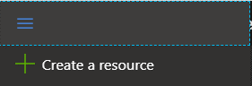

You’ll be directed to the Azure Market Place, where you type in the search: 'Data Share' 

   

You’ll be redirected to the product Azure Data Share:

   

Navigate to Create, and you’ll have to provide the following: 

   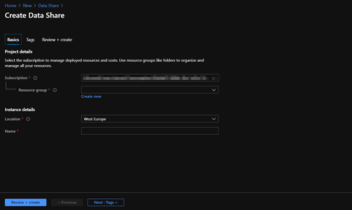

Settings:

*Resource Group:*

If you have an existing resource group in which you would want to create the Azure Data Share in, select it from the drop-down menu for the resource group that you’d like to deploy the Data Share into.

If you don’t have an existing Resource group, navigate through ‘Create new’, and create a new resource group.

*Location:*

Choose the Azure region that's right for you and your customers.

Azure Data Share does not store a copy of the data itself. The data is stored in the underlying data store that is being shared. For example, if a data producer stores their data in an Azure Data Lake Store account located in West US, that is where the data is stored. If they are sharing data with an Azure Storage account located in West Europe via snapshot, typically the data is transferred directly to the Azure Storage account located in West Europe.

The Azure Data Share service does not have to be available in your region to leverage the service. For example, if you have data stored in an Azure Storage account located in a region where Azure Data Share is not yet available, you can still leverage the service to share your data.

*Name:*

Give the resource a name.

Once you have filled out the mandatory marks, go to ‘Review + create’, which will validate the variables that you filled out in the form in order to deploy the Azure Data Share to the resource group you selected/created.

You’ll be redirected to the below screen, in which you navigate to create, which will deploy the Azure Data share in your resource group.

   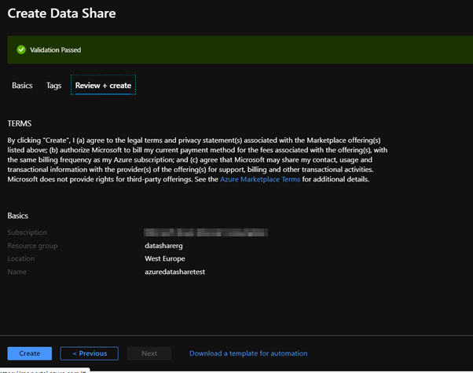

The next step is to share a dataset with Azure Data Share to an organization that Is the data consumer. 

Navigate to the Data share resource to the ‘Overview’ page:

   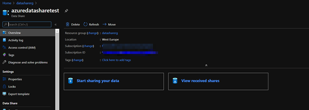

In the overview page, select ‘Start sharing your data’  and you’ll be redirected to the following page:

   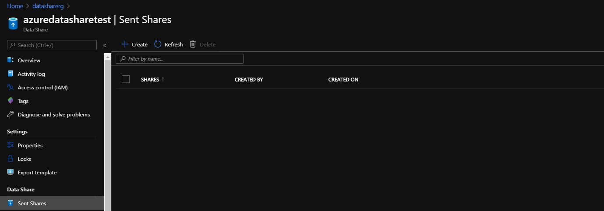

If you want to create a dataset that you want to share  select ‘+Create’, which lands you into this screen:

   

There are a couple of settings to specify:

*Share name:*

Fill out a name for the share you’re going to send to your data consumer

*Share type:*

Specify what type of share you want to use which determines how your data will be shared: That is Snapshot or In-Place.

*Description:*

Describe the dataset that will be shared and be aware that this description will be visible to whom you’re sending the data share. 

*Term of use:*

Specify the terms of use the data consumer needs to adhere to.

These are terms which data consumers will need to consent to in order to accept the share invitation.

   

Select continue and  you’ll be redirected to the following screen in which you are going to add a dataset that you are going to share. 

   

Select ‘Add datasets’ and select Azure SQL Database:

   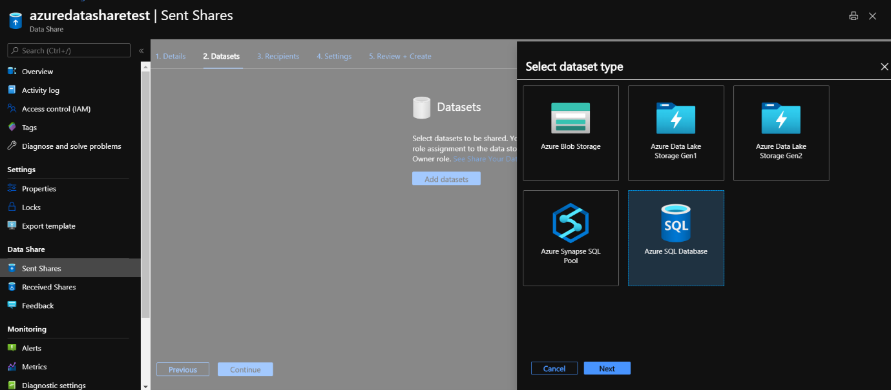

Select the SQL server  in which you have the dataset that you’re  going to share. 

Authenticate with your SQL server admin login and password. 

   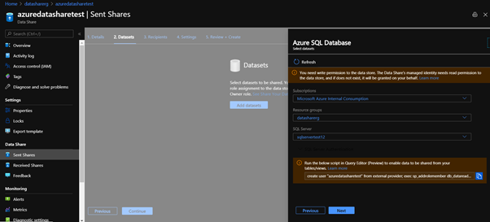

A message will pop up to run a script in the Query Editor to enable data to be shared from tables/views from your SQL Database. 

Open a new web browser tab in order to navigate to the Azure portal. Stay logged into the same tenant and login credentials. 

Select the SQL Database, where you have saved the tables of the taxi dataset and go to the query editor where you’ll be asked to log in. Log in with Active Directory Authentication. 

What is not covered in this step is that prior to this exercise, set yourself as an Active Directory Admin for the SQL Server and allow your client IP access to the SQL Server. 

Copy the script that was given and run the query. 

   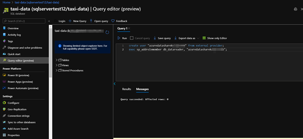

Navigate back to the Azure Data Share resource and select Sent Shares, navigate to the Datasets Tab, and add the taxi data. 

Select the taxi dataset: 

   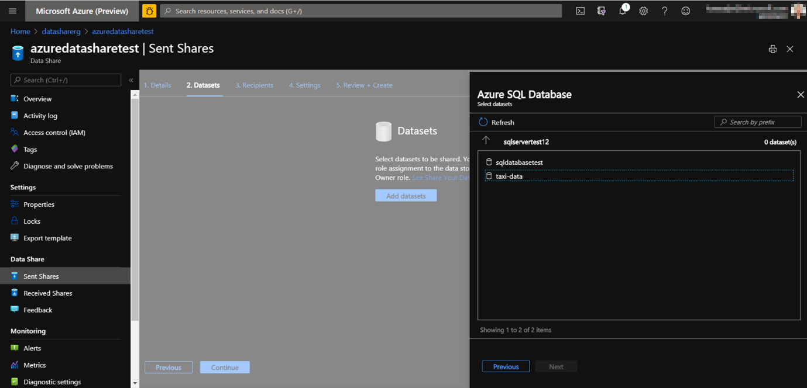

Select tables:

   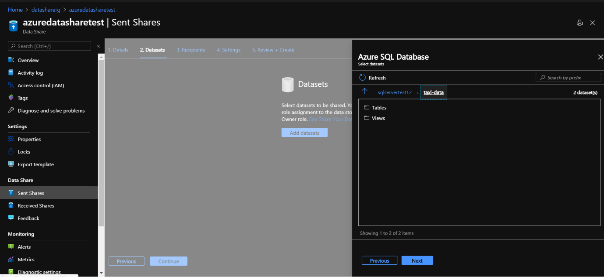

Select both tables:

   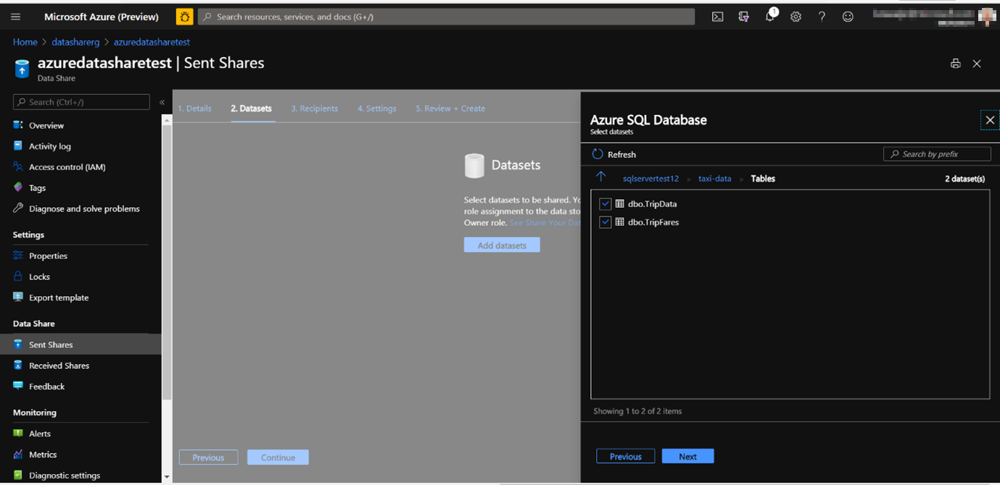

Select next:

   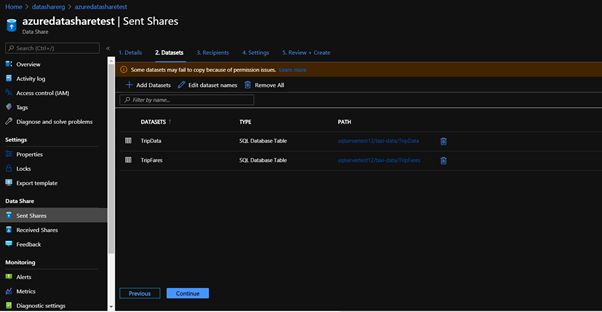

Select continue which will land you in the following page:

   

Add recipients to your share. The recipients you add will receive invitations to your share. Click Add recipient and enter email address. 

Select continue:

   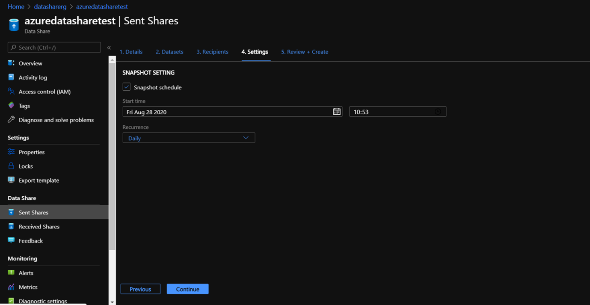

Configure a snapshot schedule for your data consumer. This will allow them to receive regular updates (hourly or daily) of your data at an interval defined by you. Check Snapshot Schedule. Leave the Start time and Recurrence as default. Select Continue.

   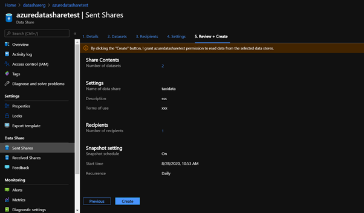

Review everything and select Create. A share is now created in your Sent Shares.

Let's review what you can see as a data provider after you have created share of taxi data:
 
   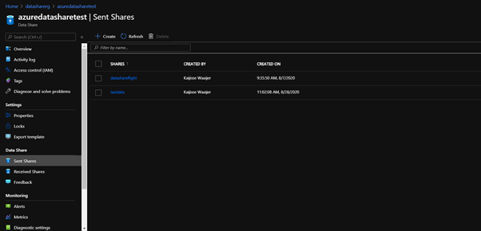

Select the share that you just created (for example, 'TaxiData').

In **Details** tab, you can view share name, description, terms of use and snapshot schedule. Be aware that you can disable the snapshot schedule if you choose.

Select the **Datasets** tab. Be aware that you can add or remove datasets after it has been created.

Select the **Share subscriptions tab**. Be aware that no share subscriptions exist yet because your data consumer has not yet accepted your invitation.

Select the **Invitations tab**. Here you'll see a list of pending invitations, send invitation to additional users or delete invitations prior to user accepting it.

Select the **History tab**. Be aware that nothing is displayed as yet because your data consumer has not yet accepted your invitation and triggered a snapshot.

In this exercise we have shared data, but we also will receive data. 

Let’s look into how receiving data looks like:

## Receive data (Data consumer flow)

Now you are switching hat to be the data consumer. As a data consumer, you will receive data into your ADLS Gen2 account. In addition to that you will use Azure Data Factory to process the data.

You should now have an Azure Data Share invitation in your inbox from Microsoft Azure. In web browser, type outlook.com to launch Outlook Web Access. Log in using the credentials supplied for your Azure tenant.

In the e-mail that you should have received (it may take up to a few minutes for the email to arrive), an invitation for the Azure Data Share you just set up. 

   :::image type="content" source="../media/azure-data-share-invitation-email.png" alt-text="Invitation Email":::

Select view invitation and In the list 'Data Share Invitations', select the invitation titled 'TaxiData'.

   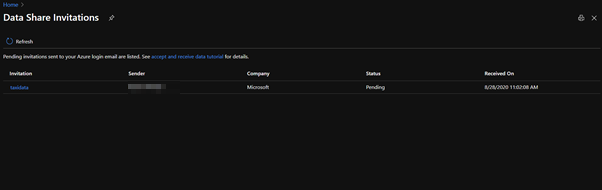

You’ll be redirected to the following invitation. 

   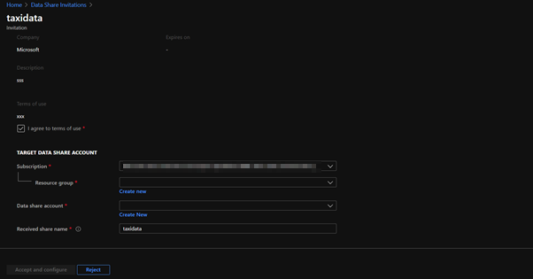

Review invitation details and accept the terms of use if provided.

Select Accept 

You are now taken to the received shares page where you can find the details of the data share resource of the taxi data share.  

   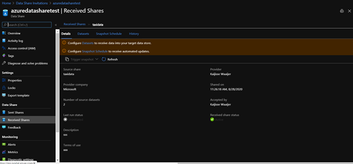

Select Datasets:

   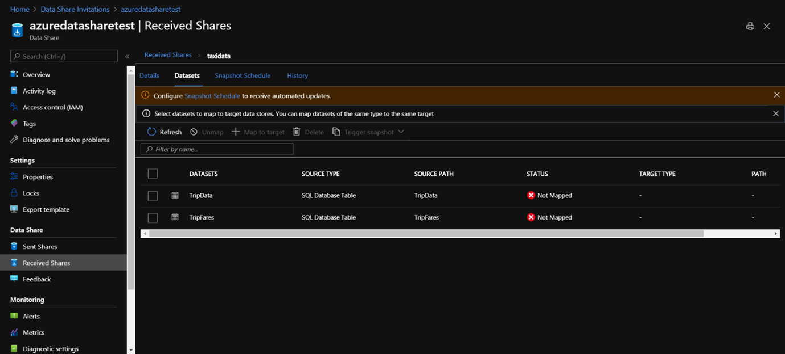

Select the Datasets tab to specify a target Azure data store to receive the data. 

Check TripFares and then select + Map to Target.

   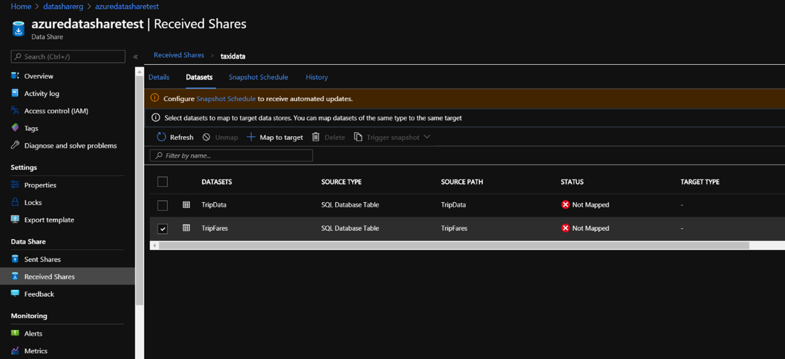

Once, you select map to target you’ll be redirected to the following screen:

   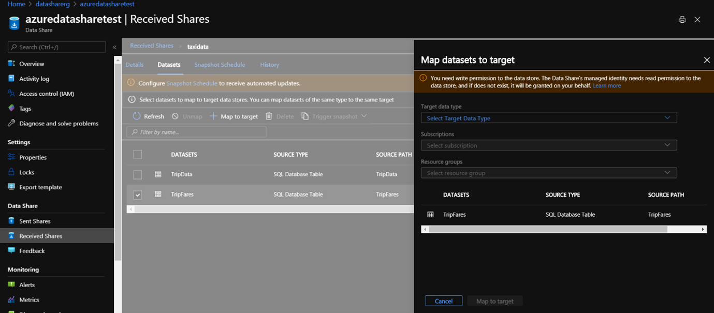

On the right-hand side of the screen, from the Target Data Type drop down, you will notice a list of options for where you can receive the data into. 

Select Azure Data Lake Store Gen2, enter Azure subscription and resource group. 

Specify the storage account, and 'taxidata' as the file system name. 

You have an option to choose either CSV or Parquet output file format. 

Leave it as default CSV. 

Click Map to target.

Now the dataset is mapped, and you are ready to receive data.

Select Snapshot Schedule. Here you can view and enable the automated update schedule provided by data provider. Check the checkbox right next to the schedule and select +Enable.

   

Select Details tab, and select Trigger snapshot -> Full Copy. 

This will start copying data into the target storage account you specified in the previous step. 

It will take approximately 3-5 minutes for the data to come across.

   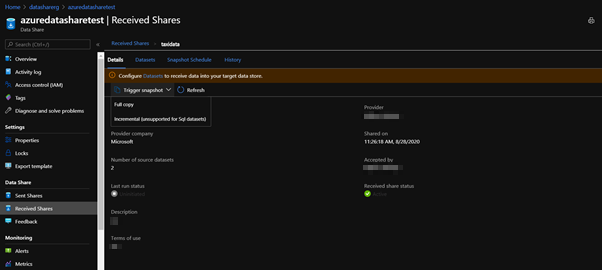

Select History tab, and click Refresh to monitor snapshot status.

   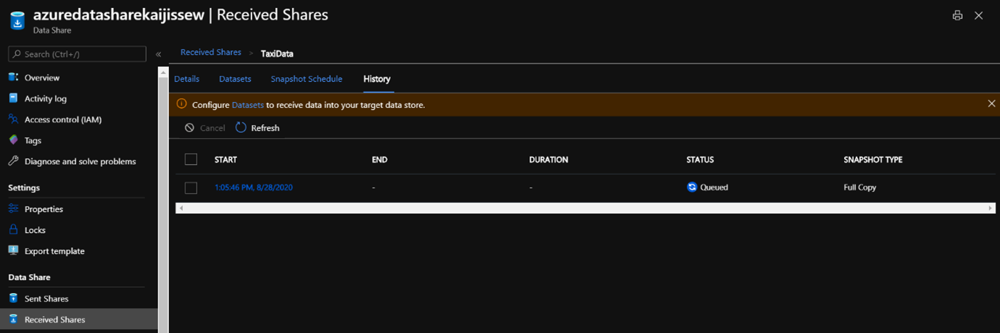

While you are waiting, navigate to the data provider's data share resource. 

Select Sent Share in left navigation, then 'TaxiData', and view the status of the Share Subscriptions and History tab. 

Click Refresh if no data is showing. 

Notice that there is now an active share subscription, and as a data provider, you can also monitor when snapshots of the data are sent to data consumer.

Navigate back to the data consumer's data share resource. 

Select Received Share in left navigation, then 'TaxiData'.

Click on History tab to verify the status of the snapshot is successful. 

Click on "Start' time to drill into the snapshot history. Click on Succeeded to view details of the snapshot result.

   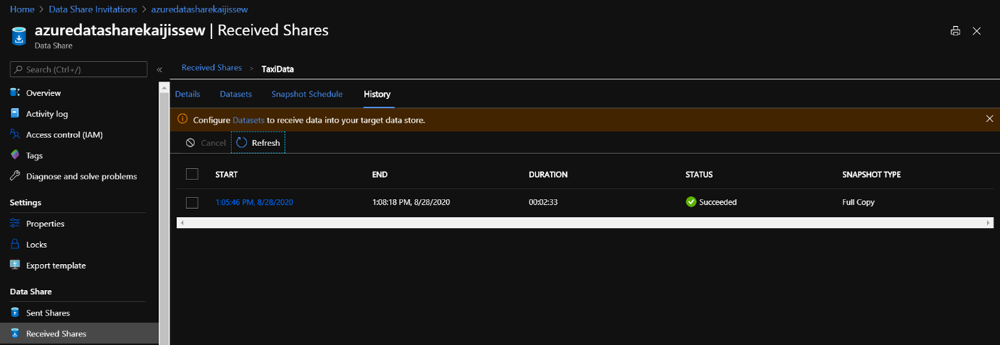

Select Datasets tab, click on the link under 'PATH', which will navigate to your ADLS Gen2 account storageadlsgen2test where the data is received into.

   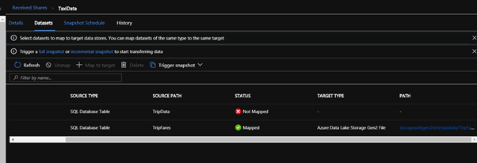

In the storage account, open Storage Explorer (preview) to verify the filesystem 'taxidata' is created, and within it, there should be a file named 'TripFares.csv'.

   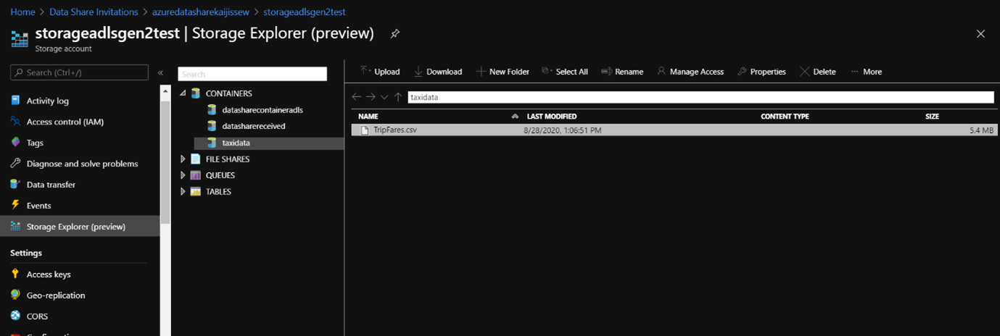

This concludes the Azure Data Share portion of the exercise.
