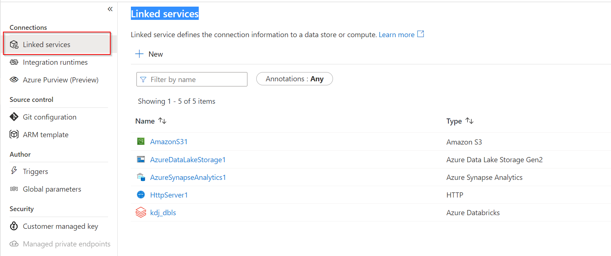
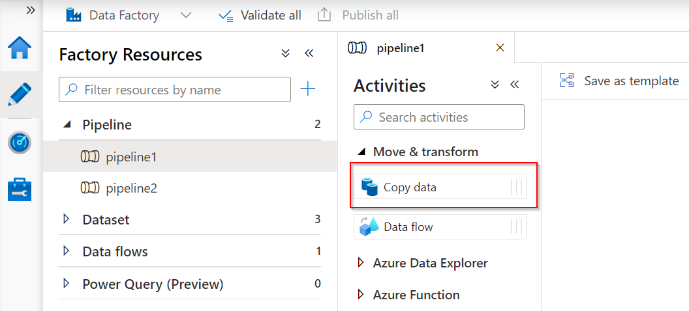

To create a pipeline we first need to set up linked services in Azure Data Factory. Linked services define the connection information for Azure Data Factory to the external resources you want to connect with, such as an Azure SQL Database or Azure Data Lake Storage Gen 2 (ADLS Gen 2). 

The connection to the data source and dataset that is linked to that linked service represents the data structure. For example, an Azure Data Lake Storage linked service will specify the connection string to the Azure Data Lake Storage account. 

The connection string can be passed through to Azure Data Factory by creating a linked service.

The purpose of linked services is to represent and show data stores and compute resources that need to be hosted for the execution of a pipeline or activity.  

Using the code-free user experience of Azure Data Factory from the Azure portal makes it easy for the non-coder to develop linked services. 

We are going to explore three of the more than 85 connectors Azure Data Factory currently supports. 

To ingest data from a resource, you can use an Azure Data Factory pipeline with a copy activity that can ingest. For example, one table from the Azure SQL Database into an ADLS Gen 2 storage account. It is important to understand that as you add pipelines in Azure Data Factory, you must configure the dataset and debug the pipeline in Azure Data Factory. 

A pipeline in Azure Data Factory is a logical grouping of activities, such as the **Copy data** activity to perform a task. The activity defines the operation that you’re performing on the data, therefore a copy means copying the same data to another data store. 

The dataset that you’re using is pointing to the data that you’re going to use from the linked service. So, if you have linked a database containing tables you can select the table that you want to copy. In doing so, the data from that table will be copied to an Azure Data Lake Storage Account. 

Now you understand linked services in Azure Data Factory, in the next unit we will get hands on to ingest data with Azure Data Factory.

