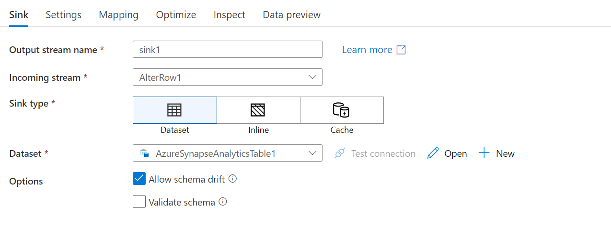

Now that you have finished joining and transforming the dataset, it is important to write the newly created dataset into a destination store. The way to do so is by using the sink transformation option in Azure Data Factory. 

Each time you use dataflow, it requires at least one sink transformation. However, if you want to write multiple sinks to complete the transformation flow, that is also possible. You do this by writing other sinks and creating new streams through new branches and conditional splits. 

When looking at sink transformations, every sink is associated with one Azure Data Factory dataset or linked service. So, each sink transformation determines the location and the shape of the data that you are going or want to write to. Therefore, if you’re writing to Azure Synapse Analytics, the datasets need to be compatible with that location. 

Mapping data flow follows an Extract Load Transform (ELT) approach and works on staging dataset in Azure. Currently, the dataset that can be used in a source transformation for Azure Synapse Analytics is the dataset option. Other sources might allow you to choose inline, or a common data model approach. 

Now that you learned to write datasets into a destination store, in the next unit you will implement sinking a dataset. 
