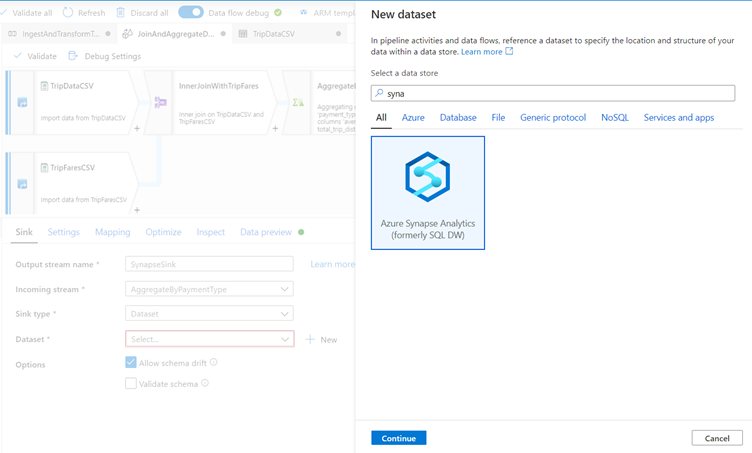
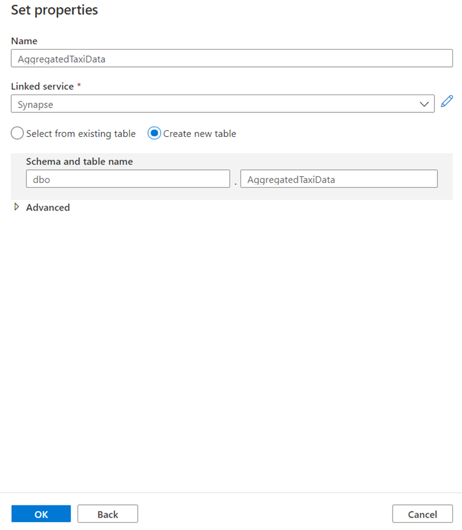
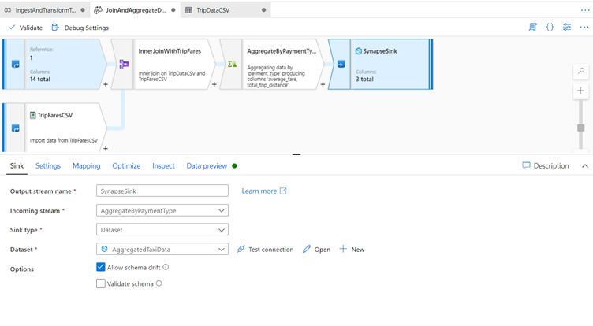

## Configure Azure Synapse Analytics sink

We have finished our transformation logic in the previous exercise, so now we are ready to sink our data in an Azure Synapse Analytics table. 

Add a sink transformation under the Destination section.

   > [!div class="mx-imgBorder"]
   > 

Name your sink 'SynapseSink'. 

Click New next to the sink dataset field to create a new Azure Synapse Analytics dataset.

   > [!div class="mx-imgBorder"]
   > 

Select the Azure Synapse Analytics (formerly SQL DW) tile and click continue.

   > [!div class="mx-imgBorder"]
   > 

Call your dataset 'AggregatedTaxiData'. 

Select 'Synapse' as your linked service. 

Select Create new table and name the new table dbo.AggregateTaxiData.

Click OK when finished

   > [!div class="mx-imgBorder"]
   > 

After creating your dataset, there are no further changes you need to make your sink! 

In the Settings tab, you will notice that by default the only update method selected is Allow insert, which means all rows will be inserted to the table. 

In conjunction with an alter row transformation, you can tag certain rows as delete, upsert, or update as well. 

Enable staging is also enabled by default, which allows for the data flow to utilize Synapse's PolyBase technology for performant loading.

   > [!div class="mx-imgBorder"]
   > 

You have successfully created your data flow. 
