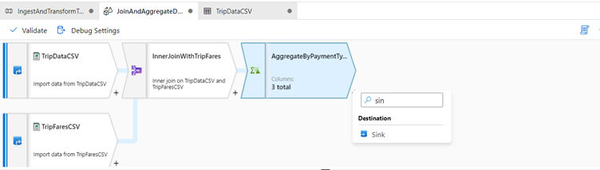
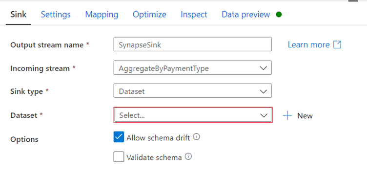

Configure you Azure Synapse Analytics sink

1.	We have finished our transformation logic in the previous exercise, so now we are ready to sink our data in an Azure Synapse Analytics table. 

2.	Add a sink transformation under the Destination section.

3.	Name your sink 'SynapseSink'. 

4.	Click New next to the sink dataset field to create a new Azure Synapse Analytics dataset.

5.	Select the Azure Synapse Analytics (formerly SQL DW) tile and click continue.

Call your dataset 'AggregatedTaxiData'. 

Select 'Synapse' as your linked service. 

Select Create new table and name the new table dbo.AggregateTaxiData.

Click OK when finished

After creating your dataset, there are no further changes you need to make your sink! 

In the Settings tab, you will notice that by default the only update method selected is Allow insert which means all rows will be inserted to the table. 

In conjunction with an alter row transformation, you can tag certain rows as delete, upsert, or update as well. 

Enable staging is also enabled by default which allows for the data flow to utilize Synapse's PolyBase technology for performant loading.

You have successfully created your data flow. Now its time to operationalize it in our pipeline.
