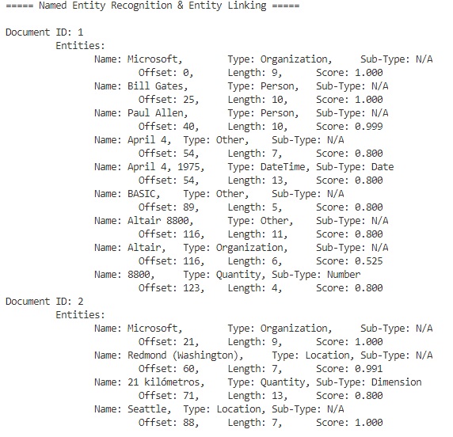

This exercise will involve the creation of a client application to perform entity recognition using Cognitive Services. You must have an active [Azure subscription](https://azure.microsoft.com/free/search/?&OCID=AID2000128_SEM_XrxJTQAABTwX01UH:20200513142357:s&msclkid=93282274b4261e4f2f987cc8fd3320f5&ef_id=XrxJTQAABTwX01UH:20200513142357:s&dclid=CKLGnKzIsekCFdgXrQYdssEIxw) and either a [multi-service](https://docs.microsoft.com/azure/cognitive-services/cognitive-services-apis-create-account?tabs=multiservice%2Cwindows#tabpanel_CeZOj-G++Q_multiservice) Cognitive Services resource, or a [Text Analytics](https://docs.microsoft.com/azure/cognitive-services/cognitive-services-apis-create-account?tabs=singleservice%2Cwindows#tabpanel_CeZOj-G++Q_singleservice) resource.

## Environment setup

The environment for this exercise will make use of Visual Studio Code as the editor. Depending on the programming language you choose, the setup will differ. Follow the steps outlined here to configure your local computer for completion of the exercises.

1. Install [Visual Studio Code](https://code.visualstudio.com/) for your operating system.

### Python

1. If you will be completing your coding with Python, ensure you have a [Python environment](https://www.python.org/downloads/) installed locally.
1. Once you have Python installed, you will need to [install the extension](https://marketplace.visualstudio.com/items?itemName=ms-python.python) for VS Code.

### C#

1. If you will be using C# as your code language, start by installing the latest [.NET Core](https://docs.microsoft.com/dotnet/core/install/windows?tabs=netcore31) package for your platform. You can choose Windows, Linux, or macOS from the drop-down on this page.
1. Once you have .NET Core installed, you will need to add the C# Extension to VS Code. Select the **Extensions** option in the left nav pane, or press **CTRL+SHIFT+X** and enter C# in the search dialog.

With your environment setup, you are now ready to begin the coding exercise.

:::zone pivot="csharp"

1. Start by opening Visual Studio Code.
1. Create a new folder with a name of your choosing, example **EntityRecCsharp**.
1. Right-click the **EntityRecCsharp** folder and choose **Open in Integrated Terminal**.

   >[!Note]
   >Visual Studio Code may have different menu options depending on the packages you have installed.  You are looking for a terminal window at the bottom of Visual Studio Code that offers a command prompt/terminal.

1. We will be using C# and .NET Core for this exercise so type in the command ```dotnet new console``` and press Enter.
1. A new C# dotnet core project structure is set up for you complete with a Program.cs file, a workspace.csproj file, and the obj folder.
1. Open the **Program.cs** file to edit the contents.
1. At the top of **Program.cs**, add the following using statements immediately following the existing one.
1. You will require several libraries for the Text Analytics functionality so paste these **using** statements into your **Program.cs** file.

    ```csharp
    using System.Collections.Generic;
    using System.Net.Http;
    using System.Threading;
    using System.Threading.Tasks;
    using Microsoft.Azure.CognitiveServices.Language.TextAnalytics;
    using Microsoft.Azure.CognitiveServices.Language.TextAnalytics.Models;
    using Microsoft.Rest;
    ```

1. Create a method called RecognizeEntities() by pasting in the code below the existing Main() method in Program.cs.

    ```csharp
        public static async Task RecognizeEntities(string endpoint, string key)
            {
                var credentials = new ApiKeyServiceClientCredentials(key);
                var client = new TextAnalyticsClient(credentials)
                {
                    Endpoint = endpoint
                };

                // The documents to be submitted for entity recognition. The ID can be any value.
                var inputDocuments = new MultiLanguageBatchInput(
                    new List<MultiLanguageInput>
                    {
                        new MultiLanguageInput("1", "Microsoft was founded by Bill Gates and Paul Allen on April 4, 1975, to develop and sell BASIC interpreters for the Altair 8800.", "en"),
                        new MultiLanguageInput("2", "La sede principal de Microsoft se encuentra en la ciudad de Redmond, a 21 kilómetros de Seattle.", "es")
                    });

                var entitiesResult = await client.EntitiesBatchAsync(inputDocuments);

                // Printing recognized entities
                Console.WriteLine("===== Named Entity Recognition & Entity Linking =====\n");

                foreach (var document in entitiesResult.Documents)
                {
                    Console.WriteLine($"Document ID: {document.Id} ");

                    Console.WriteLine("\t Entities:");

                    foreach (var entity in document.Entities)
                    {
                        Console.WriteLine($"\t\tName: {entity.Name},\tType: {entity.Type ?? "N/A"},\tSub-Type: {entity.SubType ?? "N/A"}");
                        foreach (var match in entity.Matches)
                        {
                            Console.WriteLine($"\t\t\tOffset: {match.Offset},\tLength: {match.Length},\tScore: {match.EntityTypeScore:F3}");
                        }
                    }
                }
                Console.WriteLine();
            }
    ```

1. Now that we have the method that will perform the bulk of the work you will require a client class to handle the authentication to your Cognitive Service.  Create that client class in the same namespace as Program.cs but as a separate class.

    ```csharp
    // <clientClass>
        class ApiKeyServiceClientCredentials : ServiceClientCredentials
        {
            private readonly string apiKey;

            public ApiKeyServiceClientCredentials(string apiKey)
            {
                this.apiKey = apiKey;
            }

            public override Task ProcessHttpRequestAsync(HttpRequestMessage request, CancellationToken cancellationToken)
            {
                if (request == null)
                {
                    throw new ArgumentNullException("request");
                }
                request.Headers.Add("Ocp-Apim-Subscription-Key", this.apiKey);
                return base.ProcessHttpRequestAsync(request, cancellationToken);
            }
        }
    // </clientClass>
    ```

1. Next, modify Main() to work asynchronously and to pass in the key and endpoint, then call the RecognizeEntities() method.

    ```csharp
    static async Task Main(string[] args)
    {
        string key = "YourCognitiveKey";
        string endpoint = "YourCognitiveEndpoint";

        await RecognizeEntities(endpoint, key);
    }
    ```

1. Paste your key and endpoint into the placeholders in the Main() method.
1. Before you run the code, you will need to add the TextAnalytics package to the application.  Enter the following command to add the package, ``` dotnet add package Microsoft.Azure.CognitiveServices.Language.TextAnalytics ```, and press Enter.
1. Once the package is added, in the Terminal, enter the command ``` dotnet run ```.
1. Your output should be the same as shown in Figure 1 outlining each document ID, the entity, entity type, subtype, offset, length, and score.
   
   > [!div class="mx-imgBorder"]
   > 

1. The output that is presented here does not include all of the attributes that are returned from the service. Using the ```entity``` variable, you can extract more attributes by accessing the additional properties.

    ```csharp
    entity.WikipediaId
    entity.BingId
    entity.WikipediaUrl
    ```

:::zone-end

:::zone pivot="python"

If you do not already have Python and Visual Studio Code installed on your local computer. Follow these instructions in the **Environment Setup** section above, to get your environment ready for the exercise.

1. Create a folder to store the project in by using your local file system, **EntityRecPython**.
1. In Visual Studio Code, select the File icon. Then open the folder you created.
1. Create a new file in this folder, and call it **entity.py**.
1. Select the hamburger menu and choose **Terminal, New Terminal**.
1. The exercise will use REST to access the service so once pip is updated, install the requests library with this command, ``` sudo pip install --upgrade requests ```.

    >[!Note]
    >Depending on your Python environment, the above command may not be appropriate. You may have to use just ```pip install``` or ```python3 install```

1. In your **entity.py** file, add the following code at the top.

    ```python
    from pip._vendor import requests
    # pprint is used to format the JSON response
    from pprint import pprint
    ```

1. Next, you will add code to import the os library and create variables to store your endpoint and key.

    ```python
    import os

    # variables to store subscription key and root URL for the Cognitive Service resource
    subscription_key = "YourCognitiveKey"
    endpoint = "YourCognitiveEndpoint"
    ```

1. Many of the Text Analytics services require additional information in the endpoint URL.  As a result you will need to append the appropriate text to your endpoint URL.

    ```python
    # append the Text Analytics endpoint information to the URL
    entities_url = endpoint + "/text/analytics/v2.1/entities"
    ```

1. To call the service, you will need a properly formatted document.  You can create that inside your Python code easily.  Create a ```documents``` variable and store a properly formatted documents array, in JSON format, using the following code.

    ```python

    # variable to store a JSON formatted document that contains two entries in a JSON array.
    documents = {"documents": [
        {"id": "1", "text": "Microsoft was founded by Bill Gates and Paul Allen on April 4, 1975, to develop and sell BASIC interpreters for the Altair 8800."},
        {"id": "2", "text": "La sede principal de Microsoft se encuentra en la ciudad de Redmond, a 21 kilómetros de Seattle."}
    ]}
    ```

1. Now that have your text document, key and URL configured, it is time to call the service and output the results.

    ```python
    # Setup the header information for the REST request passing in the subscription key
    headers = {"Ocp-Apim-Subscription-Key": subscription_key}

    # Build the REST request by passing in the complete URL, header information for authentication, and the JSON document
    response = requests.post(entities_url, headers=headers, json=documents)

    # Create a variable to store the results that are returned from the REST request
    entities = response.json()

    # Output the result using pprint.
    pprint(entities)
    ```

1. Paste your key and endpoint URL into the placeholders in the code.
1. Select the **Run Python File in Terminal** or right-click anywhere in the code editor and select **Run Python File in Terminal**.
1. If your code contains no errors, the resulting JSON output should be sent to the output window and is displayed here.

    ```json
    {'documents': [{'entities': [{'bingId': 'a093e9b9-90f5-a3d5-c4b8-5855e1b01f85',
                                'matches': [{'entityTypeScore': 1.0,
                                            'length': 9,
                                            'offset': 0,
                                            'text': 'Microsoft',
                                            'wikipediaScore': 0.4312820356939451}],
                                'name': 'Microsoft',
                                'type': 'Organization',
                                'wikipediaId': 'Microsoft',
                                'wikipediaLanguage': 'en',
                                'wikipediaUrl': 'https://en.wikipedia.org/wiki/Microsoft'},
                                {'bingId': '0d47c987-0042-5576-15e8-97af601614fa',
                                'matches': [{'entityTypeScore': 0.999847412109375,
                                            'length': 10,
                                            'offset': 25,
                                            'text': 'Bill Gates',
                                            'wikipediaScore': 0.49610998585133137}],
                                'name': 'Bill Gates',
                                'type': 'Person',
                                'wikipediaId': 'Bill Gates',
                                'wikipediaLanguage': 'en',
                                'wikipediaUrl': 'https://en.wikipedia.org/wiki/Bill_Gates'},
                                {'bingId': 'df2c4376-9923-6a54-893f-2ee5a5badbc7',
                                'matches': [{'entityTypeScore': 0.9988409876823425,
                                            'length': 10,
                                            'offset': 40,
                                            'text': 'Paul Allen',
                                            'wikipediaScore': 0.8291266530647086}],
                                'name': 'Paul Allen',
                                'type': 'Person',
                                'wikipediaId': 'Paul Allen',
                                'wikipediaLanguage': 'en',
                                'wikipediaUrl': 'https://en.wikipedia.org/wiki/Paul_Allen'},
                                {'bingId': '52535f87-235e-b513-54fe-c03e4233ac6e',
                                'matches': [{'entityTypeScore': 0.8,
                                            'length': 7,
                                            'offset': 54,
                                            'text': 'April 4',
                                            'wikipediaScore': 0.6275325637464364}],
                                'name': 'April 4',
                                'type': 'Other',
                                'wikipediaId': 'April 4',
                                'wikipediaLanguage': 'en',
                                'wikipediaUrl': 'https://en.wikipedia.org/wiki/April_4'},
                                {'matches': [{'entityTypeScore': 0.8,
                                            'length': 13,
                                            'offset': 54,
                                            'text': 'April 4, 1975'}],
                                'name': 'April 4, 1975',
                                'subType': 'Date',
                                'type': 'DateTime'},
                                {'bingId': '5b16443d-501c-58f3-352e-611bbe75aa6e',
                                'matches': [{'entityTypeScore': 0.8,
                                            'length': 5,
                                            'offset': 89,
                                            'text': 'BASIC',
                                            'wikipediaScore': 0.2767034941738966}],
                                'name': 'BASIC',
                                'type': 'Other',
                                'wikipediaId': 'BASIC',
                                'wikipediaLanguage': 'en',
                                'wikipediaUrl': 'https://en.wikipedia.org/wiki/BASIC'},
                                {'bingId': '7216c654-3779-68a2-c7b7-12ff3dad5606',
                                'matches': [{'entityTypeScore': 0.8,
                                            'length': 11,
                                            'offset': 116,
                                            'text': 'Altair 8800',
                                            'wikipediaScore': 0.7664344486697048}],
                                'name': 'Altair 8800',
                                'type': 'Other',
                                'wikipediaId': 'Altair 8800',
                                'wikipediaLanguage': 'en',
                                'wikipediaUrl': 'https://en.wikipedia.org/wiki/Altair_8800'},
                                {'matches': [{'entityTypeScore': 0.5250527262687683,
                                            'length': 6,
                                            'offset': 116,
                                            'text': 'Altair'}],
                                'name': 'Altair',
                                'type': 'Organization'},
                                {'matches': [{'entityTypeScore': 0.8,
                                            'length': 4,
                                            'offset': 123,
                                            'text': '8800'}],
                                'name': '8800',
                                'subType': 'Number',
                                'type': 'Quantity'}],
                    'id': '1'},
                {'entities': [{'bingId': '9958ca5c-ea31-4e71-8a17-bd1e7839c723',
                                'matches': [{'entityTypeScore': 0.8,
                                            'length': 2,
                                            'offset': 0,
                                            'text': 'La',
                                            'wikipediaScore': 0.23247315992344353}],
                                'name': 'Los Angeles',
                                'type': 'Location',
                                'wikipediaId': 'Los Angeles',
                                'wikipediaLanguage': 'en',
                                'wikipediaUrl': 'https://en.wikipedia.org/wiki/Los_Angeles'},
                                {'bingId': 'a093e9b9-90f5-a3d5-c4b8-5855e1b01f85',
                                'matches': [{'entityTypeScore': 0.9837456345558167,
                                            'length': 9,
                                            'offset': 21,
                                            'text': 'Microsoft',
                                            'wikipediaScore': 0.2157225999829695}],
                                'name': 'Microsoft',
                                'type': 'Organization',
                                'wikipediaId': 'Microsoft',
                                'wikipediaLanguage': 'en',
                                'wikipediaUrl': 'https://en.wikipedia.org/wiki/Microsoft'},
                                {'bingId': '8769d4c0-b645-70ac-03ec-6eebabf6d26e',
                                'matches': [{'entityTypeScore': 0.8,
                                            'length': 7,
                                            'offset': 60,
                                            'text': 'Redmond',
                                            'wikipediaScore': 0.2150334752221521}],
                                'name': 'Redmond, Washington',
                                'type': 'Location',
                                'wikipediaId': 'Redmond, Washington',
                                'wikipediaLanguage': 'en',
                                'wikipediaUrl': 'https://en.wikipedia.org/wiki/Redmond,_Washington'},
                                {'matches': [{'entityTypeScore': 0.8,
                                            'length': 2,
                                            'offset': 71,
                                            'text': '21'}],
                                'name': '21',
                                'subType': 'Number',
                                'type': 'Quantity'},
                                {'bingId': '5fbba6b8-85e1-4d41-9444-d9055436e473',
                                'matches': [{'entityTypeScore': 0.8,
                                            'length': 7,
                                            'offset': 88,
                                            'text': 'Seattle',
                                            'wikipediaScore': 0.20215058750288195}],
                                'name': 'Seattle',
                                'type': 'Location',
                                'wikipediaId': 'Seattle',
                                'wikipediaLanguage': 'en',
                                'wikipediaUrl': 'https://en.wikipedia.org/wiki/Seattle'}],
                    'id': '2'}],
    'errors': []}
    ```

:::zone-end
