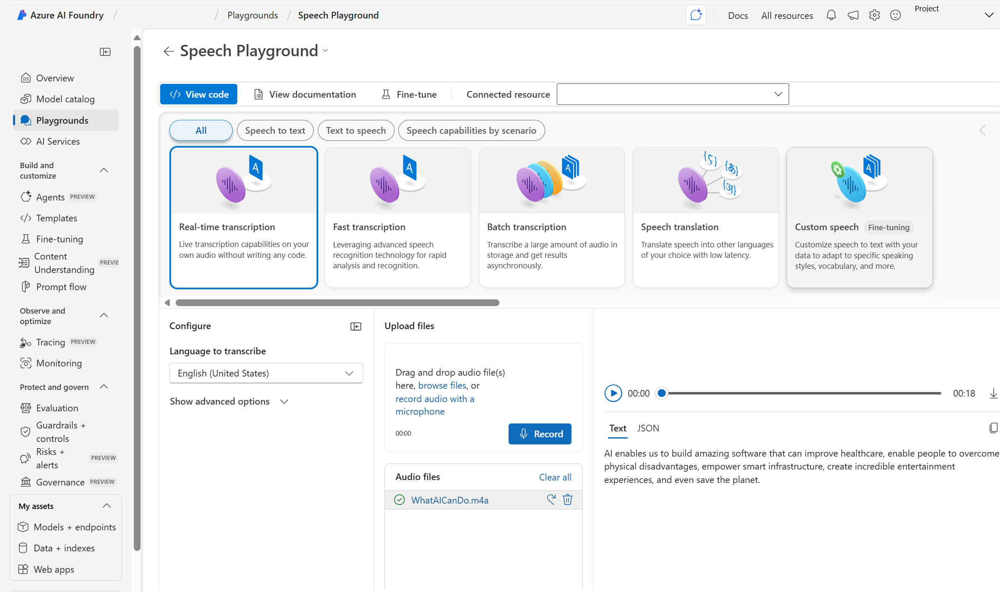

**Azure AI Speech** is available for use through several tools and programming languages including: 
- Studio interfaces
- [Command Line Interface (CLI)](/azure/ai-services/speech-service/spx-overview)
- REST APIs and [Software Development Kits (SDKs)](/azure/ai-services/speech-service/speech-sdk) 

## Using studio interfaces

You can create Azure AI Speech projects using **Azure AI Foundry portal's Speech Playground**.

## Azure resources for Azure AI Speech

To use Azure AI Speech in an application, you must create an appropriate resource in your Azure subscription. You can choose to create either of the following types of resource:

- A **Speech** resource - choose this resource type if you only plan to use Azure AI Speech, or if you want to manage access and billing for the resource separately from other services.
- An **Azure AI services** resource - choose this resource type if you plan to use Azure AI Speech in combination with other Azure AI services, and you want to manage access and billing for these services together.