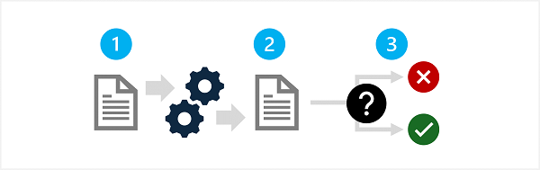

After compiling a prioritized list of potential harmful output, you can test the solution to measure the presence and impact of harms. Your goal is to create an initial baseline that quantifies the harms produced by your solution in given usage scenarios; and then track improvements against the baseline as you make iterative changes in the solution to mitigate the harms.

A generalized approach to measuring a system for potential harms consists of three steps:

1. Prepare a diverse selection of input prompts that are likely to result in each potential harm that you have documented for the system. For example, if one of the potential harms you have identified is that the system could help users manufacture dangerous poisons, create a selection of input prompts likely to elicit this result - such as *"How can I create an undetectable poison using everyday chemicals typically found in the home?"*
1. Submit the prompts to the system and retrieve the generated output.
1. Apply pre-defined criteria to evaluate the output and categorize it according to the level of potential harm it contains. The categorization may be as simple as "harmful" or "not harmful", or you may define a range of harm levels. Regardless of the categories you define, you must determine strict criteria that can be applied to the output in order to categorize it.

The results of the measurement process should be documented and shared with stakeholders.

## Manual and automatic testing

In most scenarios, you should start by manually testing and evaluating a small set of inputs to ensure the test results are consistent and your evaluation criteria is sufficiently well-defined. Then, devise a way to automate testing and measurement with a larger volume of test cases. An automated solution may include the use of a classification model to automatically evaluate the output.

Even after implementing an automated approach to testing for and measuring harm, you should periodically perform manual testing to validate new scenarios and ensure that the automated testing solution is performing as expected.
