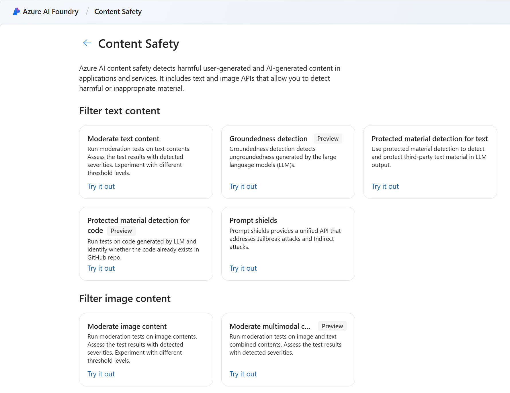

# What is Azure AI Content Safety?

Azure AI Content Safety is a set of advanced content moderating features that can be incorporated into your applications and services. Azure AI Content Safety is available as a resource in the Azure portal.

Online content safeguarding is needed in a growing number of situations. Not only are we concerned with moderating content generated by people, but  must also guard against the malicious use of AI.

## Trusting user-generated content

Social interaction is increasingly a part of many digital spaces. Genuine user-generated content is seen as independent and trustworthy, and used alongside advertising and marketing. Different industries are encouraging their customers to connect with each other and their brand.  

Harmful content has many negative affects. It damages trusted brands, discourages users from participating in online forums, and can have a devastating impact on individuals.

Azure AI Content Safety is designed to be used in applications and services to protect against harmful user-generated and AI-generated content.

## Content Safety in Azure AI Studio

Azure AI Content Safety Studio is available as part of [Azure AI Studio](https://ai.azure.com/explore/contentsafety), a unified platform that enables you to explore many different Azure AI services, including Content Safety.

From the [Azure AI Studio](https://ai.azure.com/) home page, scroll down to find Content Safety and then select **View all Content Safety capabilities**.

Azure AI Content Safety Studio enables you to explore and test Content Safety features for yourself. Select the feature you want to try, and then select *Try it out*. You can then use the user interface to test samples or your own material. Select *View code* to generate sample code in C#, Java, or Python. You can then copy and paste the sample code and amend the variables to use your own data.  

**NOTE:** You can access Azure AI Content Studio either through [Azure AI Studio](https://ai.azure.com/) or through [Content Safety Studio](https://contentsafety.cognitive.azure.com/).

For guided practice using Azure AI Content Studio, see [Moderate content and detect harm with Azure AI Content Safety Studio](/training/modules/moderate-content-detect-harm-azure-ai-content-safety-studio/). 
