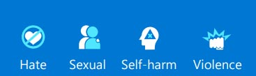

Azure AI Content Safety works with text and images, and AI-generated content.

Content Safety vision capabilities are powered by Microsoft's Florence foundation model, which has been trained with billions of text-image pairs. Text analysis uses natural language processing techniques, giving a better understanding of nuance and context. Azure AI Content Safety is multilingual and can detect harmful content in both short form and long form. It's currently available in English, German, Spanish, French, Portuguese, Italian, and Chinese.

Azure AI Content Safety classifies content into four categories:

A severity level for each category is used to determine whether content should be blocked, sent to a moderator, or auto approved.

Azure AI Content Safety features include:

## Safeguarding text content

- **Moderate text** scans text across four categories: violence, hate speech, sexual content, and self-harm. A severity level from 0 to 6 is returned for each category. This level helps to prioritize what needs immediate attention by people, and how urgently. You can also create a blocklist to scan for terms specific to your situation.

- **Prompt shields** is a unified API to identify and block jailbreak attacks from inputs to LLMs. It includes both user input and documents. These attacks are prompts to LLMs that attempt to bypass the model's in-built safety features. User prompts are tested to ensure the input to the LLM is safe. Documents are tested to ensure they don't contain unsafe instructions embedded within the text.

- **Protected material detection** checks AI-generated text for protected text such as recipes, copyrighted song lyrics, or other original material.

- **Groundedness detection** protects against inaccurate responses in AI-generated text by LLMs. Public LLMs use data available at the time they were trained. However, data can be introduced after the original training of the model or be built on private data. A grounded response is one where the model’s output is based on the source information. An ungrounded response is one where the model's output varies from the source information. Groundedness detection includes a *reasoning* option in the API response. This adds a *reasoning* field that explains any ungroundedness detection. However, reasoning increases processing time and costs.

## Safeguarding image content

- **Moderate images** scans for inappropriate content across four categories: violence, self-harm, sexual, and hate. A severity level is returned: safe, low, or high. You then set a threshold level of low, medium, or high. The combination of the severity and threshold level determines whether the image is allowed or blocked for each category.  

- **Moderate multimodal content** scans both images and text, including text extracted from an image using optical character recognition (OCR). Content is analyzed across four categories: violence, hate speech, sexual content, and self-harm.  

## Custom safety solutions

- **Custom categories** enables you to create your own categories by providing positive and negative examples, and training the model. Content can then be scanned according to your own category definitions.

- **Safety system message** helps you to write effective prompts to guide an AI system's behavior. 

## Limitations

Azure AI Content Safety uses AI algorithms, and so may not always detect inappropriate language. And on occasions it might block acceptable language because it relies on algorithms and machine learning to detect problematic language.

Azure AI Content Safety should be tested and evaluated on real data before being deployed. And once deployed, you should continue to monitor the system to see how accurately it's performing.

## Evaluating accuracy

When evaluating how accurately Azure AI Content Safety is for your situation, compare its performance against four criteria:

- **True positive** - correct identification of harmful content.
- **False positive** - incorrect identification of harmful content.
- **True negative** - correct identification of harmless content.
- **False negative** - harmful content isn't identified.

Azure AI Content Safety works best to support human moderators who can resolve cases of incorrect identification. When people add content to a site, they don't expect posts to be removed without reason. Communicating with users about why content is removed or flagged as inappropriate helps everyone to understand what is permissible and what isn't.
