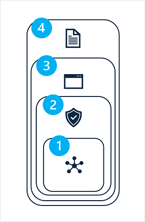

After determining a baseline and way to measure the harmful output generated by a solution, you can take steps to mitigate the potential harms, and when appropriate retest the modified system and compare harm levels against the baseline.

Mitigation of potential harms in a generative AI solution involves a layered approach, in which mitigation techniques can be applied at each of four layers, as shown here:

1. **Model**
1. **Safety System**
1. **Application**
1. **Positioning**

## 1: The *model* layer

The model layer consists of the generative AI model(s) at the heart of your solution. For example, your solution may be built around a model such as GPT-4.

Mitigations you can apply at the model layer include:

- Selecting a model that is appropriate for the intended solution use. For example, while GPT-4 may be a powerful and versatile model, in a solution that is required only to classify small, specific text inputs, a simpler model might provide the required functionality with lower risk of harmful content generation.
- *Fine-tuning* a foundational model with your own training data so that the responses it generates are more likely to be relevant and scoped to your solution scenario.

## 2: The *safety system* layer

The safety system layer includes platform-level configurations and capabilities that help mitigate harm. For example, Azure OpenAI Service includes support for *content filters* that apply criteria to suppress prompts and responses based on classification of content into four severity levels (*safe*, *low*, *medium*, and *high*) for four categories of potential harm (*hate*, *sexual*, *violence*, and *self-harm*).

Other safety system layer mitigations can include abuse detection algorithms to determine if the solution is being systematically abused (for example through high volumes of automated requests from a bot) and alert notifications that enable a fast response to potential system abuse or harmful behavior.

## 3: The *application* layer

The application layer is the software application through which users interact with the generative AI model. Harm mitigation techniques at this layer include:

- Designing the application user experience (UX) to constrain inputs to specific subjects or types, or applying input and output validation.
- Specifying *metaprompts* or system inputs that define behavioral parameters for the model.
- Applying prompt engineering techniques to add context to input prompts, maximizing the likelihood of a relevant, nonharmful output.
- Citing sources of information in the generated output (or explicitly noting that no citation has been provided).

## 4: The *positioning* layer

The positioning layer includes any documentation or other user collateral that describes the use of the solution to its users and stakeholders.

Documentation and other descriptions of a generative AI solution should be appropriately transparent about the capabilities and limitations of the system, the models on which it's based, and any potential harms that may not always be addressed by the mitigation measures you have put in place.
