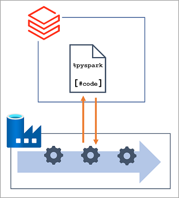

In Azure Databricks, you can use notebooks to run code written in Python, Scala, SQL, and other languages to ingest and process data. Notebooks provide an interactive interface in which you can run individual code cells and use Markdown to include notes and annotations.

In many data engineering solutions, code that is written and tested interactively can later be incorporated into an automated data processing workload. On Azure, such workloads are often implemented as *pipelines* in Azure Data Factory, in which one or more *activities* are used to orchestrate a series of tasks that can be run on-demand, at scheduled intervals, or in response to an event (such as new data being loaded into a folder in a data lake). Azure Data Factory supports a **Notebook** activity that can be used to automate the unattended execution of a notebook in an Azure Databricks workspace.

> [!NOTE]
> The same **Notebook** activity is available in pipelines built in Azure Synapse Analytics.
