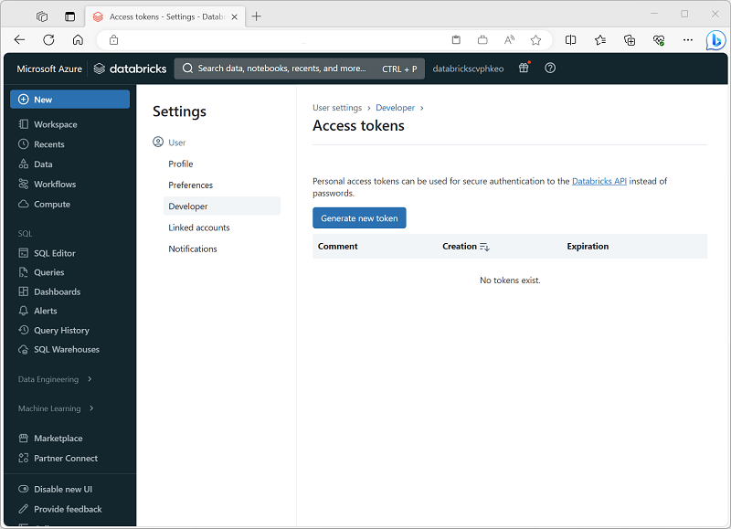

To run notebooks in an Azure Databricks workspace, the Azure Data Factory pipeline must be able to connect to the workspace; which requires authentication. To enable this authenticated connection, you must perform two configuration tasks:

1. Generate an *access token* for your Azure Databricks workspace.
2. Create a *linked service* in your Azure Data Factory resource that uses the access token to connect to Azure Databricks.

## Generating an access token

An access token provides an authentication method for Azure Databricks as an alternative to credentials on the form of a user name and password. You can generate access tokens for applications, specifying an expiration period after which the token must be regenerated and updated in the client applications.

To create an Access token, use the **Generate new token** option on the **Developer** tab of the **User Settings** page in Azure Databricks portal.

## Creating a linked service

To connect to Azure Databricks from Azure Data Factory, you need to create a linked service for **Azure Databricks** compute. You can create a linked service in the **Linked services** page in the **Manage** section of Azure Data Factory Studio.

When you create an **Azure Databricks** linked service, you must specify the following configuration settings:

| Setting | Description |
|--|--|
| Name | A unique name for the linked service |
| Description | A meaningful description |
| Integration runtime | The integration runtime used to run activities in this linked service. See [Integration runtime in Azure Data Factory](/azure/data-factory/concepts-integration-runtime) for more details. |
| Azure subscription | The Azure subscription in which Azure Databricks is provisioned |
| Databricks workspace | The Azure Databricks workspace |
| Cluster | The Spark cluster on which activity code will be run. You can have Azure Databricks dynamically provision a *job cluster* on-demand or you can specify an existing cluster in the workspace. |
| Authentication type | How the linked connection will be authenticated by Azure Databricks. For example, using an access token (in which case, you need to specify the access token you generated for your workspace). |
| Cluster configuration | The Databricks runtime version, Python version, worker node type, and number of worker nodes for your cluster. |
