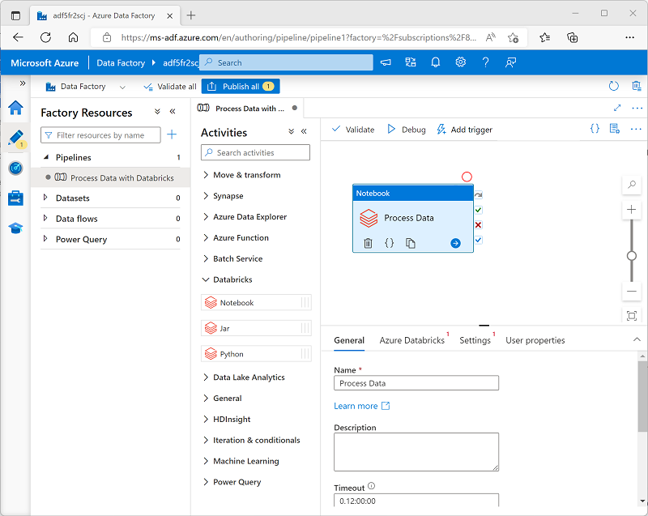

After you've created a linked service in Azure Data Factory for your Azure Databricks workspace, you can use it to define the connection for a **Notebook** activity in a pipeline.

To use a **Notebook** activity, create a pipeline and from the **Databricks** category, add a **Notebook** activity to the pipeline designer surface.

Use the following properties of the **Notebook** activity to configure it:

| Category | Setting | Descriptions |
|--|--|--|
|**General** | Name | A unique name for the activity. |
|| Description | A meaningful description. |
|| Timeout | How long the activity should run before automatically canceling. |
|| Retries | How many times should Azure Data Factory try before failing. |
|| Retry interval | How long to wait before retrying. |
|| Secure input and output | Determines if input and output values are logged. |
|**Azure Databricks** | Azure Databricks linked service | The linked service for the Azure Databricks workspace containing the notebook. |
| **Settings** | Notebook path | The path to the notebook file in the Workspace. |
|| Base parameters | Used to pass parameters to the notebook. |
|| Append libraries | Required code libraries that aren't installed by default. |
| **User properties** | | Custom user-defined properties. |

## Running a pipeline

When the pipeline containing the **Notebook** activity is published, you can run it by defining a trigger. You can then monitor pipeline runs in the **Monitor** section of Azure Data Factory Studio.