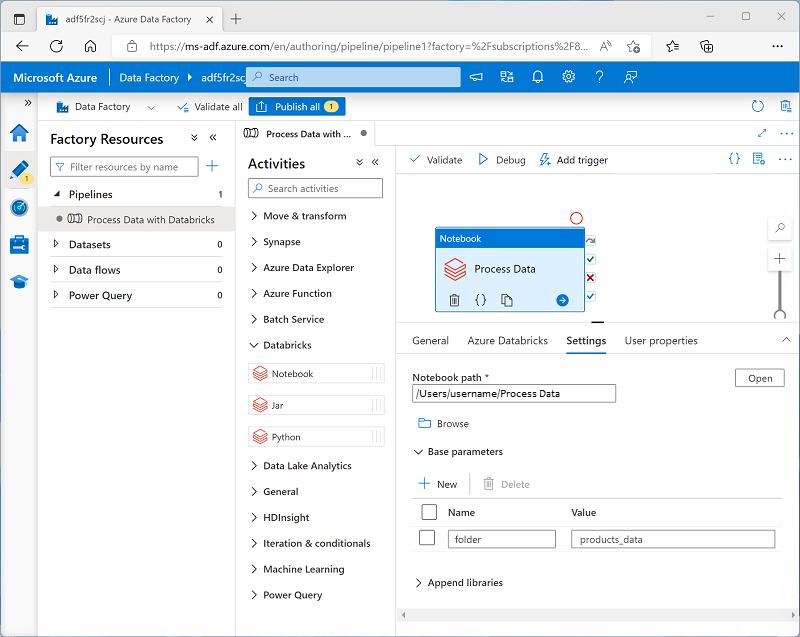

You can use parameters to pass variable values to a notebook from the pipeline. Parameterization enables greater flexibility than using hard-coded values in the notebook code.

## Using parameters in a notebook

To define and use parameters in a notebook, use the **dbutils.widgets** library in your notebook code.

For example, the following Python code defines a variable named **folder** and assigns a default value of *data*:

```python
dbutils.widgets.text("folder", "data")
```

To retrieve a parameter value, use the **get** function, like this:

```python
folder = dbutils.widgets.get("folder")
```

The **get** function will retrieve the value for the specific parameter that was passed to the notebook. If no such parameter was passed, it will get the default value of the variable you declared previously.

### Passing output values

In addition to using parameters that can be passed *in* to a notebook, you can pass values *out* to the calling application by using the **notebook.exit** function, as shown here:

```python
path = "dbfs:/{0}/products.csv".format(folder)
dbutils.notebook.exit(path)
```

## Setting parameter values in a pipeline

To pass parameter values to a **Notebook** activity, add each parameter to the activity's **Base parameters**, as shown here:



In this example, the parameter value is explicitly specified as a property of the **Notebook** activity. You could also define a *pipeline* parameter and assign its value dynamically to the **Notebook** activity's base parameter; adding a further level of abstraction.

> [!TIP]
> For more information about using parameters in Azure Data Factory, see [How to use parameters, expressions and functions in Azure Data Factory](/azure/data-factory/how-to-expression-language-functions) in the Azure Data Factory documentation.
