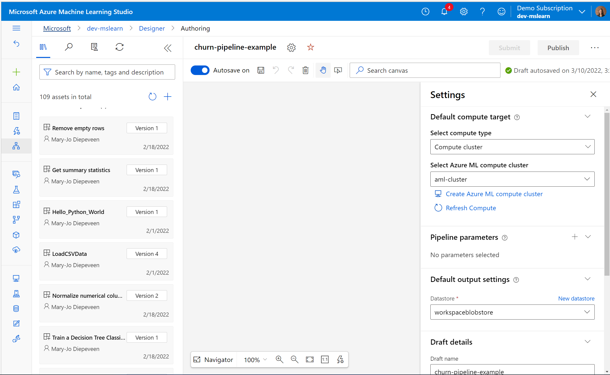
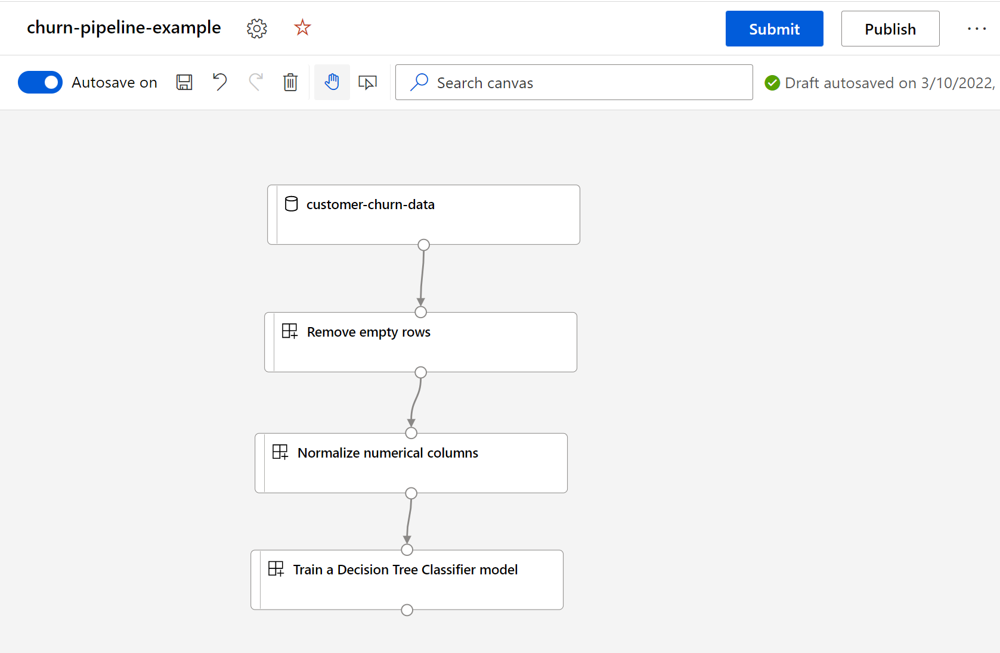

The Azure Machine Learning designer allows you to create component-based pipelines to combine machine learning tasks.

Some data scientists may want to quickly iterate over different configurations for machine learning workflows. In other words, they want to create several components-based pipelines easily and run the pipelines to compare models. Instead of using the CLI (v2), data scientists can use the more user-friendly Azure Machine Learning designer to create a pipeline.

You'll create the pipeline using the Azure Machine Learning designer.

## Create a pipeline

You already created components in an Azure Machine Learning workspace and now want to use the components to create a pipeline to train a model.

You'll create the pipeline with the designer of the Azure Machine Learning studio, which you can find at [https://ml.azure.com](https://ml.azure.com).

Under **Components** in the Azure Machine Learning studio you'll find the existing components:

You want to create a pipeline that consists of three components, and thus three steps in the machine learning workflow:

1. Fix missing data
2. Normalize the data
3. Train a decision tree model

You can create a new empty pipeline in the **Designer** tab in the Azure Machine Learning studio. For each new pipeline you need to specify:

- The pipeline name
- The default compute target
- The default datastore to which output will be saved

To create a workflow for the pipeline, you can find your custom components in the menu on the left of the canvas in your designer pipeline.

To use a component, drag and drop it onto the canvas. If you want to use a dataset as input, ensure the dataset is registered to the workspace and a component for that dataset is automatically created in the designer.

To specify which input you want for a component, connect an output port of another component to the input port of the component. Once all components are connected, you'll have a pipeline similar to the example below:

To run the pipeline, select the **Submit** button and specify whether you want to use an existing experiment or create a new experiment name. 

You can track the progress of the pipeline in the designer. The execution of the pipeline can also be tracked in the **Experiments** tab. 

> [!NOTE]
> An experiment run is created for the pipeline and can be found under the experiment name you specified when submitting the pipeline. Additionally, each component will run as a job and will be represented as a **child run** to the pipeline's experiment run. 
> If an error occurs, it may be more informative to investigate the child run of the component that failed and check its logs.

