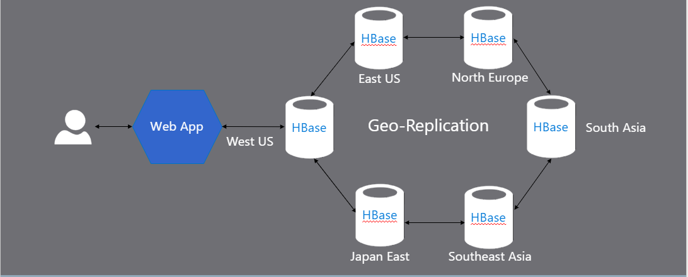
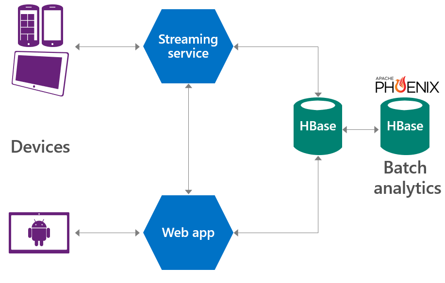

Below is a sample architecture pattern that customers have used with HDInsight HBase. 

## Highly available key value stores 

Highly available low latency Key value stores are used in messaging and content management systems. The global availability of HDInsight HBase with real-time replication capabilities has been used to create a real time highly available Key value stores  data store.

Example of such implementations could involve chat messaging systems, content management systems, and web tables.

   

## Low latency sensor data

Low latency sensor data systems can be used for Social analytics, Time series Databases, and Interactive dashboards with trends, counters etc. The low latency read and write capabilities of HBase combined with the SQL querying capabilities of Apache Phoenix are used to run real-time queries on sensor data. 

Example of such implementations could involve Social analytics, Time series databases, Interactive dashboards with trends, counters, and Audit log systems.

 