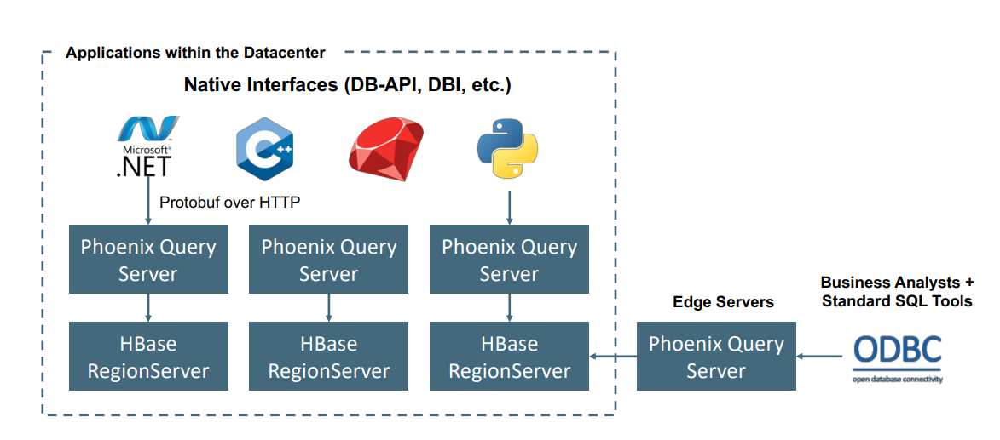
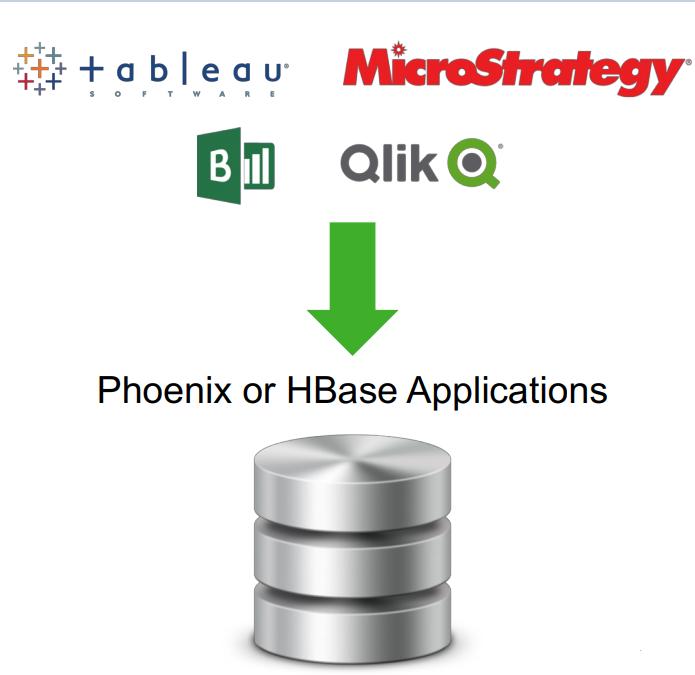

HBase clusters on HDInsight come with Apache Phoenix. [Apache Phoenix](https://phoenix.apache.org/) is an open source, massively parallel relational database layer built on [Apache HBase](https://docs.microsoft.com/azure/hdinsight/hbase/apache-hbase-overview). Apache Phoenix allows you to use SQL-like queries over HBase. It uses JDBC drivers underneath to enable users to create, delete, and alter SQL tables. You can also index, create views and sequences, and upsert rows individually and in bulk. Phoenix uses noSQL native compilation rather than using MapReduce to compile queries, enabling the creation of low-latency applications on top of HBase. Phoenix adds coprocessors to support running client-supplied code in the address space of the server, executing the code colocated with the data. This approach minimizes client/server data transfer. For more information, see the [Apache Phoenix documentation](https://phoenix.apache.org/).

 

Apache Phoenix on HDInsight HBase is typically used to enable self-service analytics and extract insights as depicted below. Phoenix can plug into any ODBC compatible BI tool and enable ad-hoc SQL analytics on HBase.  

 

Combining Apache HBase and Phoenix can be used as a datastore for mutable data. The Apache Phoenix querying engine on HBase comes with some important features.

## Secondary indexes

Records in HBase are accessed using the primary row key using a single index that’s lexicographically sorted on the primary row key. If you try to access records in any way other than the primary row, that would lead to inefficient scanning of all the data in the HBase table. Apache Phoenix allows you to create secondary indexes on columns and expressions to create alternate row keys to allow point lookups or range scans along this new index. For more information, see the [Apache Phoenix Secondary Indexes documentation](http://phoenix.apache.org/secondary_indexing.html). 

The CREATE INDEX command is used to create secondary indexes in HBase as shows below. 

```SQL
CREATE INDEX ix_purchasetype on SALTEDWEBLOGS (purchasetype, transactiondate) INCLUDE (bookname, quantity); 
```

## Views

Limiting the number of physical tables in HBase and in turn limiting the number of regions is a recommended strategy. Views in Phoenix help this recommendation by allowing for the creation of multiple virtual tables sharing the same underlying physical table on HBase. For more information, see the [Apache Phoenix Views documentation](http://phoenix.apache.org/views.html).

Given the below Table definition in HBase.

```SQL
CREATE  TABLE product_metrics (
    metric_type CHAR(1),
    created_by VARCHAR,
    created_date DATE,
    metric_id INTEGER
    CONSTRAINT pk PRIMARY KEY (metric_type, created_by, created_date, metric_id));
```

You can define the following view.

```SQL
CREATE VIEW mobile_product_metrics (carrier VARCHAR, dropped_calls BIGINT) AS SELECT * FROM product_metric WHERE metric_type = 'm';
```

## Transactions

While HBase works with row level transactions only, Apache Phoenix enables cross table and cross row transactions with full ACID support by integrating with Apache Tephra.

For more information, see the [Apache Phoenix Transactions documentation](https://phoenix.apache.org/transactions.html)

The following example creates a table named my_table, and then altering the table to enable transactions.

```SQL
CREATE TABLE my_table (k BIGINT PRIMARY KEY, v VARCHAR) TRANSACTIONAL=true;

ALTER TABLE my_other_table SET TRANSACTIONAL=true;
```

## Salted Tables

Region Server hotspotting in HBase can occur during sequential writes if the row keys increase monotonically. Apache Phoenix can alleviate the hotspotting by providing a way to salt the row key with a salting byte for a particular table. For more information, refer to the Apache Phoenix Salted Table documentation. 

```SQL
CREATE TABLE Saltedweblogs (
    transactionid varchar(500) Primary Key,
    transactiondate Date NULL,
    customerid varchar(50) NULL,
    bookid varchar(50) NULL,
    purchasetype varchar(50) NULL,
    orderid varchar(50) NULL,
    bookname varchar(50) NULL,
    categoryname varchar(50) NULL,
    invoicenumber varchar(50) NULL,
    invoicestatus varchar(50) NULL,
    city varchar(50) NULL,
    state varchar(50) NULL,
    paymentamount DOUBLE NULL,
    quantity INTEGER NULL,
    shippingamount DOUBLE NULL) SALT_BUCKETS=4;
```

## Skip Scan

For a given set of rows, Apache Phoenix uses Skip Scan for intra-row scanning over a Range Scan for improved performance. Skip Scan leverages the SEEK_NEXT_USING_HINT HBase Filter. It stores information about what set of keys/ranges of keys are being searched for in each column. It then takes a key (passed to it during filter evaluation), and figures out if it’s in one of the combinations or range or not. If not, it figures out to which next highest key to jump. For more information, see the [Apache Phoenix Skip Scan documentation](http://phoenix.apache.org/skip_scan.html). 

Performance optimization on Apache Phoenix is an optional requested feature and is mostly dependent on optimize HBase performance underneath. Performance optimization is a complex topic and is beyond the scope of this course. However if you are interested, you could refer the documentation on [Apache Phoenix Performance best practices](https://docs.microsoft.com/azure/hdinsight/hbase/apache-hbase-phoenix-performance).
