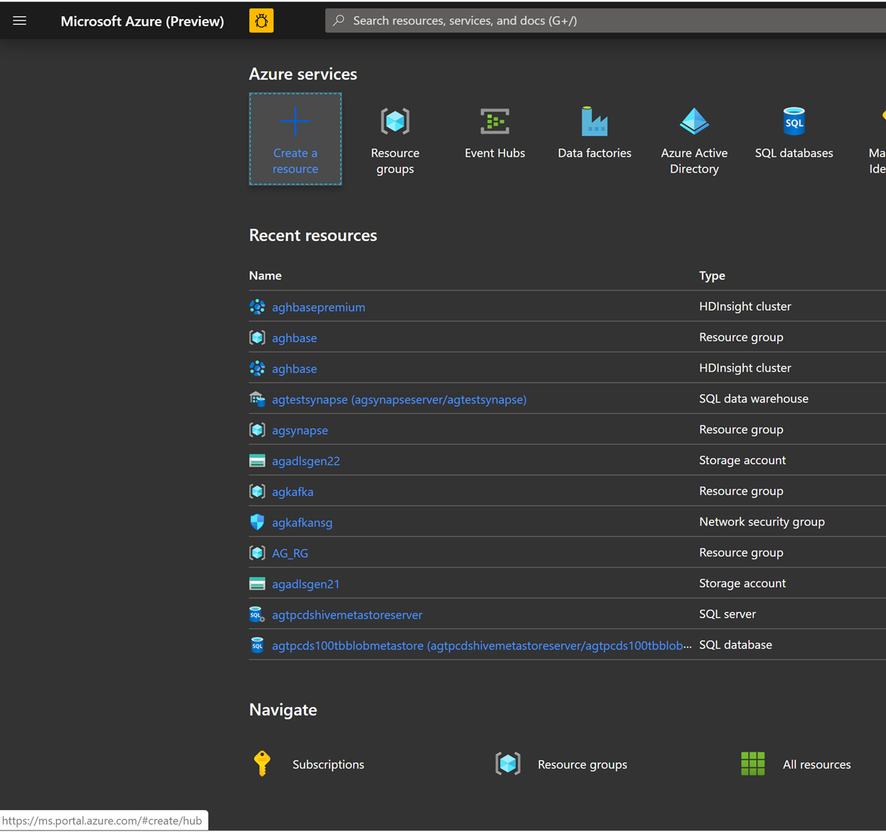
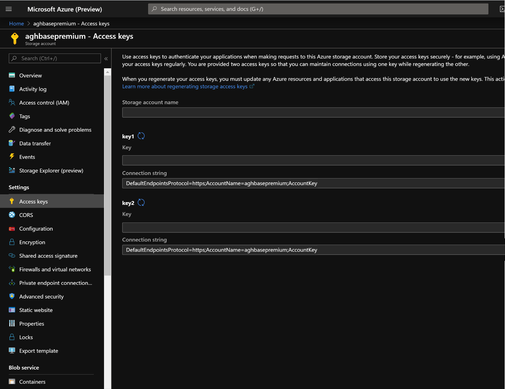
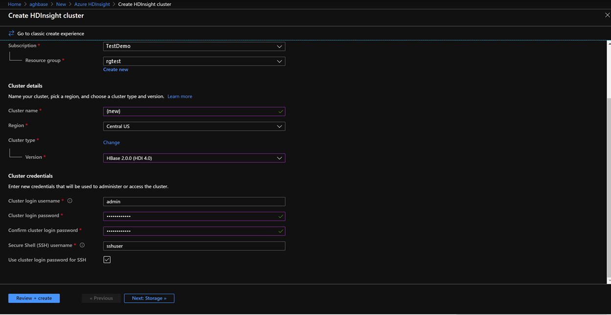
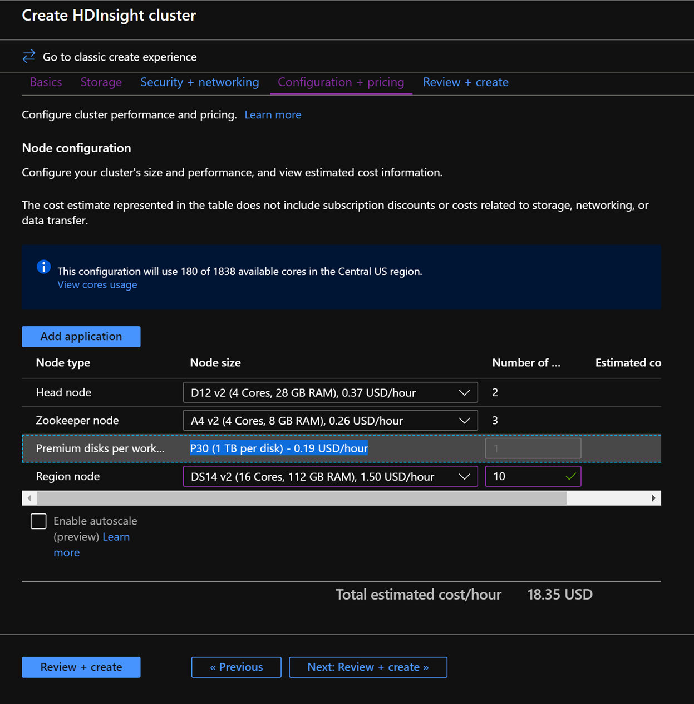
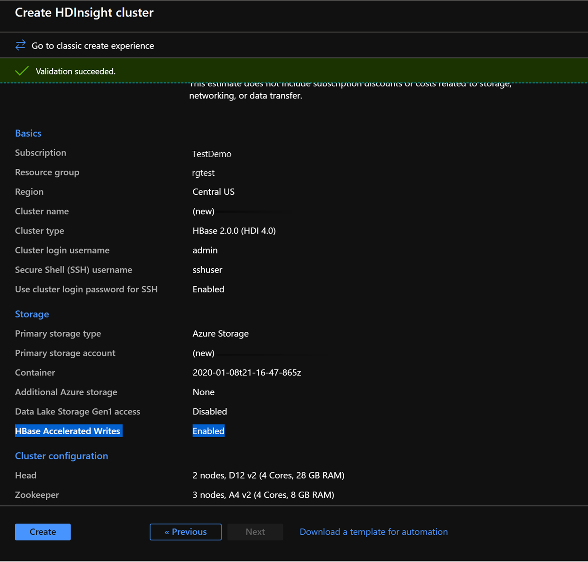
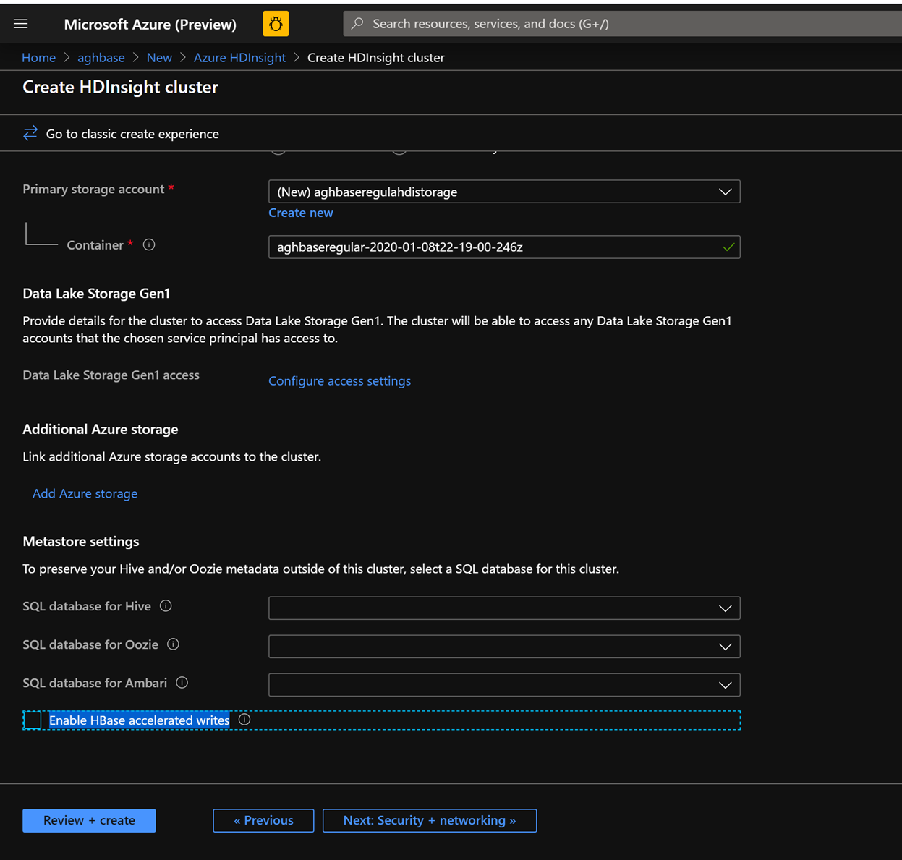
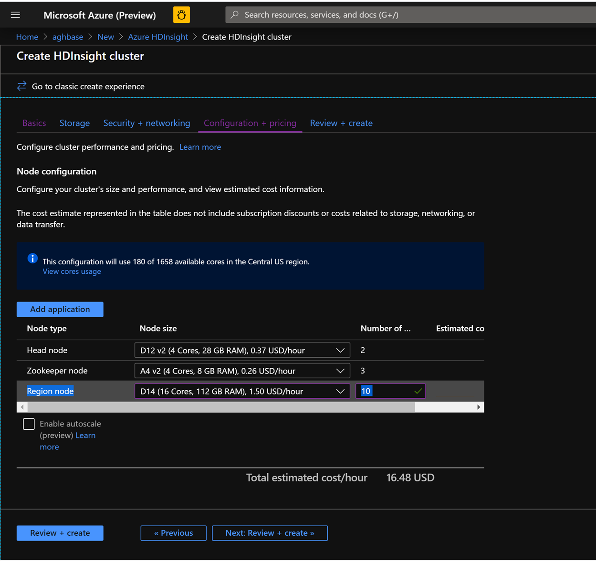

To provision HDInsight HBase with the new experience on Azure Management Portal, perform the below steps.

1. Go to the Azure portal portal.azure.com. Login using your Azure account credentials. 

	 

1. We would start with creating a **Premium Block Blob Storage Account**. From the New Page, click on **Storage**. 

	

1. In the Create Storage Account page, populate the below fields.
	- **Subscription**: Should be autopopulated with the subscription details
	- **Resource Group**: Enter a resource group for holding your HDInsight HBase deployment
	- **Storage account name**: Enter a name for your storage account for use in the premium cluster.
	- **Region**: Enter the name of the region of deployment(ensure that cluster and storage account are in the same region)
	- **Performance**: Premium
	- **Account kind**: BlockBlobStorage
	- **Replication**: Locally redundant storage(LRS)
	- **Cluster login username**: Enter username for cluster administrator(default:admin) 

		

1. Leave all other tabs at default and click on **Review + create** to create the storage account.

1. After the storage account is created, click on **Access Keys** on the left and copy **key1**. We would use this later in the cluster creation process. 

	

1. Lets now start deploying an HDInsight HBase cluster with Accelerated writes. Select **Create a resource -> Analytics -> HDInsight**

	

1. On the Basics Tab, populate the below fields towards the creation of an HBase cluster.
	- **Subscription**: Should be autopopulated with the subscription details
	- **Resource Group**: Enter a resource group for holding your HDInsight HBase deployment
	- **Cluster Name**: Enter the cluster name. A green tick will appear if the cluster name is available.
	- **Region**: Enter the name of the region of deployment
	- **Cluster Type**: Cluster Type - HBase Version- HBase 2.0.0(HDI 4.0)
	- **Cluster login username**: Enter username for cluster administrator(default:admin)
	- **Cluster login password**: Enter password for cluster login(default:sshuser)
	- **Confirm Cluster login password**: Confirm the password entered in the last step
	- **Secure Shell(SSH) username**: Enter the SSH login user (default:sshuser)
	- **Use cluster login password for SSH**: Check the box to use the same password for both SSH logins and Ambari Logins 

		

1. Click Next: Storage to launch the Storage Tab and populate the below fields
	- **Primary Storage Type**: Azure Storage.
	- **Selection Method**: Choose Radio button Use access key
	- **Storage account name**: Enter the name of the Premium Block Blob storage account created earlier
	- **Access Key**: Enter the key1 access key you copied earlier
	- **Container**: HDInsight should propose a default container name. You could either choose this or create a name of your own.

		

1. Leave the rest of the options untouched and scroll down to check the checkbox Enable HBase accelerated writes. (Note that we would later be creating a second cluster without accelerated writes using the same steps but with this box unchecked.)

	

1. Leave the **Security + Networking** blade to its default settings with no changes and go to the **Configuration + pricing** tab.

1. In the **Configuration + pricing** tab, note the **Node configuration** section now has a line Item titled **Premium disks per worker node**.

1. Choose the Region node to **10** and Node Size to **DS14v2**(__you could chooser smaller number and size also but ensure both the clusters have identical number of nodes and VM SKU to ensure parity in comparison__)

	

1. Click **Next**: **Review + Create**

1. In the Review and Create tab, ensure that **HBase Accelerated Writes** is Enabled under the **Storage** section.

	

1. Click **Create** to start deploying the first cluster with Accelerated Writes.

1. Repeat the same steps again to create a second HDInsight HBase cluster, this time without Accelerated writes. Note the below changes
	- Use a normal blob storage account that is recommended by default
	- Keep the **Enable Accelerated Writes** checkbox unchecked on the Storage tab.

	

1. In the **Configuration + pricing** tab for this cluster, note that the **Node configuration** section does NOT have a **Premium disks per worker node** line item.

1. Choose the Region node to **10** and Node Size to **D14v2**. Also note the lack of DS series VM types like earlier.

	

1. Click **Create** to start deploying the second cluster without Accelerated Writes.

1. Now that we are done with cluster deployments, in the next section we would set up and run YCSB tests on both these clusters.
