The **Yahoo! Cloud Serving Benchmark** (YCSB) is an open-source specification and program suite for evaluating relative performance of NoSQL database management systems. In this exercise, you will run the benchmark to the performance of two HBase clusters one of which is using accelerated writes feature. Your task is to understand the performance differences between the two options.
Exercise Prerequisites

If you wish to perform the steps in the exercise, ensure you have the below:

- Azure subscription with authorization to create an HDInsight HBase cluster.
- Access to an SSH client like Putty(Windows) /Terminal(Mac book)

## Provision HDInsight HBase cluster with Azure Management Portal

To provision HDInsight HBase with the new experience on Azure Management Portal, perform the below steps.

1. Go to the [Azure portal](https://portal.azure.com). Log in using your Azure account credentials.

	

1. We would start with creating a **Premium Block Blob Storage Account**. From the New Page, click on **Storage Account**.

	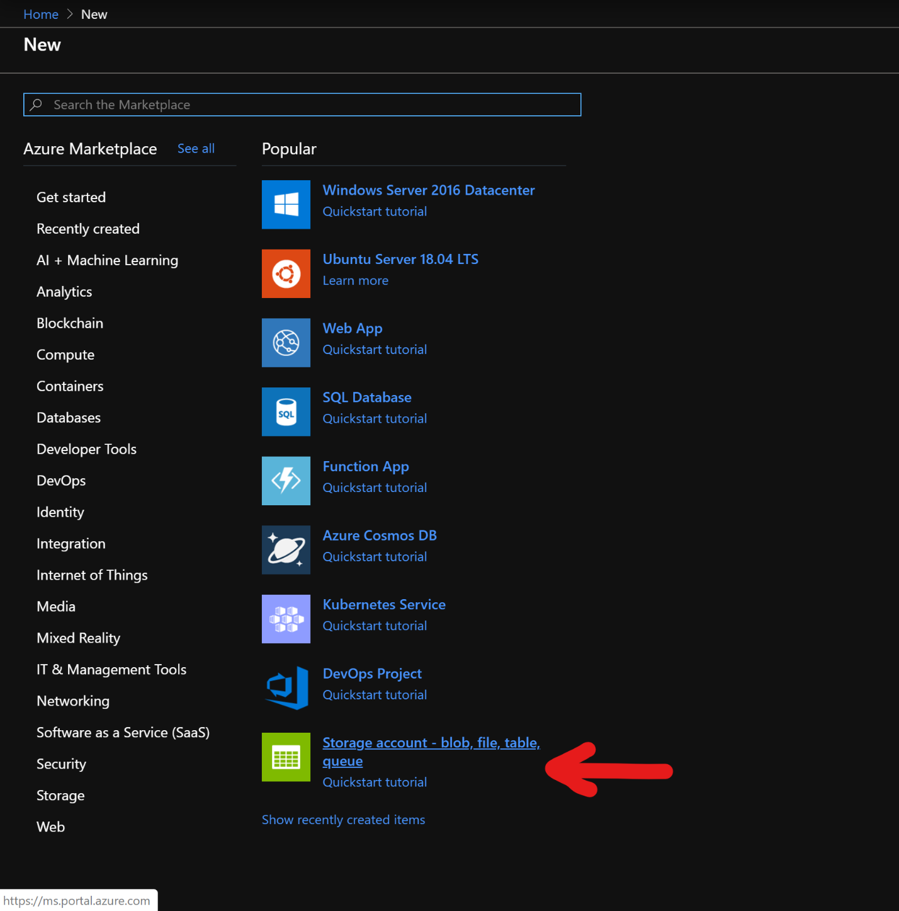

1. In the Create Storage Account page, populate the below fields

	- **Subscription**: Should be autopopulated with the subscription details
	- **Resource Group**: Enter a resource group for holding your HDInsight HBase deployment
	- **Storage account name**: Enter a name for your storage account for use in the premium cluster.
	- **Region**: Enter the name of the region of deployment(ensure that cluster and storage account are in the same region)
	- **Performance**: Premium
	- **Account kind**: BlockBlobStorage
	- **Replication**: Locally redundant storage(LRS)
	- **Cluster log in username**: Enter username for cluster administrator(default:admin)

		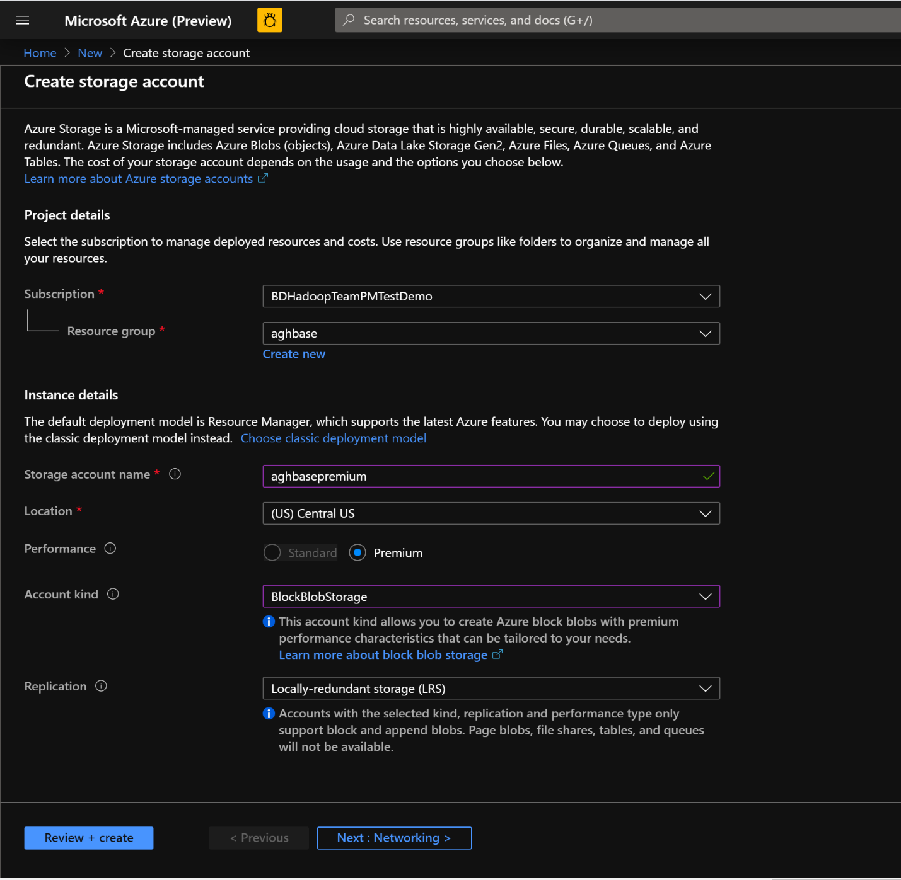

1. Leave all other tabs at default and click on **Review + create** to create the storage account.

1. After the storage account is created, click on **Access Keys** on the left and copy **key1**. We would use this later in the cluster creation process.

	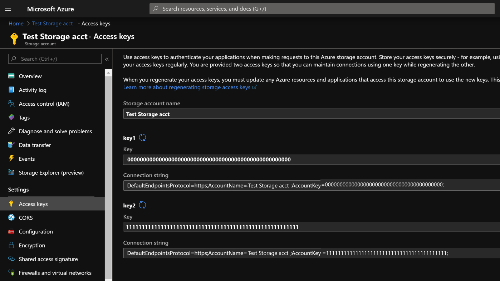

1. Let’s now start deploying an HDInsight HBase cluster with Accelerated writes. Select **Create a resource -> Analytics -> HDInsight**

	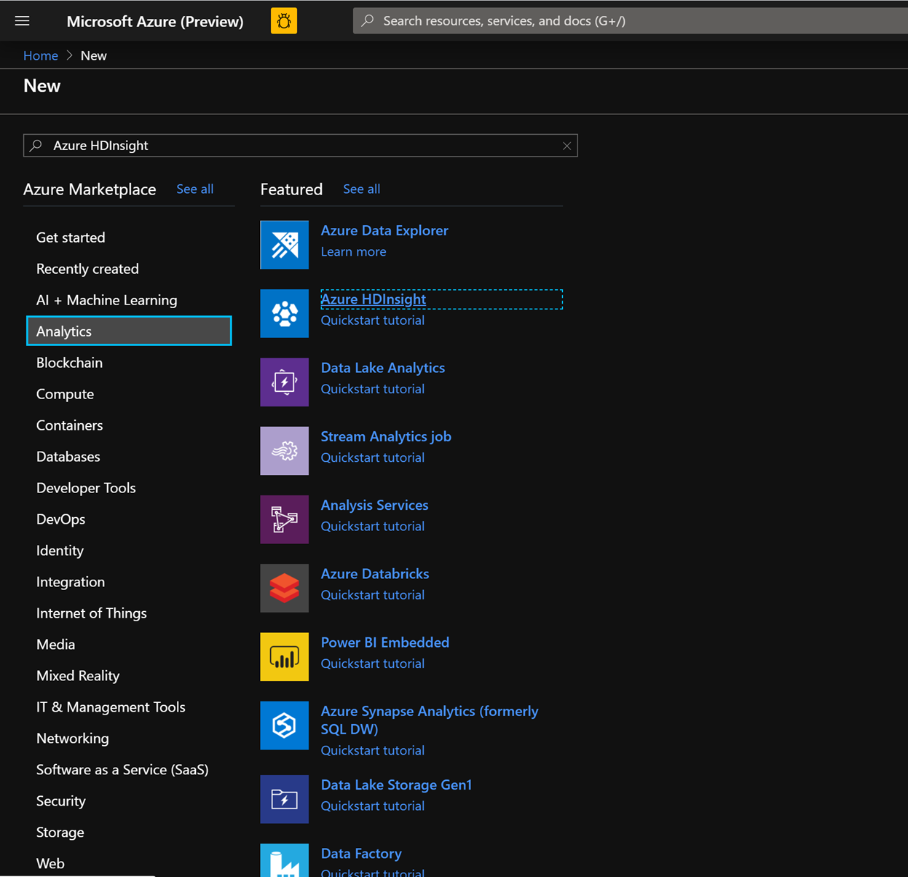

1. On the Basics Tab, populate the below fields towards the creation of an HBase cluster.
	- **Subscription**: Should be autopopulated with the subscription details
	- **Resource Group**: Enter a resource group for holding your HDInsight HBase deployment
	- **Cluster Name**: Enter the cluster name. A green tick will appear if the cluster name is available.
	- **Region**: Enter the name of the region of deployment
	- **Cluster Type**: Cluster Type - HBase. Version- HBase 2.0.0(HDI 4.0)
	- **Cluster log in username**: Enter username for cluster administrator(default:admin)
	- **Cluster log in password**: Enter password for cluster login(default:sshuser)
	- **Confirm Cluster log in password**: Confirm the password entered in the last step
	- **Secure Shell(SSH) username**: Enter the SSH log in user (default:sshuser)
	- **Use cluster log in password for SSH**: Check the box to use the same password for both SSH logins and Ambari Logins etc.

		[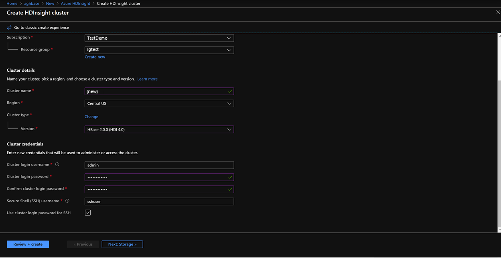](../media/define-hdinsight-settings.png#lightbox)

1. Click **Next:Storage** to launch the Storage Tab and populate the below fields
	- **Primary Storage Type**: Azure Storage.
	- **Selection Method**: Choose Radio button Use access key
	- **Storage account name**: Enter the name of the Premium Block Blob storage account created earlier
	- **Access Key**: Enter the key1 access key you copied earlier
	- **Container**: HDInsight should propose a default container name. You could either choose this or create a name of your own.

		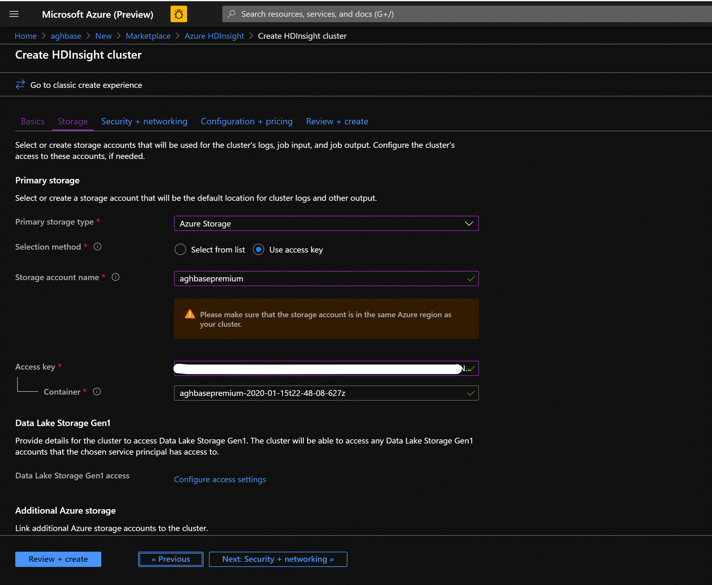

1. Leave the rest of the options untouched and scroll down to check the checkbox Enable HBase accelerated writes.(Note that we would later be creating a second cluster without accelerated writes using the same steps but with this box unchecked.)

	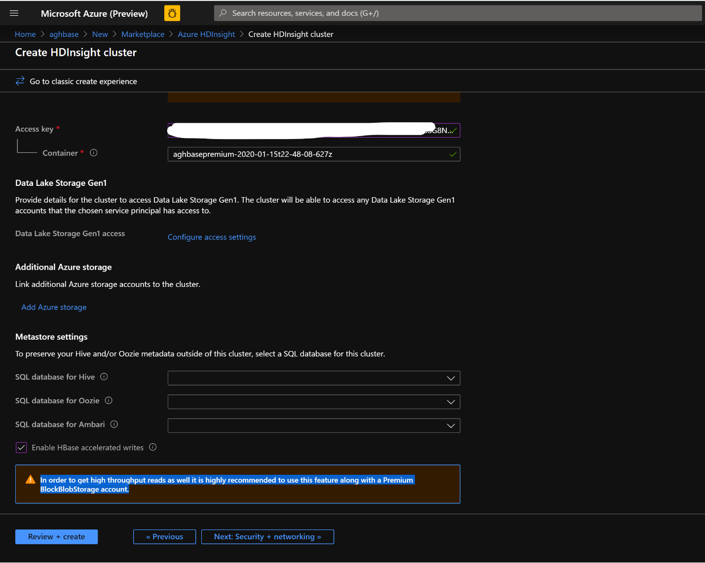

1. Leave the **Security + Networking** blade to its default settings with no changes and go to the **Configuration + pricing** tab.

1. In the **Configuration + pricing** tab, note the **Node configuration** section now has a line Item titled **Premium disks per worker node**.

1. Choose the Region node to **10** and **Node Size** to **DS14v2**(you could chooser smaller numbers of VMs and smaller VM SKU but ensure that both the clusters have identical number of nodes and VM SKU to ensure parity in comparison)

	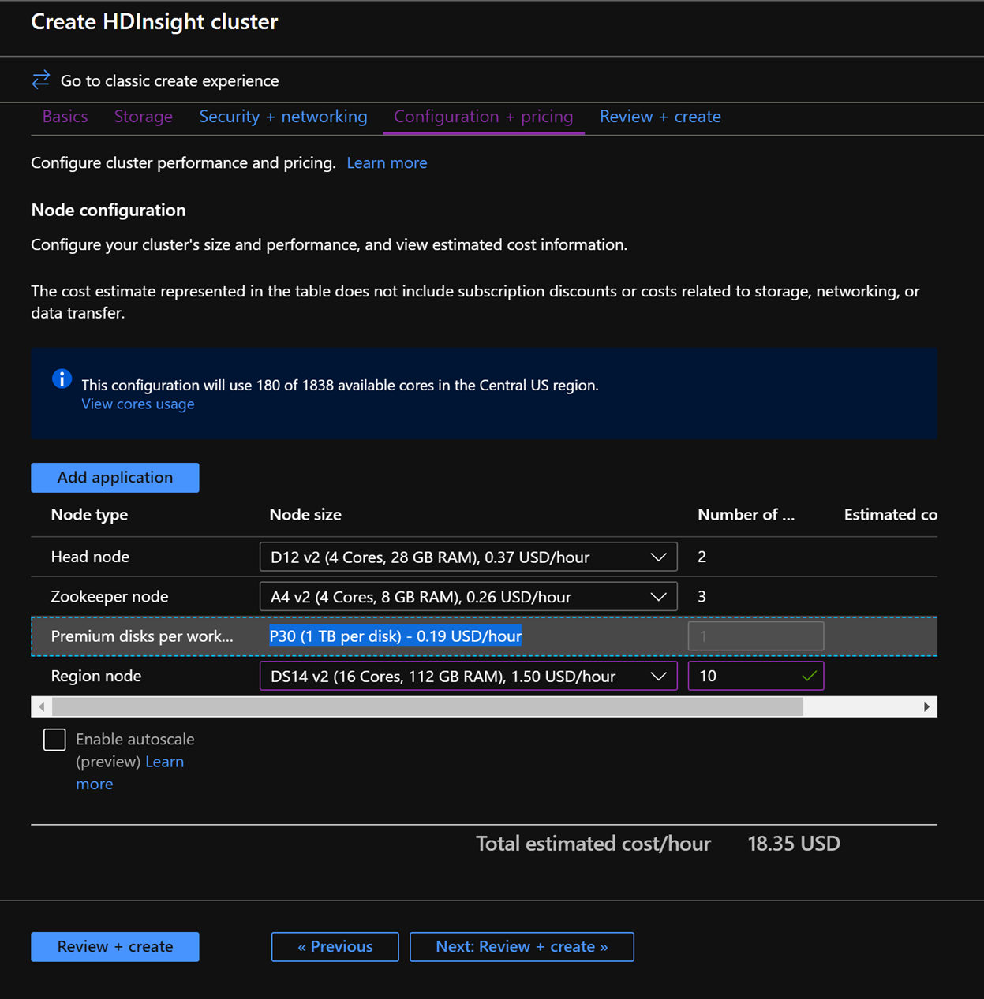

1. Click **Next: Review + Create**

1. In the Review and Create tab, ensure that **HBase Accelerated Writes** is Enabled under the **Storage** section.

	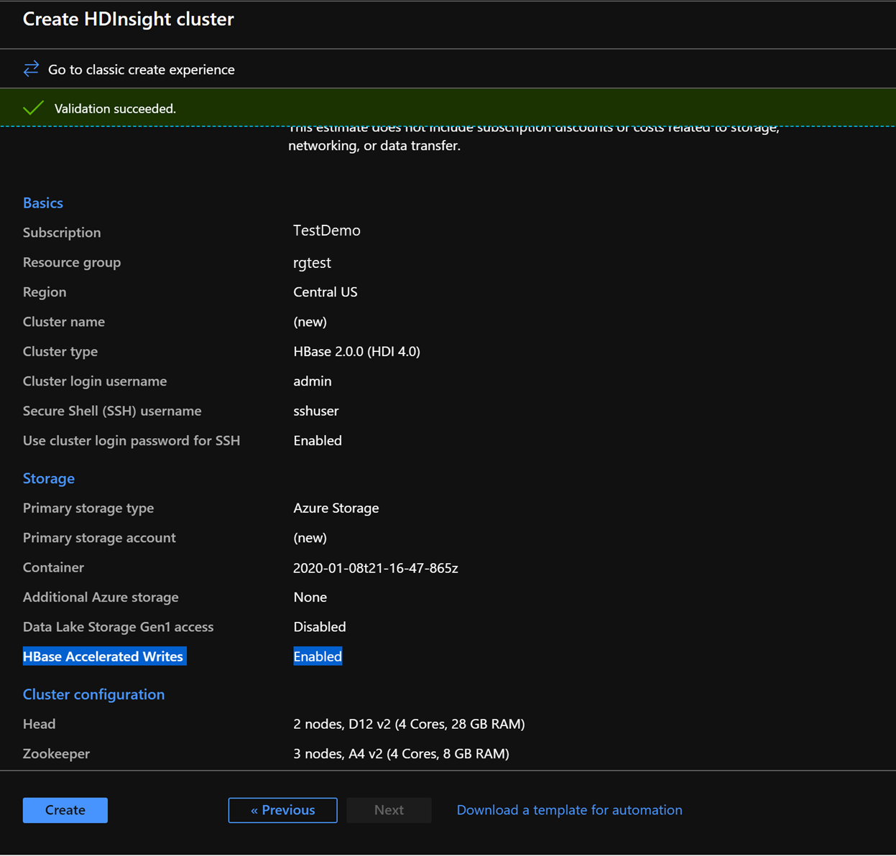

1. Click **Create** to start deploying the first cluster with Accelerated Writes.

1. Repeat the same steps again to create a second HDInsight HBase cluster, this time without Accelerated writes. Note the below changes
	- Use a normal blob storage account that is recommended by default
	- Keep the Enable Accelerated Writes checkbox unchecked on the Storage tab.

		

1. In the **Configuration + pricing** tab for this cluster, note that the Node configuration section does NOT have a **Premium disks per worker node** line item.

1. Choose the Region node to **10** and Node Size to **D14v2**.(Also note the lack of DS series VM types like earlier). (you could chooser smaller numbers of VMs and smaller VM SKU but ensure that both the clusters have identical number of nodes and VM SKU to ensure parity in comparison)

	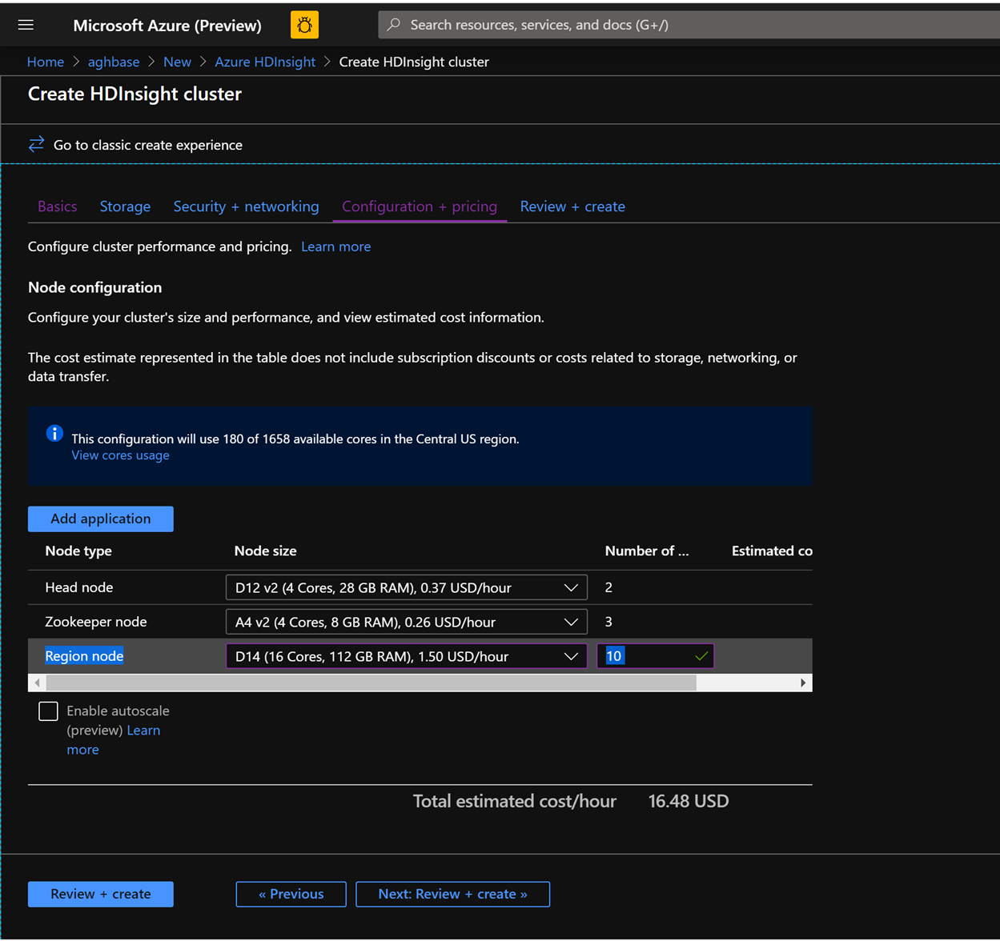

1. Click **Create** to start deploying the second cluster without Accelerated Writes.

1. Now that we are done with cluster deployments, in the next section we would set up and run YCSB tests on both these clusters.


##  Running YCSB tests

1. Log in to HDInsight shell
	- Steps to set up and run YCSB tests on both clusters are identical.
	- On the cluster page on the Azure portal , navigate to the SSH + Cluster log in and use the Hostname and SSH path to ssh into the cluster. The path should have below format.
	- ssh <sshuser>@<clustername>.azurehdinsight.net 

		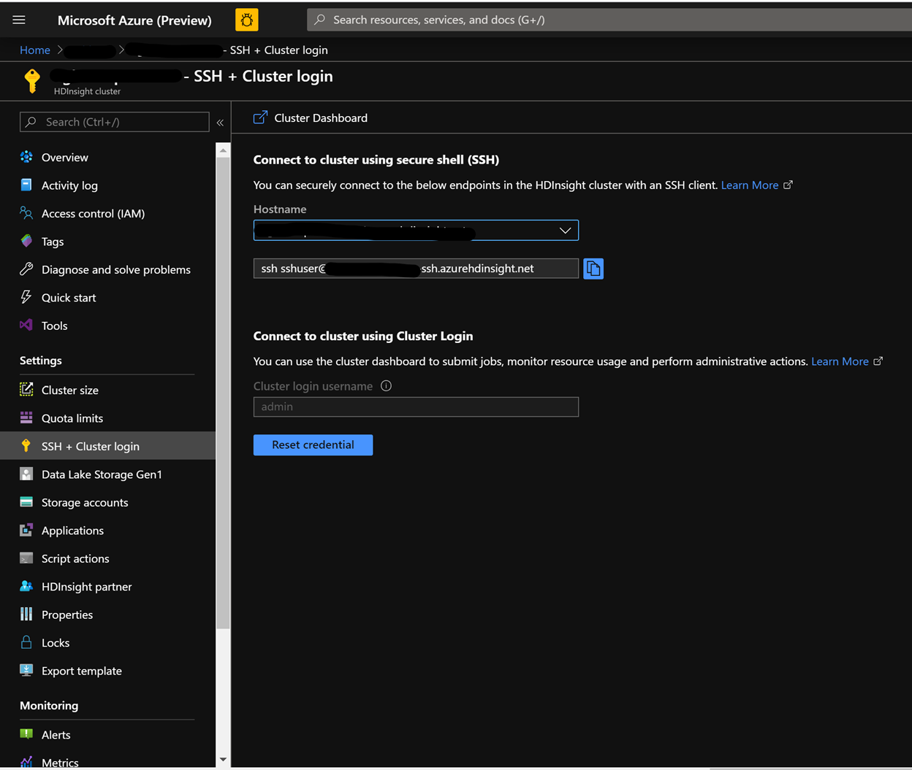


1. Create the Table
	- Run the below steps to create the HBase tables, which will be used to load the datasets
	- Launch the HBase Shell and set a parameter for the number of table splits. Set the table splits (10 * Number of Region Servers)
	- Create the HBase table, which would be used to run the tests
	- Exit the HBase shell

		```CMD
		hbase(main):018:0> n_splits = 100
		hbase(main):019:0> create 'usertable', 'cf', {SPLITS => (1..n_splits).map {|i| "user#{1000+i*(9999-1000)/n_splits}"}}
		hbase(main):020:0> exit
		```

1. Download the YSCB Repo

	- Download the YCSB repository from the below destination

		```CMD
		$ curl -O --location https://github.com/brianfrankcooper/YCSB/releases/download/0.17.0/ycsb-0.17.0.tar.gz 
		```

	- Unzip the folder to access the contents

		```CMD
		$ tar xfvz ycsb-0.17.0.tar.gz 
		```

	- This would create a ycsb-0.17.0 folder. Move into this folder


1. Run a write heavy workload in both clusters

	- Use the below command to initiate a write heavy workload with the below parameters
		- **workloads/workloada** : Indicates that the append workload/workloada needs to be run
		- **table**: Populate the name of your HBase table created earlier
		- **columnfamily**: Populate the value of the HBase columfamily name from the table you created
		- **recordcount**: Number of records to be inserted( we use 1 Million)
		- **threadcount**: Number of threads( this can be varied, but needs to be kept constant across experiments)
		- **-cp /etc/hbase/conf**: Pointer to HBase config settings
		- **-s | tee -a**: Provide a file name to write your output.
 
			```CMD
			bin/ycsb load hbase12 -P workloads/workloada -p table=usertable -p columnfamily=cf -p recordcount=1000000 -p threadcount=4 -cp /etc/hbase/conf -s | tee -a workloada.dat
			```

	- Run the write heavy workload to load 1 million rows into previously created HBase table.
	
	> [!NOTE]
	> Ignore the warnings that you may see after submitting the command.

### Example results for HDInsight HBase with accelerated writes

1. Run the following command:

		```CMD
		$ bin/ycsb load hbase12 -P workloads/workloada -p table=usertable -p columnfamily=cf -p recordcount=1000000 -p threadcount=4 -cp /etc/hbase/conf -s | tee -a workloada.dat 
		```
1. Read the results:

		```CMD
		2020-01-10 16:21:40:213 10 sec: 15451 operations; 1545.1 current ops/sec; est completion in 10 minutes [INSERT: Count=15452, Max=120319, Min=1249, Avg=2312.21, 90=2625, 99=7915, 99.9=19551, 99.99=113855]
		2020-01-10 16:21:50:213 20 sec: 34012 operations; 1856.1 current ops/sec; est completion in 9 minutes [INSERT: Count=18560, Max=305663, Min=1230, Avg=2146.57, 90=2341, 99=5975, 99.9=11151, 99.99=296703]
		....
		2020-01-10 16:30:10:213 520 sec: 972048 operations; 1866.7 current ops/sec; est completion in 15 seconds [INSERT: Count=18667, Max=91199, Min=1209, Avg=2140.52, 90=2469, 99=7091, 99.9=22591, 99.99=66239]
		2020-01-10 16:30:20:214 530 sec: 988005 operations; 1595.7 current ops/sec; est completion in 7 second [INSERT: Count=15957, Max=38847, Min=1257, Avg=2502.91, 90=3707, 99=8303, 99.9=21711, 99.99=38015]
		...
		...
		2020-01-11 00:22:06:192 564 sec: 1000000 operations; 1792.97 current ops/sec; [CLEANUP: Count=8, Max=80447, Min=5, Avg=10105.12, 90=268, 99=80447, 99.9=80447, 99.99=80447] [INSERT: Count=8512, Max=16639, Min=1200, Avg=2042.62, 90=2323, 99=6743, 99.9=11487, 99.99=16495]
		[OVERALL], RunTime(ms), 564748
		[OVERALL], Throughput(ops/sec), 1770.7012685303887
		[TOTAL_GCS_PS_Scavenge], Count, 871
		[TOTAL_GC_TIME_PS_Scavenge], Time(ms), 3116
		[TOTAL_GC_TIME_%_PS_Scavenge], Time(%), 0.5517505152740692
		[TOTAL_GCS_PS_MarkSweep], Count, 0
		[TOTAL_GC_TIME_PS_MarkSweep], Time(ms), 0
		[TOTAL_GC_TIME_%_PS_MarkSweep], Time(%), 0.0
		[TOTAL_GCs], Count, 871
		[TOTAL_GC_TIME], Time(ms), 3116
		[TOTAL_GC_TIME_%], Time(%), 0.5517505152740692
		[CLEANUP], Operations, 8
		[CLEANUP], AverageLatency(us), 10105.125
		[CLEANUP], MinLatency(us), 5
		[CLEANUP], MaxLatency(us), 80447
		[CLEANUP], 95thPercentileLatency(us), 80447
		[CLEANUP], 99thPercentileLatency(us), 80447
		[INSERT], Operations, 1000000
		[INSERT], AverageLatency(us), 2248.752362
		[INSERT], MinLatency(us), 1120
		[INSERT], MaxLatency(us), 498687
		[INSERT], 95thPercentileLatency(us), 3623
		[INSERT], 99thPercentileLatency(us), 7375
		[INSERT], Return=OK, 1000000
		```

1. Explore the outcome of the test. Some example observations from the results above can include:

	- The test took 538663(8.97 Minutes) milliseconds to run
	- Return=OK, 1000000 indicates that all 1 Million inputs were were successfully written, **
	- Write throughput was at 1856 operations per second
	- 95% of the inserts had a latency of 3389 milliseconds
	- Few inserts took more time , perhaps they were blocked by region severs due to the high workload

### Example results for HDInsight HBase without accelerated writes

1. Run the following command:

	```CMD
	$ bin/ycsb load hbase12 -P workloads/workloada -p table=usertable -p columnfamily=cf -p recordcount=1000000 -p threadcount=4 -cp /etc/hbase/conf -s | tee -a workloada.dat 
	```
1. Read the results:

	```CMD
	2020-01-10 23:58:20:475 2574 sec: 1000000 operations; 333.72 current ops/sec; [CLEANUP: Count=8, Max=79679, Min=4, Avg=9996.38, 90=239, 99=79679, 99.9  =79679, 99.99=79679] [INSERT: Count=1426, Max=39839, Min=6136, Avg=9289.47, 90=13071, 99=27535, 99.9=38655, 99.99=39839]
	[OVERALL], RunTime(ms), 2574273
	[OVERALL], Throughput(ops/sec), 388.45918828344935
	[TOTAL_GCS_PS_Scavenge], Count, 908
	[TOTAL_GC_TIME_PS_Scavenge], Time(ms), 3208
	[TOTAL_GC_TIME_%_PS_Scavenge], Time(%), 0.12461770760133055
	[TOTAL_GCS_PS_MarkSweep], Count, 0
	[TOTAL_GC_TIME_PS_MarkSweep], Time(ms), 0
	[TOTAL_GC_TIME_%_PS_MarkSweep], Time(%), 0.0
	[TOTAL_GCs], Count, 908
	[TOTAL_GC_TIME], Time(ms), 3208
	[TOTAL_GC_TIME_%], Time(%), 0.12461770760133055
	[CLEANUP], Operations, 8
	[CLEANUP], AverageLatency(us), 9996.375
	[CLEANUP], MinLatency(us), 4
	[CLEANUP], MaxLatency(us), 79679
	[CLEANUP], 95thPercentileLatency(us), 79679
	[CLEANUP], 99thPercentileLatency(us), 79679
	[INSERT], Operations, 1000000
	[INSERT], AverageLatency(us), 10285.497832
	[INSERT], MinLatency(us), 5568
	[INSERT], MaxLatency(us), 1307647
	[INSERT], 95thPercentileLatency(us), 18751
	[INSERT], 99thPercentileLatency(us), 33759
	[INSERT], Return=OK, 1000000
	```

1. Compare the results:

	|Parameter | Unit | With Accelerated writes | Without Accelerated writes |
	|-|-|-|-|
	|[OVERALL], RunTime(ms) | Milliseconds |567478 | 2574273 |
	|[OVERALL], Throughput(ops/sec) | Operations/sec | 1770 | 388 |
	|[INSERT], Operations |	# of Operations | 1000000 | 1000000 |
	|[INSERT], 95thPercentileLatency(us) | Microseconds | 3623 | 18751 |
	|[INSERT], 99thPercentileLatency(us) | Microseconds | 7375 | 33759 |
	|[INSERT], Return=OK | # of records | 1000000 | 1000000 |

1. Some example observations that can be made of the comparisons include:

	- [OVERALL], RunTime(ms) : Total execution time in milliseconds
	- [OVERALL], Throughput(ops/sec) : Number of operations/sec across all threads
	- [INSERT], Operations: Total number of insert operations, with associated average, min, max, 95th and 99th percentile latencies below
	- [INSERT], 95thPercentileLatency(us): 95% of INSERT operations have a data point below this value
	- [INSERT], 99thPercentileLatency(us): 99% of INSERT operations have a data point below this value
	- [INSERT], Return=OK: Record OK indicates that all INSERT operations were succesful with the count alongside


1. Consider trying out a range of other work loads to make comparisons. Examples include:

	- Mostly Read(95% Read & 5% Write) : workloadb

	    ```CMD
	    bin/ycsb run hbase12 -P workloads/workloadb -p table=usertable -p columnfamily=cf -p recordcount=1000000 -p operationcount=100000 -p threadcount=4 -cp /etc/hbase/conf -s | tee -a workloadb.dat
	    ```

	- Read Only(100% Read & 0% Write) : workloadc

	    ```CMD
	    bin/ycsb run hbase12 -P workloads/workloadc -p table=usertable -p columnfamily=cf -p recordcount=1000000 -p operationcount=100000 -p threadcount=4 -cp /etc/hbase/conf -s | tee -a workloadc.dat
	    ```
