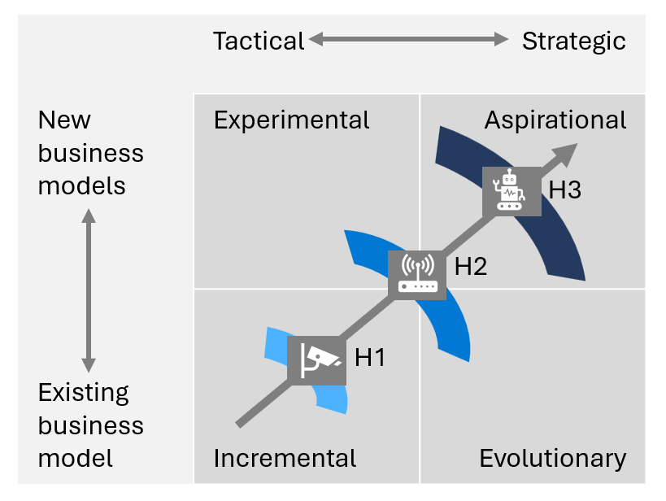

Adopting AI throughout an organization implies a serious investment. However, investing in AI projects requires a different perspective than most investments. If you use AI to improve or automate an existing process, then it's possible to measure return on investment (ROI) in the straightforward, traditional way. But there are a few characteristics of AI initiatives that make it difficult to estimate their costs and benefits.

First, most AI models require upfront investment before it's even possible to measure effectiveness. It's hard to predict the accuracy of the model and its business impact until you've prepared data and completed model training and testing. Additionally, it's hard to predict the amount of long-term maintenance a model needs. Individual models improve over time in ways that are difficult to calculate in advance.

With AI initiatives, you need to think like a venture capitalist. That means being willing to invest and take risks amid uncertainties. But you don't have to guess. Instead, you can use a framework to help prioritize AI investments.

## Apply a horizon-based framework

At Microsoft, we use a horizon-based framework to evaluate and prioritize AI investments. This groups AI projects into three horizons, from improving core business functions to creating brand new revenue streams. The risk and uncertainty of specific applications depends on a company's level of AI maturity, size, business objectives, and more.

### Horizon 1: Running (operate and optimize the core business)

:::row:::
:::column span="2":::
Not every AI application involves revolutionary changes. In fact, using AI to improve or automate existing processes is becoming essential to remaining competitive. Horizon 1 (H1) represents AI initiatives that optimize core business functions.

For example, perhaps you manufacture electronic components. While you might manually inspect quality for 100 parts per hour, an AI model with image recognition capabilities could inspect 1,000 parts per hour.

:::column-end:::
:::column span="2":::

> [!div class="mx-imgBorder"]
> 

:::column-end:::
:::row-end:::

### Horizon 2: Growing (improve market position)

Horizon 2 (H2) initiatives take advantage of emerging opportunities. These initiatives might create new services or new customer experiences.

For example, a manufacturer of electronics might use IoT to collect operational data and AI to suggest optimal times for maintenance. These initiatives facilitate a brand-new customer experience and help the manufacturer differentiate from competitors.

### Horizon 3: Transforming (change market position)

Horizon 3 (H3) involves disruptive and innovative new business models. These are revolutionary applications that might cross industry boundaries or even create new customer needs.

For example, the same electronics manufacturer could sell "electronics-as-a-service"—which means they use AI models to predict which electronic devices work best for your current system and needs. Ultimately, the company is selling a personalized service rather than a single product, creating new revenue streams and opportunities.

## Map scenarios and use cases to the framework

:::row:::
:::column span="2":::
Using this framework, you can then map AI scenarios into quadrants. The "tactical" spectrum represents initiatives that are confined to a single team or use case. The "strategic" side represents larger business initiatives that might affect the entire organization.

To go back to the earlier manufacturing example, you might place automation of quality control in the lower left quadrant. It's an initiative that digitizes and optimizes an existing business model without requiring systemic changes.

Scenarios that fall below the middle line help the organization survive more than thrive. They might address competitive and disruptive threats, improve operations, or empower employees in the organization. Scenarios above the middle line help companies create new value propositions, revenue streams, or business models.

:::column-end:::
:::column span="2":::
> [!div class="mx-imgBorder"]
> 
:::column-end:::
:::row-end:::

As you map initiatives, it's helpful to involve the Chief Financial Officer (CFO) office and other stakeholders to ensure you've made the right assumptions around the opportunity valuation.

## Prioritize investments and organize phases

We recommend prioritizing initiatives in phases: start with foundational initiatives in the bottom left of the Prioritization framework quadrant and move towards transformational initiatives in the top right of the quadrant.

:::row:::
:::column span="2":::
We recommend this approach because it's helpful to grow capabilities and get buy-in before you move to more complex projects. Begin by forming technical teams that can prepare data appropriately and familiarize themselves with AI models. Starting with foundational initiatives also helps establish trust across the business and manage expectations related to AI initiatives. The success and value you're able to demonstrate in early initiatives pave the way for the more transformational projects.

Another reason to start at the bottom left of the prioritization framework quadrant is that the technology used to support H1 initiatives is typically more accessible than advanced use cases. There are countless out-of-the-box AI models you can apply to common use cases. These applications cost less and their effect on the business is easier to estimate. As you build maturity with these accessible models, you can experiment with more complex AI initiatives and hone your objectives.

:::column-end:::
:::column span="2":::
> [!div class="mx-imgBorder"]
> 
:::column-end:::
:::row-end:::

H2 and H3 initiatives require more sophisticated data science capabilities, which may result in unintended or unexpected outcomes. These initiatives often require businesses to work with partners to create a custom model that can't be bought off the shelf. These solutions require the most resources, time, and risk, but they offer the greatest reward. Achieving a lasting competitive advantage requires solutions that aren't easily duplicated.

## Define clear value drivers and KPIs for your AI investments

Once you've chosen AI initiatives, it's important to identify value drivers and key performance indicators (KPIs) for each project. The framework provides a useful way to think about any investment—including AI initiatives.

| Value | Sample category | Definition | AI example |
|---|---|---|---|
| Financial drivers | Sales |The revenue earned from products or services. | Use targeted marketing to improve accuracy in classifying prospects. |
| Financial drivers | Cost management | Process of planning and controlling the budget of a business. In addition to employee time and effort, the costs of AI models include cloud compute, which varies depending on the model's workload. | Improve prediction models for scheduling equipment maintenance to improve sustainability. |
| Financial drivers | Capital productivity | Measure of how physical capital is used in providing goods and services. | Enhance employee productivity and resource allocation with insight into operations. |
| Quality measures | Quality | The degree to which products or services meet customer or business expectations. | Improve product quality with automated inspection processes. |
| Quality measures | Cycle times | The time it takes to complete a process. | Accelerate product inspections with image recognition.                                    |
| Quality measures | Satisfaction (customer and/or employee) | How happy customers are with a company's products or services (which contributes to market share, competitive differentiation, and more). | Improve customer engagement with personalized discounts and product bundles. |

As you invest in initiatives, it's important to develop market and financial models to help balance potential risk and return. Consider factors such as the total addressable market (TAM), net present value (NPV), and internal rate of return (IRR). Work with the CFO office and other key stakeholders to ensure the financial models make sense within the context of the business. These metrics can help secure their buy-in and ensure support throughout the process.

Moving forward, we advise putting systemic processes in place to manage and evaluate value throughout the project lifecycle. We recommend taking an agile approach that happens in stages—after you invest in an initiative, evaluate the initial results. Then you can determine whether to continue, adjust your approach, or take another path. Continue to evaluate value at major milestones throughout the project.

Next, let’s take a look at the AI-related roles and responsibilities that should be established in every AI organization.
