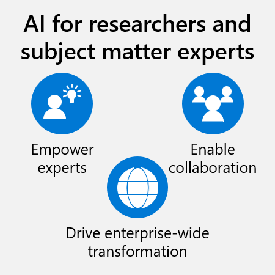

Human beings are incredible. We have so many unique capabilities that no machine can replicate—creativity, empathy, inventiveness, and imagination. Business value comes from human expertise. At Microsoft, we believe the right AI tools can amplify these capabilities to help everyone achieve more. You should consider AI as a copilot, which helps you fulfill your potential.

Business users in every industry can take advantage of a wide array of AI solutions. For example, subject matter experts like researchers and engineers can use AI to apply their expertise more effectively and efficiently.

In this unit, we discuss what knowledge workers can do with available AI tools that don't require coding or data science expertise, from software as a service (SaaS) to low-code products. The goal is to gain independence from data science teams so these subject matter experts can focus on what they do best. Let’s look at some examples of how anyone can work with and even create AI to achieve more.

## Build AI without code

Employees don't need to be data scientists to be able to use AI in their everyday work. Microsoft is working hard to deliver business users AI-powered products and services. The latest advances in AI technologies focus on prebuilt models, like GPT models, which everyone can use. You can use these models from a wide range of Microsoft products, such as Bing, Microsoft 365, or Microsoft Dynamics 365.

> [!NOTE] 
> Nearly a third of white-collar workers (27 percent) have tried to incorporate prebuilt generative AI models such as GPT in their work routines.3

For more complex solutions, business users may want to create their own AI models or integrate a model into an app themselves. With no-code tools and platforms such as those provided by Microsoft Power Platform and Azure Cognitive Services, now business users can add AI capabilities to their apps and automate their workflow—regardless of their technical expertise.

The module [Leverage AI tools and resources for your business](/training/modules/leverage-ai-tools) gives you a more detailed overview of the AI products and services available for these cases.

## AI for reasoning

:::row:::
:::column span="2":::
Real transformation happens when everyone can use a wide range of AI models to reason over complex, unstructured information. The availability of a wide range of models means people can choose which AI models to use for different purposes and what information sources to analyze with them.

AI for reasoning is exactly that. It's highly valuable for people with business-critical expertise like researchers, operations managers, field technicians, marketers, business developers, and more. With powerful AI applications, they can apply their knowledge more efficiently and effectively, speed up learning cycle iterations, and deliver real business impact at a rate never before possible.
:::column-end:::
:::column span="2":::
> [!div class="mx-imgBorder"]
> 
:::column-end:::
:::row-end:::

Let's see some examples.

* **Pharmaceutical industry**: Some pharmaceutical companies are using AI to test molecules as a first step in their drug development process. This procedure enables them to accelerate drug discovery.

* **Food industry**: Food processing industries are applying AI to generate new recipes based on existing recipes, sales data, and customer preferences. These initiatives allow experts to launch new products faster than with traditional research.

Research-related use cases are numberless and apply in almost every industry. In many scenarios, you can use prebuilt AI models such as GPT, which can be embedded in many options, to extract insights from papers, documentation, or research results. However, the same AI can also be used to find new ideas and create content, such as ads or keywords for marketing campaigns.

> [!NOTE] 
> Gartner predicts that, by 2025, large organizations will leverage generative AI to create 30 percent of their outbound marketing messages.4

Next, let’s wrap up everything you’ve learned with a knowledge check.
