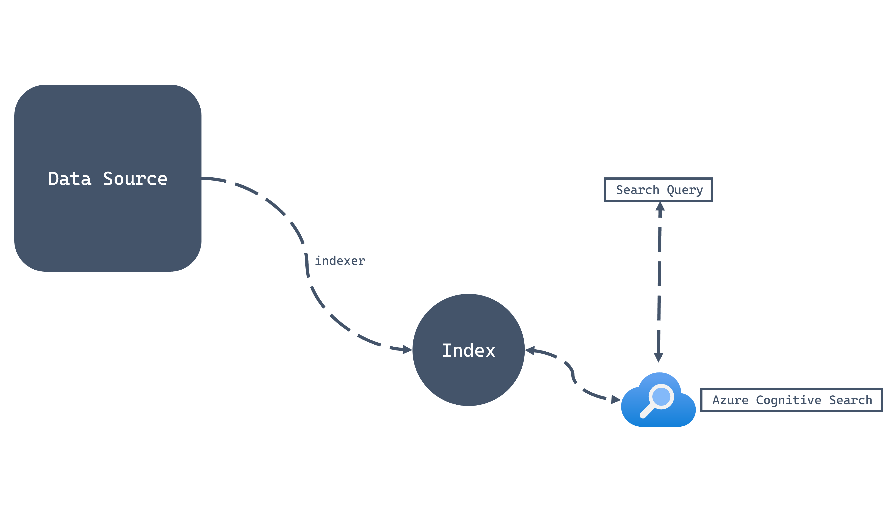

An **Azure Cognitive Search** instance is comprised of a few core components:

- **Indexes** that contain JSON documents that are searchable
- **Indexers** to crawl data from various data sources and insert them into indexes
- **Data Sources** that connect Azure Cognitive Search to various data platforms

In the case of Azure Cosmos DB SQL API, you can configure a container as a **data source**, create a query and a frequency that the **indexer** will use to crawl data, and create a target **index** where the resulting searchable JSON documents are stored.

## Connecting a data source

The first step is to create a data source. The data source points to somewhere where data is stored. With Azure Cosmos DB SQL API, the data source is a reference to an existing account with the following parameters configured:

| **Parameter** | **Value** |
| ---: | :--- |
| **Connection string** | Connection string for Azure Cosmos DB account |
| **Database** | Name of target database |
| **Collection** | Name of target container |
| **Query** | A SQL query to select items to be indexed |

## Customizing the index

Once the data source is configured, an index should be created that would be the target of the indexing operation. The index contains, at a minimum, a **name** and a **key**. The key refers to a unique identifier field for each JSON document in the index.

Each field in the index should be configured to enable or disable features when searching. These optional features allow extra search functionality on specific fields when it makes sense. For each field, you must configure whether the field is:

| **Feature** | **Description** |
| ---: | :--- |
| **Retrievable** | Configures the field to be projected in search result sets |
| **Filterable** | Accepts OData-style filtering on the field |
| **Sortable** | Enables sorting using the field |
| **Facetable** | Allows field to be dynamically aggregated and grouped |
| **Searchable** | Allows search queries to match terms in the field |

## Configuring the indexer

The final step is to configure the indexer’s **name** and **schedule**. The schedule determines how often the indexer will run to pull data from the data source and populate the index with JSON documents.
