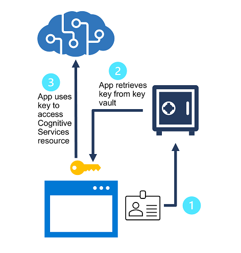

By default, access to Azure AI services resources is restricted by using subscription keys. Management of access to these keys is a primary consideration for security.

## Regenerate keys

You should regenerate keys regularly to protect against the risk of keys being shared with or accessed by unauthorized users. You can regenerate keys by using the visual interface in the Azure portal, or by using the `az cognitiveservices account keys regenerate` Azure command-line interface (CLI) command.

Each Azure AI service is provided with two keys, enabling you to regenerate keys without service interruption. To accomplish this:

1. Configure all production applications to use key 2.
2. Regenerate key 1
3. Switch all production applications to use the newly regenerated key 1.
4. Regenerate key 2.

## Protect keys with Azure Key Vault

Azure Key Vault is an Azure service in which you can securely store secrets (such as passwords and keys). Access to the key vault is granted to *security principals*, which you can think of user identities that are authenticated using Azure Active Directory (Azure AD). Administrators can assign a security principal to an application (in which case it is known as a *service principal*) to define a *managed identity* for the application. The application can then use this identity to access the key vault and retrieve a secret to which it has access. Controlling access to the secret in this way minimizes the risk of it being compromised by being hard-coded in an application or saved in a configuration file.

You can store the subscription keys for an Azure AI services resource in Azure Key Vault, and assign a managed identity to client applications that need to use the service. The applications can then retrieve the key as needed from the key vault, without risk of exposing it to unauthorized users.

## Token-based authentication

When using the REST interface, some Azure AI Services support (or even *require*) token-based authentication. In these cases, the subscription key is presented in an initial request to obtain an authentication token, which has a valid period of 10 minutes. Subsequent requests must present the token to validate that the caller has been authenticated.

> [!TIP]
> When using an SDK, the calls to obtain and present a token are handled for you by the SDK.

## Azure Active Directory authentication

Some Azure AI Services support Azure Active Directory authentication, enabling you to grant access to specific service principals or managed identities for apps and services running in Azure.

> [!NOTE]
> For more information about authentication options for Azure AI Services, see the [Azure AI Services documentation](/azure/ai-services/authentication).
