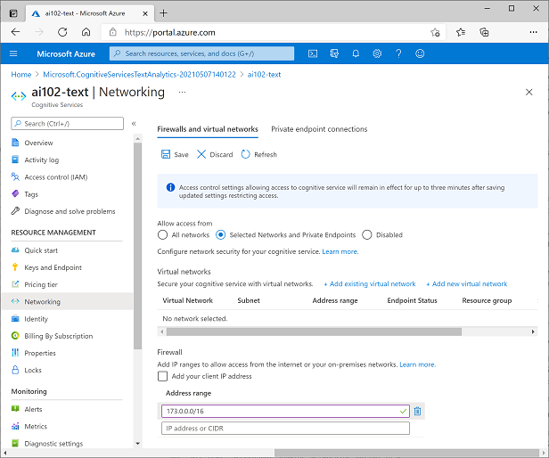

Network security is an important measure to ensure unauthorized users cannot reach the services that you are protecting. Limiting what users can see is always a great idea, since they can’t compromise what they can’t see.

## Apply network access restrictions

By default, Azure AI Services are accessible from all networks. Some individual Azure AI Services resources (such as **Text Analytics**, **Face**, **Computer Vision**, and others) can be configured to restrict access to specific network addresses - either public Internet addresses or addresses on virtual networks.

With network restrictions enabled, a client trying to connect from an IP address that is not allowed will receive an **Access Denied** error.

> [!NOTE]
> For more information about configuring network access for Azure AI Services, see the [Azure AI Services documentation](/azure/ai-services/cognitive-services-virtual-networks).
