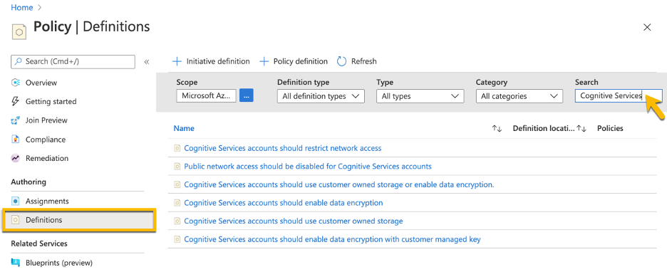
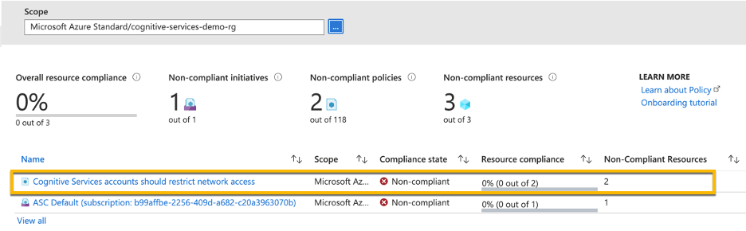
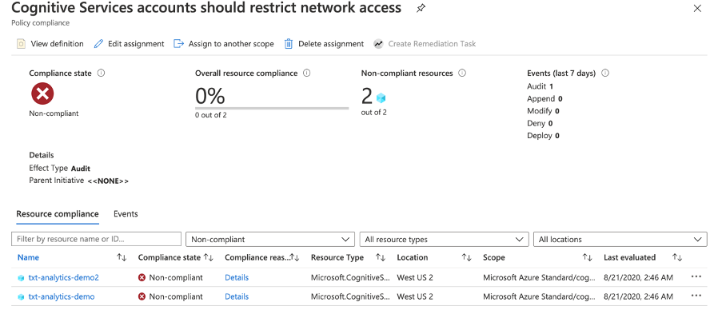

You now have knowledge of key security practices for Cognitive Services. You will take steps in your environment that secure your services. However, it is a good idea to audit your Azure environment to ensure others are doing their part. When working with a team of people, not everyone will know the company security standards. You can set up policies that help keep your environment secure.

Azure Policy will continually check resources for compliance. You can define policies to audit that all of your Cognitive Services has network restrictions and use data encryption. Azure Policy has a dashboard, which shows all policy exceptions. From the dashboard, you can drill into specific policy assignments and resources. In addition, you can run remediation steps that correct the policy exceptions.

## View Azure policies for Cognitive Services

Let’s take a look at the Cognitive Services built-in policy definitions in the Azure portal. These steps show how to find and manage the policies yourself.

1. Choose **All services** then search for and select **Policy**.

   :::image type="content" source="../media/02-policy-search.png" alt-text="Screenshot of searching and selecting the Policy service in the Azure portal.":::

1. To see available policy definitions, select Definitions and search for Cognitive Services.

   > [!div class="mx-imgBorder"]
   > [](../media/02-policy-definitions-search.png#lightbox)

You can choose a definition by clicking on the name. You can assign the built-in policy as is or create a custom definition. To customize it, you duplicate and edit the policy.

## Assign a policy

You can assign a policy from the Assignments section or from a selected policy definition. The policy will apply to either a subscription or a resource group. The policy will not affect resources, which are already deployed unless you set up a remediation.

To assign a policy, provide the following inputs:

| Scope	| Assign to a subscription or resource group |
|---|---|
| Exclusions | Exclude resource groups or resources from policy (optional) |
| Assignment name |	Name the assignment, defaults to policy name |
| Description | Describe the assignment (optional) |
| Parameters | Enter additional options that will vary based on policy. A common parameter is Effect to set whether the policy should audit, deny, or disable |
| Remediation | Remediate existing violations once policy is assigned (optional) |

## Duplicate and edit a policy

You can duplicate a built-in policy and customize it. It is helpful if you want to provide additional rules or parameters. When duplicating you will create a custom name and description. It should describe how the policy is different from the built-in policy. The category should stay the same in most cases to group it with similar policy definitions. You can find policies to import from GitHub or define your own policy changes.

## View policy alerts

The Policy Overview screen will show resource compliance. Let’s view an example of the policy Cognitive Services accounts should restrict network access assigned with the default settings. In this example, there are two Cognitive Services resources, which have not had the network security configured.

> [!div class="mx-imgBorder"]
> [](../media/02-policy-overview-alert.png#lightbox)


You select a policy assignment for details, which include the resources that are non-compliant.

> [!div class="mx-imgBorder"]
> [](../media/02-policy-detail-alert.png#lightbox)

Now you can add and review Cognitive Services policies to keep your environment in a secured state.

## Cleanup

You have completed all the exercises, but don’t forget to clean up your resources.

If you are not using the resource group for other services, you can remove everything in it by running:

```azurecli
az group delete --name <resource-group> --yes --no-wait
```

Alternatively, you could remove individual services with the following commands:

* Azure Text Analytics Service

   ```azurecli
   az cognitiveservices account delete --resource-group <resource-group> --name <service-name>
   ```

* Azure Key Vault

   ```azurecli
   az keyvault delete --name <key-vault-name>
   ```
