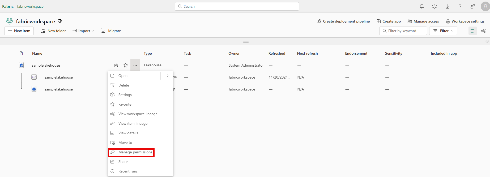

Workspaces are environments where users can collaborate to create groups of items. Items are the resources you can work with in Fabric such as lakehouses, warehouses, and reports. Workspace roles are preconfigured sets of permissions that let you manage what users can do and access in a Fabric workspace.

Item permissions control access to individual Fabric items within a workspace. Item permissions let you either adjust the permissions set by a workspace role or give a user access to one or more items within a workspace without adding the user to a workspace role.

Let's consider some scenarios where you would need to configure data access using  workspace roles and item permissions.

## Understand workspace roles

Suppose you work at a health care company as the Fabric security admin. You need to set up access for a new data engineer. The data engineer needs the ability to:

- Create Fabric items in an existing workspace
- Read all data in an existing lakehouse that's in the same workspace where they can create Fabric items

Workspace roles control what users can do and access within a Fabric workspace. There are four workspace roles and they apply to *all items* within a workspace. Workspace roles can be assigned to individuals, security groups, Microsoft 365 groups, and distribution lists. Users can be assigned to the following roles:

- **Admin** - Can view, modify, share, and manage all content and data in the workspace, and manage permissions.
- **Member** - Can view, modify, and share all content and data in the workspace.
- **Contributor** - Can view and modify all content and data in the workspace.
- **Viewer** - Can view all content and data in the workspace, but can't modify it.

> [!Tip]
> For a full list of the permissions associated with workspace roles, see: [Roles in workspaces](/fabric/get-started/roles-workspaces?azure-portal=true)

To meet the access requirements for the new data engineer, you can assign them the workspace **Contributor** role. This gives them access to modify content in the workspace, including creating Fabric items like lakehouses. The contributor role would also allow them to read data in the existing lakehouse.

### Assign workspace roles

Users can be added to workspace roles from the **Manage access** button from within a workspace. Add a user by entering the user's name and selecting the workspace role to assign them in the **Add people** dialogue.

## Configure item permissions

Item permissions control access to individual Fabric items within a workspace. Item permission can be used to give a user access to one or more items within a workspace without adding the user to a workspace role or can be used with workspace roles.

Suppose that after a few months of having **Contributor** access on a workspace, a data engineer no longer needs to create Fabric items and now only needs to view a single lakehouse and read data in it. 

Since the engineer no longer needs to view all items in the workspace, the **Contributor** workspace role can be removed and item permissions on the lakehouse can be configured so the engineer will only be able to see the lakehouse metadata and data and nothing else in the workspace. This item access configuration helps you adhere to the principle of least privilege, where the engineer only has access to what's needed to perform their job duties.

An item can be shared and item permissions can be configured by selecting on the ellipsis (...) next to a Fabric item in a workspace and then selecting **Manage permissions**.

 

In the **Grant people access** window that appears after selecting **Manage permissions**, if you add the user and don't select any of the checkboxes under **Additional permissions**, the user will have read access to the lakehouse metadata. The user won't have access to the underlying data in the lakehouse. To grant the engineer the ability to read data and not just metadata, **Read all SQL endpoint data** or **Read all Apache Spark** can be selected. 

 

> [!Tip]
> Each Fabric data item has its own security model. To learn more about permissions that can be granted when a lakehouse or other Fabric data item is shared see:
>
> - [Warehouse](/fabric/data-warehouse/share-warehouse-manage-permissions?azure-portal=true)
> - [Lakehouse](/fabric/data-engineering/lakehouse-sharing?azure-portal=true)
> - [Semantic model](/power-bi/connect-data/service-datasets-permissions?azure-portal=true)