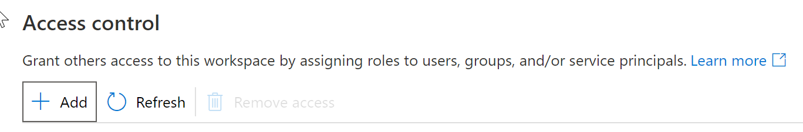
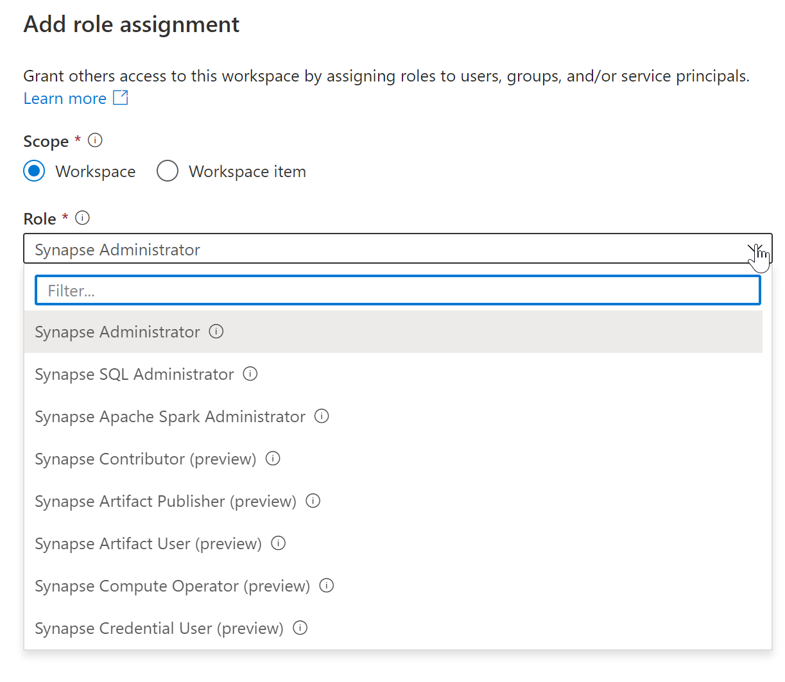

You can give administrator privileges to a user to Azure Synapse serverless SQL pool. To do this you should open a Azure Synapse workspace and do the following steps:

1.	Go to **Manage** menu
2.	Go to **Access control**
3.	Click on **Add**

    

4.	Choose **Workspace admin**

    

5.	Select a User or Security group (security group is a recommended option here)
6.	Click **Apply**

Now this user/group is administrator of Azure Synapse workspace and serverless SQL pool.
