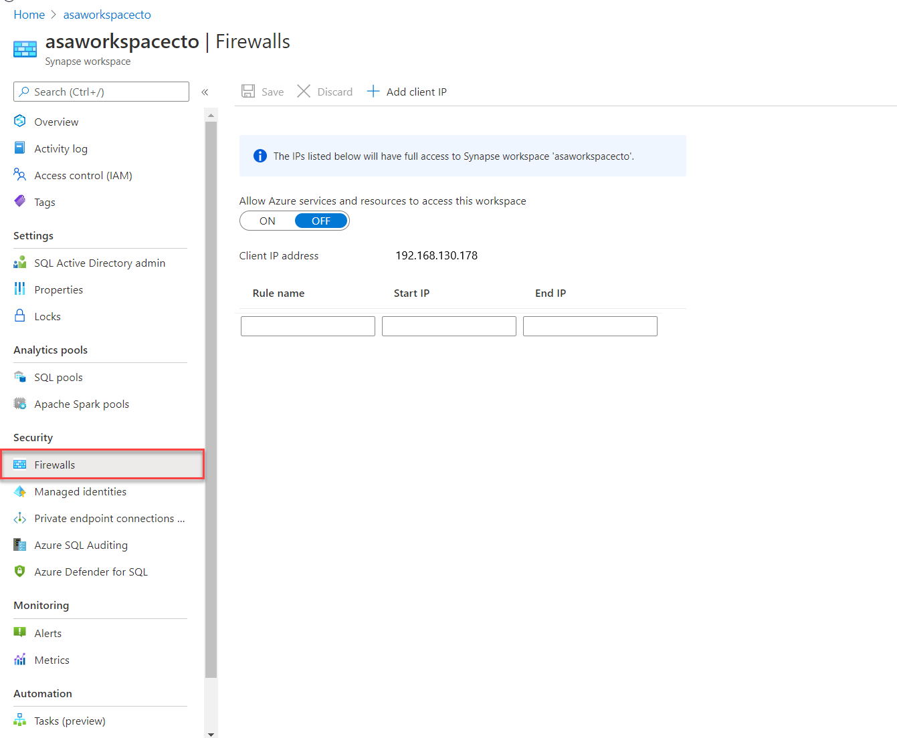
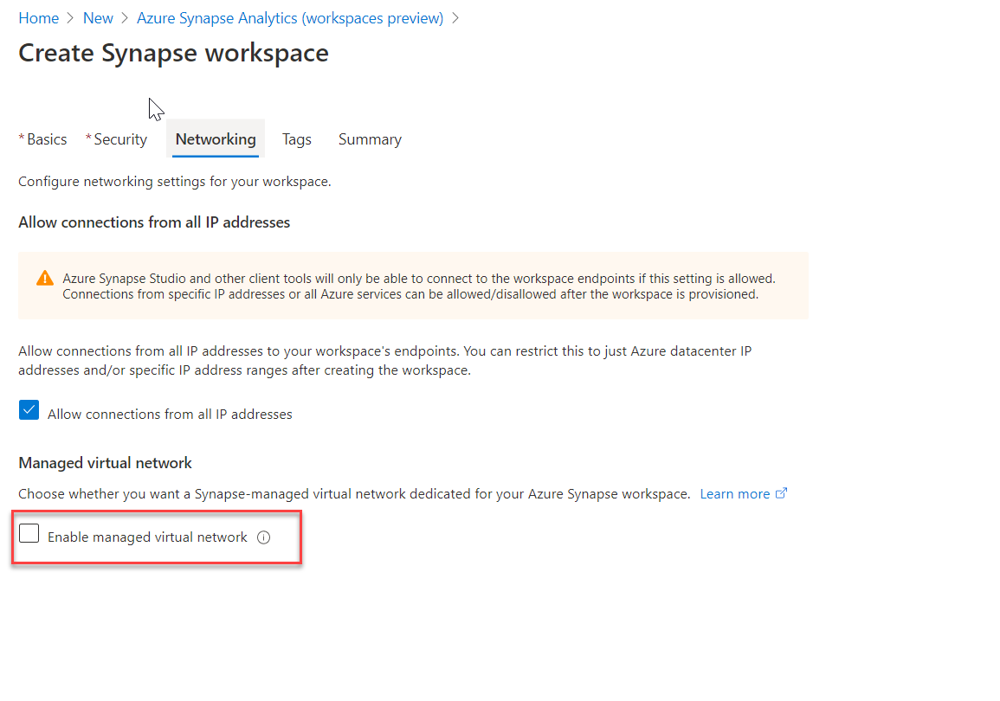

There are a range of network security steps that you should consider to secure Azure Synapse Analytics. One of the first aspects that you will consider is securing access to the service itself. This can be achieved by creating the following network objects including:

- Firewall rules
- Virtual networks
- Private endpoints

## Firewall rules

Firewall rules enable you to define the type of traffic that is allowed or denied access to an Azure Synapse workspace using the originating IP address of the client that is trying to access the Azure Synapse Workspace. IP firewall rules configured at the workspace level apply to all public endpoints of the workspace including dedicated SQL pools, serverless SQL pool, and the development endpoint.

You can choose to allow connections from all IP addresses as you are creating the Azure Synapse Workspaces, although this is not recommended as it does not allow for control access to the workspace. Instead, within the Azure portal, you can configure specific IP address ranges and associate them with a rule name so that you have greater control.

> [!div class="mx-imgBorder"]
> 

Make sure that the firewall on your network and local computer allows outgoing communication on TCP ports 80, 443 and 1443 for Synapse Studio.

Also, you need to allow outgoing communication on UDP port 53 for Synapse Studio. To connect using tools such as SSMS and Power BI, you must allow outgoing communication on TCP port 1433.

## Virtual networks

Azure Virtual Network (VNet) enables private networks in Azure. VNet enables many types of Azure resources, such as Azure Synapse Analytics, to securely communicate with other virtual networks, the internet, and on-premises networks. When you create your Azure Synapse workspace, you can choose to associate it to a Microsoft Azure Virtual Network. The Virtual Network associated with your workspace is managed by Azure Synapse. This Virtual Network is called a Managed workspace Virtual Network.

Using a managed workspace virtual network provides the following benefits:

- With a Managed workspace Virtual Network, you can offload the burden of managing the Virtual Network to Azure Synapse.
- You don't have to configure inbound NSG rules on your own Virtual Networks to allow Azure Synapse management traffic to enter your Virtual Network. Misconfiguration of these NSG rules causes service disruption for customers.
- You don't need to create a subnet for your Spark clusters based on peak load.
- Managed workspace Virtual Network along with Managed private endpoints protects against data exfiltration. You can only create Managed private endpoints in a workspace that has a Managed workspace Virtual Network associated with it.
-  it ensures that your workspace is network isolated from other workspaces. 

If your workspace has a Managed workspace Virtual Network, Data integration and Spark resources are deployed in it. A Managed workspace Virtual Network also provides user-level isolation for Spark activities because each Spark cluster is in its own subnet.

Dedicated SQL pool and serverless SQL pool are multi-tenant capabilities and therefore reside outside of the Managed workspace Virtual Network. Intra-workspace communication to dedicated SQL pool and serverless SQL pool use Azure private links. These private links are automatically created for you when you create a workspace with a Managed workspace Virtual Network associated to it.

You can only choose to enable managed virtual networks as you are creating the Azure Synapse Workspaces.

> [!div class="mx-imgBorder"]
> 

## Private endpoints

Azure Synapse Analytics enables you to connect upto its various components through endpoints. You can set up managed private endpoints to access these components in a secure manner known as private links. This can only be achieved in an Azure Synapse workspace with a Managed workspace Virtual Network. Private link enables you to access Azure services (such as Azure Storage and Azure Cosmos DB) and Azure hosted customer/partner services from your Azure Virtual Network securely.

When you use a private link, traffic between your Virtual Network and workspace traverses entirely over the Microsoft backbone network. Private Link protects against data exfiltration risks. You establish a private link to a resource by creating a private endpoint.

Private endpoint uses a private IP address from your Virtual Network to effectively bring the service into your Virtual Network. Private endpoints are mapped to a specific resource in Azure and not the entire service. Customers can limit connectivity to a specific resource approved by their organization. You can manage the private endpoints in the Azure Synapse Studio manage hub.

