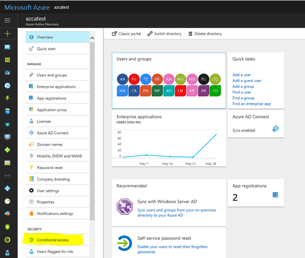
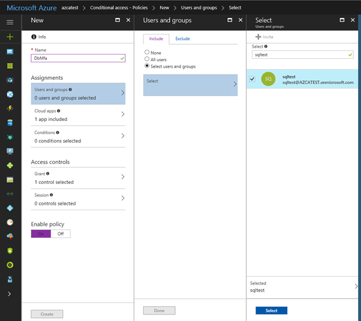
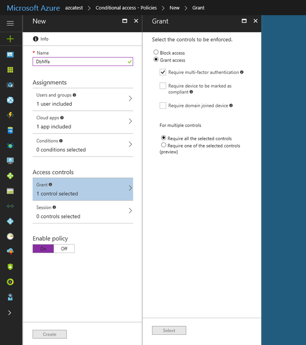

Conditional Access is a feature that enables you to define the conditions under which a user can connect to your Azure subscription and access services.  Conditional Access provides an additional layer of security that can be used in combination with authentication to strengthen the security access to your network.

> [!VIDEO https://channel9.msdn.com/Shows/Docs-Azure/Azure-AD-Conditional-Access/player?format=ny] 

Conditional Access policies at their simplest are if-then statements, if a user wants to access a resource, then they must complete an action. As an example, if a Data Engineer wishes to access services in Azure Synapse Analytics, they may be requested by the Conditional Access policy to perform an additional step of multifactor authentication (MFA) to complete the authentication to get onto the service

Conditional Access policies use signals as a basis to determine if Conditional Access should first be applied. Common signals include:
-	User or group membership names
-	IP address information
-	Device platforms or type
-	Application access requests
-	Real-time and calculated risk detection
-	Microsoft Cloud App Security (MCAS)

Based on these signals, you can then choose to block access. The alternative is you can grant access, and at the same time request that the user perform an additional action including:
-	Perform multifactor authentication
-	Use a specific device to connect

Given the amount of data that could potentially be stored, Azure Synapse Analytics dedicated SQL pools supports Conditional Access to provide protection for your data. It does require that Azure Synapse Analytics is configured to support Microsoft Entra ID, and that if you chose multifactor authentication, that the tool you are using support it.

To configure Conditional Access, you can perform the following steps:

1. Sign in to the Azure portal, select **Microsoft Entra ID**, and then select **Conditional Access**.
 
    > [!div class="mx-imgBorder"]
    > 

1. In the **Conditional Access-Policies** blade, click **New policy**, provide a name, and then click **Configure rules**.

1. Under **Assignments**, select **Users and groups**, check **Select users and groups**, and then select the user or group for Conditional Access. Click **Select**, and then click **Done** to accept your selection.
 
    > [!div class="mx-imgBorder"]
    > 

1. Select **Cloud apps**, click **Select apps**. You see all apps available for Conditional Access. Select **Azure SQL Database**, at the bottom click **Select**, and then click **Done**.
 
    > [!div class="mx-imgBorder"]
    > 

1. If you can't find **Azure SQL Database** listed in the following third screenshot, complete the following steps:
    -	Connect to your database in Azure SQL Database by using SSMS with a Microsoft Entra admin account.
    -	Execute CREATE USER [user@yourtenant.com] FROM EXTERNAL PROVIDER.
    -	Sign into Microsoft Entra ID and verify that Azure SQL Database, SQL Managed Instance, or Azure Synapse are listed in the applications in your Microsoft Entra instance.

1. Select **Access controls**, select **Grant**, and then check the policy you want to apply. For this example, we select **Require multifactor authentication**.
 
    > [!div class="mx-imgBorder"]
    > 
