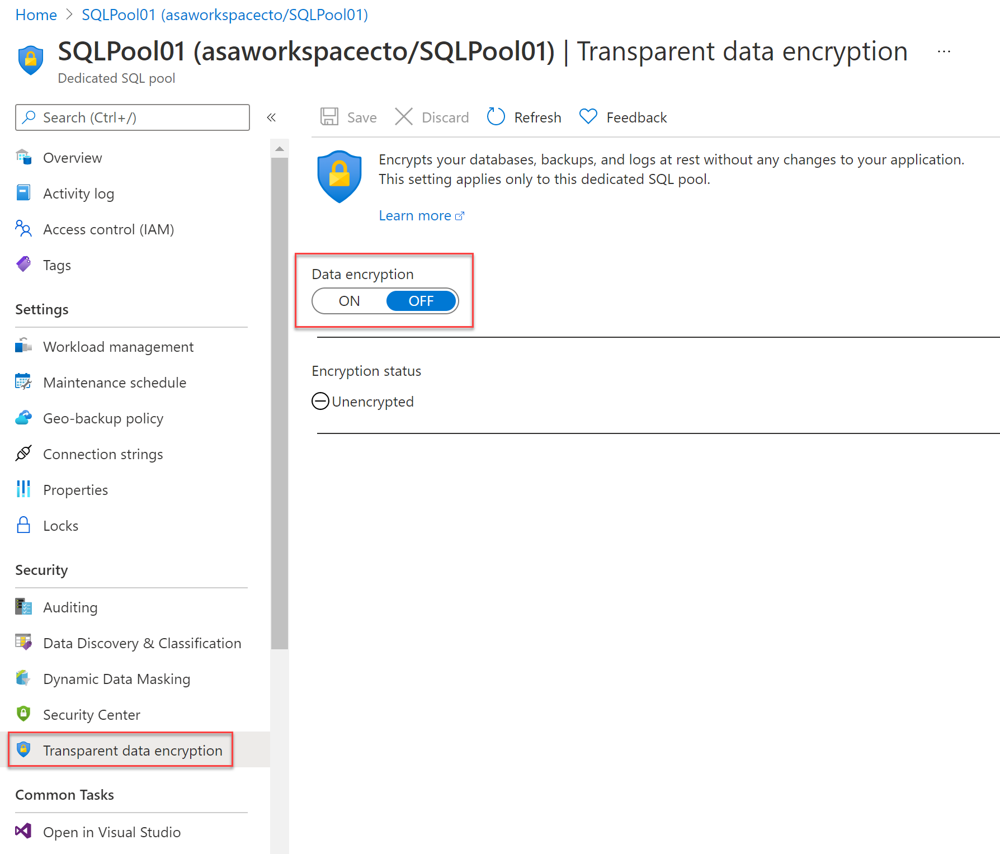

In this section, we will go through Transparent Data Encryption and TokenLibrary for Apache Spark. 

## What is transparent data encryption

Transparent data encryption (TDE) is an encryption mechanism to help you protect Azure Synapse Analytics.
It will protect Azure Synapse Analytics against threats of malicious offline activity.
The way TDE will do so, is by encrypting data at rest. 
TDE performs real-time encryption as well as decryption of the database, associated backups, and transaction log files at rest without you having to make changes to the application. 
In order to use TDE for Azure Synapse Analytics, you will have to manually enable it. 

What TDE does is performing I/O encryption and decryption of data at the page level in real time. 
When a page is read into memory, it is decrypted. It is encrypted before writing it to disk. 
TDE encrypts the entire data base storage, using a symmetric key called a Database Encryption Key (DEK).
When you start up a database, the encrypted Database Encryption Key is decrypted when it then will be used for decryption and re-encryption of the database files in the SQL Server database engine. 
The DEK is protected by the Transparent Data Encryption Protector. 
This protector can be either a service-managed certificated, which is referred to as service-managed transparent data encryption, or an asymmetric key that is stored in Azure Key Vault (customer-managed transparent data encryption).

What is important to understand is that for Azure Synapse Analytics, this TDE protector is set on the server level. 
There it is inherited by all the databases that are attached or aligned to that server. 
The term server refers both to server and instance.

## Service-managed transparent data encryption

As stated above, the DEK that is protected by the Transparent Encryption protector can be service-managed certificated which we call service-managed TDE.
When you look in Azure, that default setting means that the DEK is protected by a built-in certificate unique for each server with encryption algorithm AES256. 
When a database is in a geo-replicated relationship then  primary and the geo-secondary database are protected by the primary database's parent server key. 
If the databases are connected to the same server, they will also have the same built-in AES 256 certificate. 
As Microsoft we automatically rotate the certificates in compliance with the internal security policy.
The root key is protected by a Microsoft internal secret store. 
Microsoft also seamlessly moves and manages the keys as needed for geo-replication and restores.

## Transparent data encryption with bring your own key for customer-managed transparent data encryption

As stated above, the DEK that is protected by the Transparent Data Encryption Protector can also be customer managed by bringing an asymmetric key that is stored in Azure Key Vault (customer-managed transparent data encryption). 
This is also referred to as Bring Your Own Key (BYOK) support for TDE. 
When this is the scenario that is applicable to you, the TDE Protector that encrypts the DEK is a customer-managed asymmetric key. 
This is stored in your own and managed Azure Key Vault. 
Azure Key Vault is Azure's cloud-based external key management system.
This managed key never leaves the key vault. 
The TDE Protector can be generated by the key vault. 
Another option is to transfer the TDE Protector to the key vault from, for example,  an on-premise hardware security module (HSM) device. 
Azure Synapse Analytics needs to be granted permissions to the customer-owned key vault in order to decrypt and encrypt the DEK. 
If permissions of the server to the key vault are revoked, a database will be inaccessible, and all data is encrypted.

By using Azure Key Vault integration for TDE, you have control over the key management tasks such as key rotations, key backups, and key permissions. 
It also enables you for auditing and reporting on all the TDE protectors when using the Azure Key Vault functionality. 
The reason for using Key Vault is that it provides you with a central key management system where tightly monitored HSMs are leveraged. 
It also enables you to separate duties of management of keys and data in order to meet compliance with security policies. 

## Manage transparent data encryption in the Azure portal. 

For Azure Synapse Analytics, you can manage TDE for the database in the Azure portal after you've signed in with the Azure Administrator or Contributor account. 
The TDE settings can be found under your user database. 



It is by default that the service-managed TDE is used and therefore a TDE certificate is automatically generated for the server that contains that database. 

## Moving a transparent data encryption protected database

In some use cases you need to move a database that is protected with TDE. 
Within Azure, there is no need to decrypt the databases. 
The TDE settings on the source database or primary database, will be inherited on the target. 
Some of the operations within Azure that inherited the TDE are:
* Geo-restore
* Self-service point-in-time restore
* Restoration of a deleted database
* Active geo-replication
* Creation of a database copy
* Restore of backup file to Azure SQL Managed Instance

If you export a TDE-protected database, the exported content is not encrypted. 
This will be stored in an unencrypted BACPAC file. 
You need to make sure that you protect this BACPAC file and enable TDE as soon as the import of the bacpac file in the new database is finished. 


## Securing your credentials through linked services with TokenLibrary for Apache Spark

It is quite a common pattern to access data from external sources. 
Unless the external data source allows anonymous access, it is highly likely that you need to secure your connection with a credential, secret, or connection string.

Within Azure Synapse Analytics, the integration process is simplified by providing linked services. 
Doing so, the connection details can be stored in the linked service or an Azure Key Vault. 
If the Linked Service is created, Apache spark can reference the linked service to apply the connection information in your code. 
When you want to access files from the Azure Data Lake Storage Gen 2 within your Azure Synapse Analytics Workspace, it uses AAD passthrough for the authentication. 
Therefore, there is no need to use the TokenLibrary. 
However, to connect to other linked services, you are enabled to make a direct call to the TokenLibrary.

An example can be found below:
In order to connect to other linked services, you are enabled to make a direct call to the TokenLibrary by retrieving the connection string. 
In order to retrieve the connection string, use the **getConnectionString** function and pass in the **linked service name**.

```scala
// Scala
// retrieve connectionstring from TokenLibrary

import com.microsoft.azure.synapse.tokenlibrary.TokenLibrary

val connectionString: String = TokenLibrary.getConnectionString("<LINKED SERVICE NAME>")
println(connectionString)
```

```python
# Python
# retrieve connectionstring from TokenLibrary

from pyspark.sql import SparkSession

sc = SparkSession.builder.getOrCreate()
token_library = sc._jvm.com.microsoft.azure.synapse.tokenlibrary.TokenLibrary
connection_string = token_library.getConnectionString("<LINKED SERVICE NAME>")
print(connection_string)
```

If you want to Get the connection string as map and parse specific values from a key pain in the connection string, you can find an example below:

To parse specific values from a _key=value_ pair in the connection string such as 

_DefaultEndpointsProtocol=https;AccountName=\<AccountName\>;AccountKey=\<AccountKey\>_

use the **getConnectionStringAsMap** function and pass the key to return the value.
```scala
// Linked services can be used for storing and retreiving credentials (e.g, account key)
// Example connection string (for storage): "DefaultEndpointsProtocol=https;AccountName=<accountname>;AccountKey=<accountkey>"
import com.microsoft.azure.synapse.tokenlibrary.TokenLibrary

val accountKey: String = TokenLibrary.getConnectionStringAsMap("<LINKED SERVICE NAME">).get("<KEY NAME>")
println(accountKey)
```

```python
# Linked services can be used for storing and retreiving credentials (e.g, account key)
# Example connection string (for storage): "DefaultEndpointsProtocol=https;AccountName=<accountname>;AccountKey=<accountkey>"
from pyspark.sql import SparkSession

sc = SparkSession.builder.getOrCreate()
token_library = sc._jvm.com.microsoft.azure.synapse.tokenlibrary.TokenLibrary
accountKey = token_library.getConnectionStringAsMap("<LINKED SERVICE NAME>").get("<KEY NAME>")
print(accountKey)
```
