Azure Synapse serverless SQL pool provides look and feel of a SQL Server to the clients connecting to it. This enables huge number of clients to interact with serverless SQL pool to query the data in the lake.

Azure Synapse Studio is the web-native experience that ties everything together for data engineers, providing one location to do every task you need to build a complete solution.

To open Synapse Studio, navigate to Synapse workspace resource in Azure portal and click on the “Open” link available in the overview page:
 
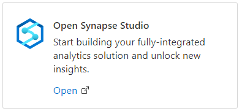

This will open the Synapse Studio related to the Synapse workspace you navigated to. The easiest way to start issuing serverless SQL pool queries is to use Knowledge center feature. There are two ways to launch knowledge center wizard:

1.	Click on question mark icon in top-right corner and select Knowledge center

    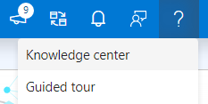

2.	Click on the Knowledge center link in Useful links section.
 
    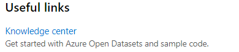

3. This will start the Knowledge center wizard. 
 
    [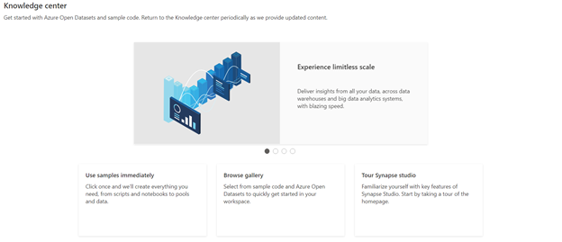](../media/knowledge-center-wizard.png#lightbox)

4. Select **Use samples immediately**, and on the right side select **Query data with SQL**, and hit **Use sample**.
 
    

5. A new SQL Script will be generated, querying the Azure Open Datasets and it will look like this:
 
    [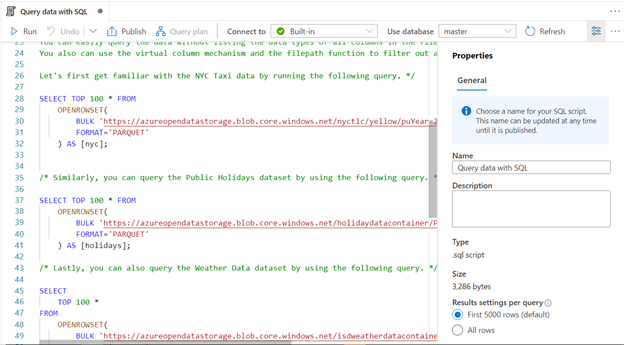](../media/view-knowledge-center-scripts.png#lightbox)

6. Select the query you want to execute and hit Run button in command menu. Once query is executed results will appear in the bottom part of the screen:
 
    [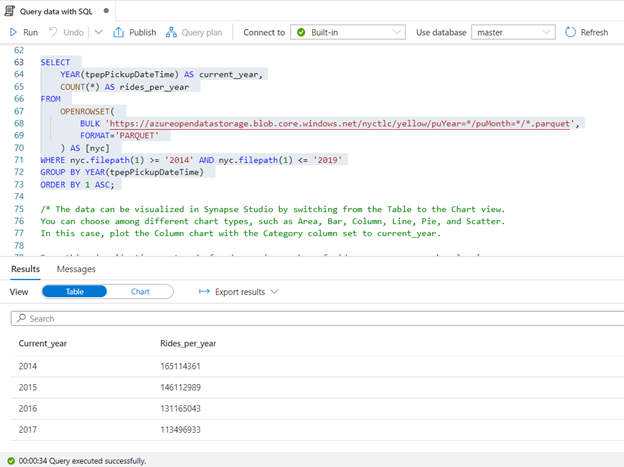](../media/execute-scripts.png#lightbox)

7. You can switch between Table and Chart mode of displaying results. Choosing Chart allows you to visualize the results immediately – I have executed the last query in the sample script and visualized the number of rides available in the data set.
 
    [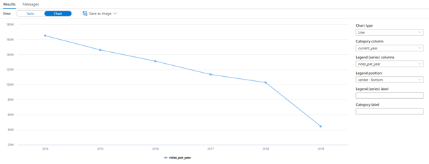](../media/visualize-script-execution-results.png#lightbox)

That’s it! In just a few clicks, you ran the query on serverless SQL pool and visualized the results.

You can now start querying your own data. Best way to start is to open your Storage and start browsing the files. You can do that by clicking on Data in the menu on the left side, click on Linked tab, select storage and filesystem/container you are interested in. Then navigate to the files you would like to start querying.
 
[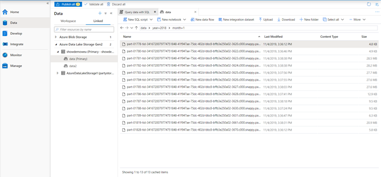](../media/view-files-data-lake.png#lightbox)

1. Right click on the file and select New SQL Script > SELECT TOP 100 rows.
 
    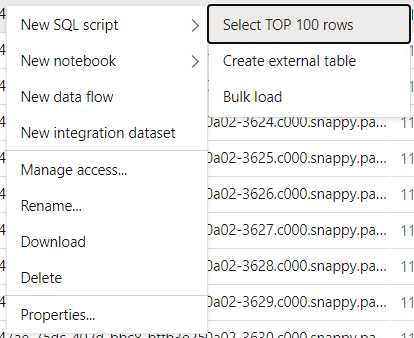

2. This will open a SQL Script with query ready to be executed to read 100 rows from the selected file.
 
    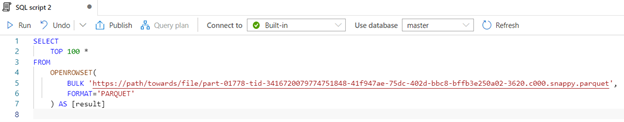

3. Hit run and results will appear at the bottom of the screen.

You will notice in command bar of this SQL Script you are connected to “Built-in” pool. This is the serverless SQL pool you get immediately when creating a Synapse workspace. Right from it, you can see list of databases that are created on this serverless SQL pool. From the drop-down menu, you can select the database on which you want to execute the query.

In Synapse Studio, once you click on the Data item in the menu on the left, in Workspace tab, you can see the list of all the database that belongs to this workspace. Databases with this icon:
 

Belong to built-in serverless SQL pool. Here is the example of one of the databases expanded to show the views available.
 
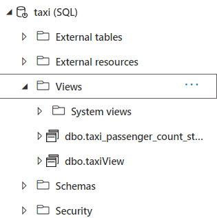
