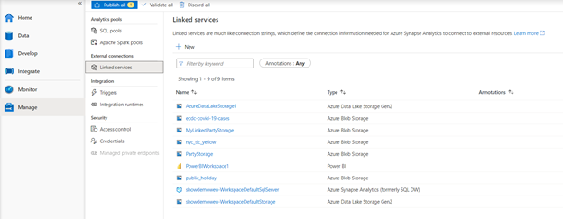
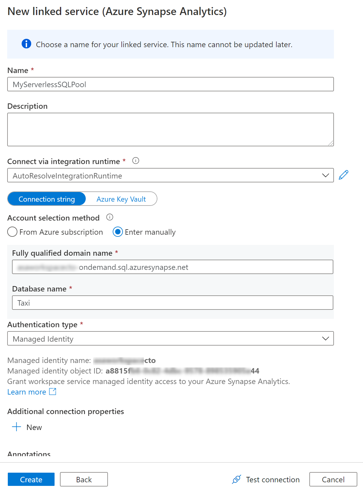
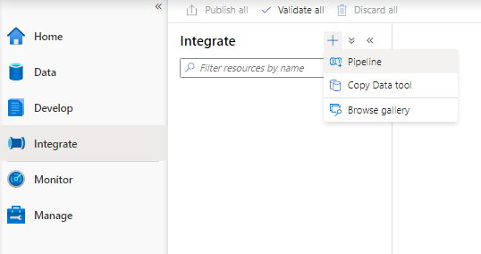
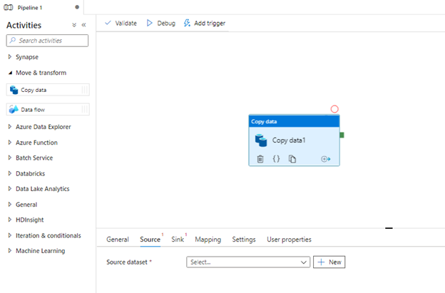
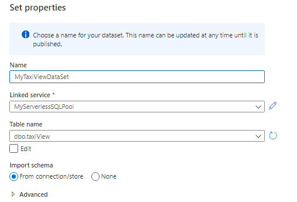
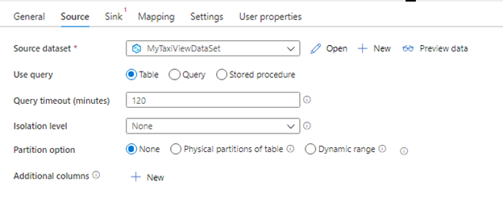
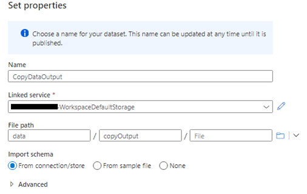
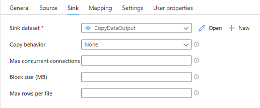
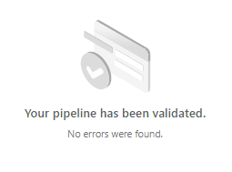

Synapse Pipelines are cloud ETL service for scale-out serverless data integration and data transformation. It offers a code-free UI for intuitive authoring and single-pane-of-glass monitoring and management.
You can use Synapse Pipeline to orchestrate data integration jobs and serverless SQL pool can be used as part of these jobs. To use serverless SQL pool in Synapse Pipeline, you need to ensure that the built-in serverless SQL pool is properly linked to the Synapse Pipeline. Select Manage item in the menu on the left side, than select Linked services.
 

Find the built-in serverless SQL pool in the list of linked services. If it’s not already there, click on + New button in the command menu. Page will open on the right side, find Synapse SQL pool or Azure Synapse Analytics (formerly SQL DW), and select it.
Once it opens, populate the page with information required. You will need to enter the built-in serverless SQL pool connection string information manually, like shown on the image below.
 

Once done, click Test connection button to see if everything will work out. Green checkbox reports that connection information is good. Click on Create now. Page will close and new linked service to you built-in serverless SQL pool will appear in the list.
Now navigate to the Integrate item in the menu on the left side, click on + button and select Pipeline.
 

Pipeline designer will open. Let’s say we now want to read the data from built-in serverless SQL pool and store results into the storage. To do this, drag and drop **Copy data** activity from **Move & transform** section. Once it’s added to the pipeline, select it and in the bottom of the screen select Source tab.
 

This is where we define the source of data for this copy activity. Click on +New button and page on the right will appear. Find SQL pool or Azure Synapse Analytics (formerly SQL DW) whatever you used to create a linked service. Give the data set a name, select linked service you just created for built-in serverless SQL pool, select a name of the table or view in Table name drop down, and click OK.
  

Source information in now populated.
 

Select Sink tab and hit + New button to create a new data set where we will copy the data to. In the page that appears on the right select Azure Data Lake Storage Gen2, next you can select the file format, let’s use Parquet. Next select the linked service for the storage where you want to write to and specify the path. You can use the default Azure Data Lake Storage Gen2 that you linked to the workspace when the workspace was created.
 

Now the sink information is populated.
 

You can change the behavior of copy activity, but for simplicity let’s leave everything to default.
At the top of the pipeline designer in command bar click on validate button. The page on the right should appear with a message that pipeline contains no errors.
 

Now click on Debug button in pipeline designer command bar and you pipeline will start executing.

Once pipeline finishes, you will see the status change to Completed. You can now go and check the files that were outputted. To operationalize this pipeline, make sure you give it a proper name, configure proper triggers that will start the pipeline, and publish it. 
