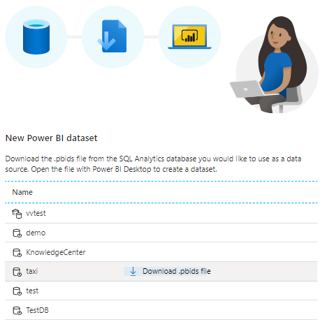
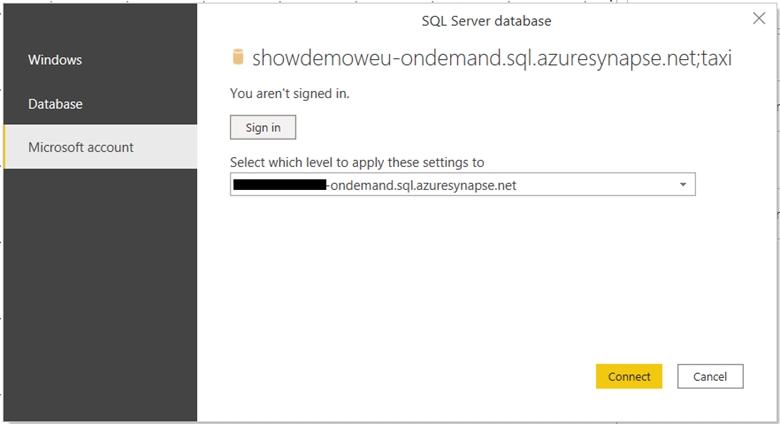
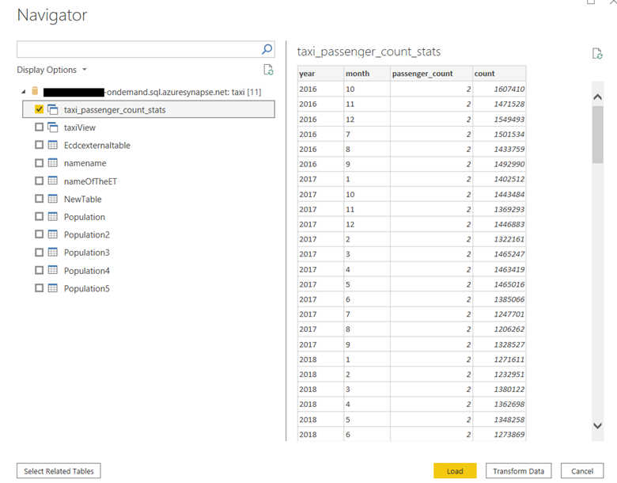
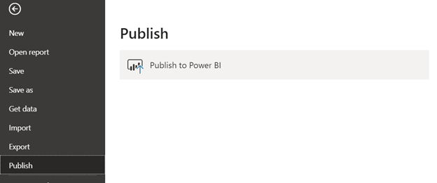
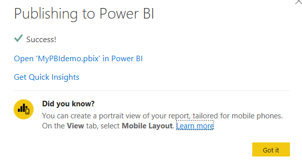

Power BI is a business analytics service that aims to provide interactive visualizations and business intelligence capabilities with an interface simple enough for end users to create their own reports and dashboards.

Power BI can be linked to Synapse workspace. To link your Power BI instance select Manage item in the menu on the left, then select Linked Services item. If you Power BI instance is not already in the linked services list, click on the +New button in command menu. In the page that will appear on the right select Power BI, then find the Power BI instance you want to connect to the workspace. Once that is done, your Power BI instance is linked to Synapse workspace.

To start creating Power BI reports using serverless SQL pool, select Develop item in the menu on the left, expand Power BI item, select your Power BI instance, and select Power BI data sets. In the command bar select + New Power BI dataset. Page on the right will appear with databases available in Synapse workspace. Click on Download .pbids file next to the database you previously created that belongs to built-in serverless SQL pool.
 

This will download a Power BI file with all connection information already populated. Open the file, it will launch Power BI desktop. Once Power BI desktop opens, it will ask you to sing in. Select Microsoft account on the left side and click sign-in button. This will open a web browser and ask you to enter your Microsoft account credentials.
 

Once singed in, click connect. New page will open where you can select the views or tables you want to use to build a report. Select the one you are interested in and click Load.
 

You will be asked to choose between direct query and import mode. Let’s use import mode for this example. Once selected, loading of the data will start, and after it’s done you can start building your report.
 
When done, save the report and publish it to Power BI server by clicking on File, Publish, Publish to Power BI.
 

New page will appear where you should select the Power BI instance you linked to the workspace and click publish. Once publishing it completed the following page will appear.
 

Now go back to Synapse Studio and select Develop tab in menu on the left, expand Power BI item, expand your Power BI instance item, and expand Power BI reports item. In the list you will be able to find the new report you have just built. Click on and it will open the report designer right as a new tab in Synapse Studio.

You can continue working on your report directly from Synapse Studio.
