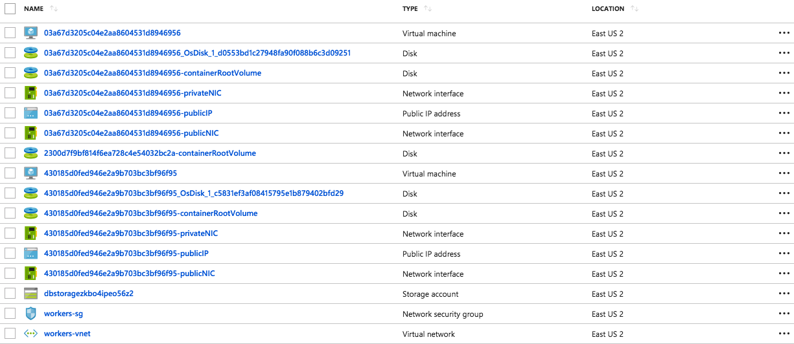
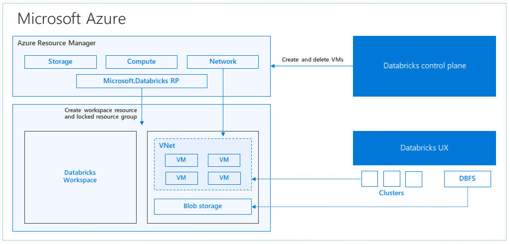

To gain a better understanding of how to develop with Azure Databricks, it is important to understand the underlying architecture. We will look at two aspects of the Databricks architecture: the Azure Databricks service and Apache Spark clusters.

## High-level overview

From a high level, the Azure Databricks service launches and manages Apache Spark clusters within your Azure subscription. Apache Spark clusters are groups of computers that are treated as a single computer and handle the execution of commands issued from notebooks. Using a master-worker type architecture, clusters allow processing of data to be parallelized across many computers to improve scale and performance. They consist of a Spark Driver (master) and worker nodes. The `driver` node sends work to the `worker` nodes and instructs them to pull data from a specified data source.

In Databricks, the notebook interface is the driver program. This driver program contains the main loop for the program and creates distributed datasets on the cluster, then applies operations (transformations & actions) to those datasets. Driver programs access Apache Spark through a `SparkSession` object regardless of deployment location.

Microsoft Azure manages the cluster, and auto-scales it as needed based on your usage and the setting used when configuring the cluster. Auto-termination can also be enabled, which allows Azure to terminate the cluster after a specified number of minutes of inactivity.

## Under the covers

Now let's take a deeper look under the covers. When you create an Azure Databricks service, a "Databricks appliance" is deployed as an Azure resource in your subscription. At the time of cluster creation, you specify the types and sizes of the virtual machines (VMs) to use for both the Driver and Worker nodes, but Azure Databricks manages all other aspects of the cluster.

> You also have the option of using a Serverless Pool. A Serverless Pool is self-managed pool of cloud resources that is auto-configured for interactive Spark workloads. You provide the minimum and maximum number of workers and the worker type, and Azure Databricks provisions the compute and local storage based on your usage.

The "Databricks appliance" is deployed into Azure as a managed resource group within your subscription. This resource group contains the Driver and Worker VMs, along with other required resources, including a virtual network, a security group, and a storage account. All metadata for your cluster, such as scheduled jobs, is stored in an Azure Database with geo-replication for fault tolerance.

Internally, Azure Kubernetes Service (AKS) is used to run the Azure Databricks control-plane and data-planes via containers running on the latest generation of Azure hardware (Dv3 VMs), with NvMe SSDs capable of blazing 100us latency on IO. These make Databricks I/O performance even better. In addition, accelerated networking provides the fastest virtualized network infrastructure in the cloud. Azure Databricks utilizes these features to further improve Spark performance. Once the services within this managed resource group are ready, you will be able to manage the Databricks cluster through the Azure Databricks UI and through features such as auto-scaling and auto-termination.

