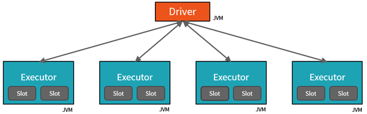

In the previous unit, we talked about the overall Azure Databricks architecture and added some context around the architecture of a Spark Cluster. Now let's dive a little deeper into how the cluster relates to Spark Jobs.

Before we break down these components in detail, let us summarize the fundamentals of a Spark architecture. As you may know, Spark is a Distributed computing environment. The unit of distribution is a Spark Cluster. Every Cluster has a Driver and one or more executors. Work submitted to the Cluster is split into as many independent Jobs as needed. This is how work is distributed across the Cluster's nodes. Jobs are further subdivided into tasks. The input to a job is partitioned into one or more partitions. These partitions are the unit of work for each slot. In between tasks, partitions may need to be re-organized and shared over the network.

## The cluster: Drivers, executors, slots & tasks

- The **Driver** is the JVM in which our application runs.
- The secret to Spark's awesome performance is parallelism.
  - Scaling vertically is limited to a finite amount of RAM, Threads and CPU speeds.
  - Scaling horizontally means we can simply add new "nodes" to the cluster almost endlessly.
- We parallelize at two levels:
  - The first level of parallelization is the **Executor** - a Java virtual machine running on a node, typically, one instance per node.
  - The second level of parallelization is the **Slot** - the number of which is determined by the number of cores and CPUs of each node.
- Each **Executor** has a number of **Slots** to which parallelized **Tasks** can be assigned to it by the **Driver**.

- The JVM is naturally multithreaded, but a single JVM, such as our **Driver**, has a finite upper limit.
- By creating **Tasks**, the **Driver** can assign units of work to **Slots** for parallel execution.
- Additionally, the **Driver** must also decide how to partition the data so that it can be distributed for parallel processing (not shown here).
- Consequently, the **Driver** is assigning a **Partition** of data to each task - in this way each **Task** knows which piece of data it is to process.
- Once started, each **Task** will fetch from the original data source the **Partition** of data assigned to it.

## Jobs & stages

- Each parallelized action is referred to as a **Job**.
- The results of each **Job** (parallelized/distributed action) is returned to the **Driver**.
- Depending on the work required, multiple **Jobs** will be required.
- Each **Job** is broken down into **Stages**.
- This would be analogous to building a house (the job)
  - The first stage would be to lay the foundation.
  - The second stage would be to erect the walls.
  - The third stage would be to add the room.
  - Attempting to do any of these steps out of order just won't make sense, if not just impossible.

## Cluster management

- At a much lower level, Spark Core employs a **Cluster Manager** that is responsible for provisioning nodes in our cluster.
  - Databricks provides a robust, high-performing **Cluster Manager** as part of its overall offerings.
- In each of these scenarios, the **Driver** is [presumably] running on one node, with each **Executors** running on N different nodes.
- For the sake of this learning path, we don't need to concern ourselves with cluster management, thanks to Azure Databricks.
- From a developer's and learner's perspective my primary focus is on...
  - The number of **Partitions** my data is divided into.
  - The number of **Slots** I have for parallel execution.
  - How many **Jobs** am I triggering?
  - And lastly the **Stages** those jobs are divided into.
