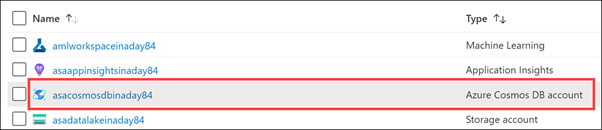
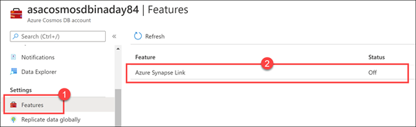
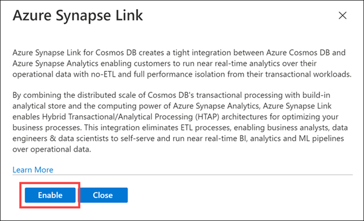
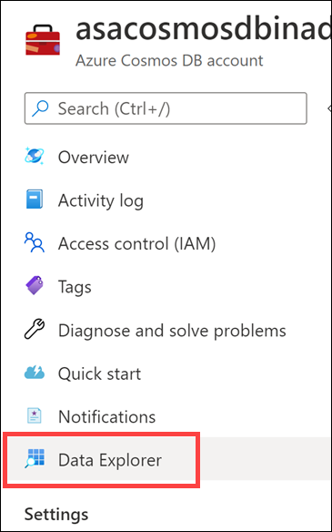
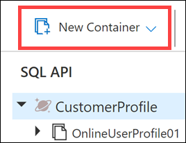
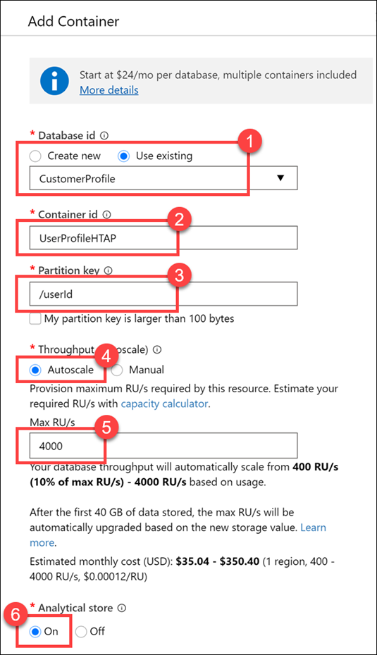
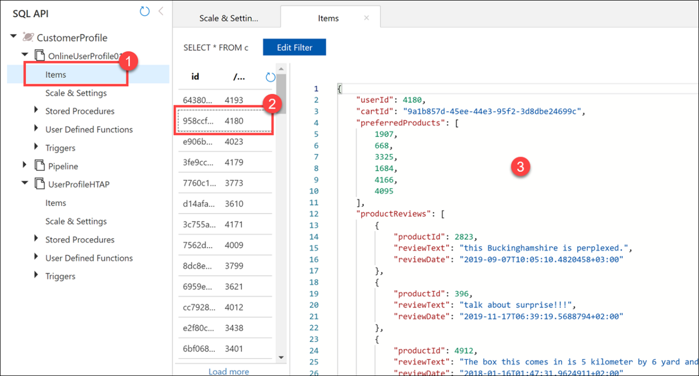

Hybrid Transactional and Analytical Processing enables businesses to perform analytics over a database system that is seen to provide transactional capabilities without impacting the performance of the system. This enables organizations to use a database to fulfill both transactional and analytical needs to support near real-time analysis of operational data to  make decisions about the information that is being analyzed. 

As an example, Tailwind Traders use Azure Cosmos DB to store user profile data from their eCommerce site. The NoSQL document store provided by the Azure Cosmos DB SQL API provides the familiarity of managing their data using SQL syntax, while being able to read and write the files at a massive, global scale.

While Tailwind Traders is happy with the capabilities and performance of Azure Cosmos DB, they are concerned about the cost of executing a large volume of analytical queries over multiple partitions (cross-partition queries) from their data warehouse. They want to efficiently access all the data without needing to increase the Azure Cosmos DB request units (RUs). They have looked at options for extracting data from their containers to the data lake as it changes, through the Azure Cosmos DB change feed mechanism. The problem with this approach is the extra service and code dependencies and long-term maintenance of the solution. They could perform bulk exports from a Synapse Pipeline, but then they won't have the most up-to-date information at any given moment.

You decide to enable Azure Synapse Link for Cosmos DB and enable the analytical store on their Azure Cosmos DB containers. With this configuration, all transactional data is automatically stored in a fully isolated column store. This store enables large-scale analytics against the operational data in Azure Cosmos DB, without impacting the transactional workloads or incurring resource unit (RU) costs. Azure Synapse Link for Cosmos DB creates a tight integration between Azure Cosmos DB and Azure Synapse Analytics, which enables Tailwind Traders to run near real-time analytics over their operational data with no-ETL and full performance isolation from their transactional workloads.

By combining the distributed scale of Cosmos DB's transactional processing with the built-in analytical store and the computing power of Azure Synapse Analytics, Azure Synapse Link enables a Hybrid Transactional/Analytical Processing (HTAP) architecture for optimizing Tailwind Trader's business processes. This integration eliminates ETL processes, enabling business analysts, data engineers & data scientists to self-serve and run near real-time BI, analytics, and Machine Learning pipelines over operational data.

Before we can create an Azure Cosmos DB container with an analytical store, we must first enable Azure Synapse Link.

## Enable Azure Synapse Link

1.	Navigate to the Azure portal (https://portal.azure.com) and select the **Azure Cosmos DB account**.
 
    

2.	Select **Features** in the left-hand menu **(1)**, then select **Azure Synapse Link (2)**.
 
    

3.	Select **Enable**.
 
    

## Create a new Azure Cosmos DB container

Tailwind Traders has an Azure Cosmos DB container named OnlineUserProfile01. Since we enabled the Azure Synapse Link feature after the container was already created, we cannot enable the analytical store on the container. We will create a new container that has the same partition key and enable the analytical store.

After creating the container, we will create a new Synapse Pipeline to copy data from the OnlineUserProfile01 container to the new one.

1.	Select **Data Explorer** on the left-hand menu.
 
    

2.	Select **New Container**.
 
    

3.	For **Database ID**, select **Use existing**, then select **CustomerProfile (1)**. Enter **UserProfileHTAP** for the **Container ID (2)**, then enter **/userId** for the **Partition key (3)**. For **Throughput**, select **Autoscale (4)**, then enter **4000** for the **Max RU/s** value **(5)**. Finally, set **Analytical store** to **On (6)**, then select **OK**.
 
    

    Here we set the partition key value to customerId, because it is a field we use most often in queries and contains a relatively high cardinality (number of unique values) for good partitioning performance. We set the throughput to Autoscale with a maximum value of 4,000 request units (RUs). This means that the container will have a minimum of 400 RUs allocated (10% of the maximum number), and will scale up to a maximum of 4,000 when the scale engine detects a high enough demand to warrant increasing the throughput. Finally, we enable the **analytical store** on the container, which allows us to take full advantage of the Hybrid Transactional/Analytical Processing (HTAP) architecture from within Synapse Analytics.

    Let's take a quick look at the data we will copy over to the new container.

4.	Expand the OnlineUserProfile01 container underneath the **CustomerProfile** database, then select **Items (1)**. Select one of the documents **(2)** and view its contents **(3)**. The documents are stored in JSON format.
 
    

With Azure Synapse Link enabled, and the analytical store provision, you are then able to query the analytical store directly from Azure Synapse Analytics, or create a pipeline to copy the contents of the analytical store 
