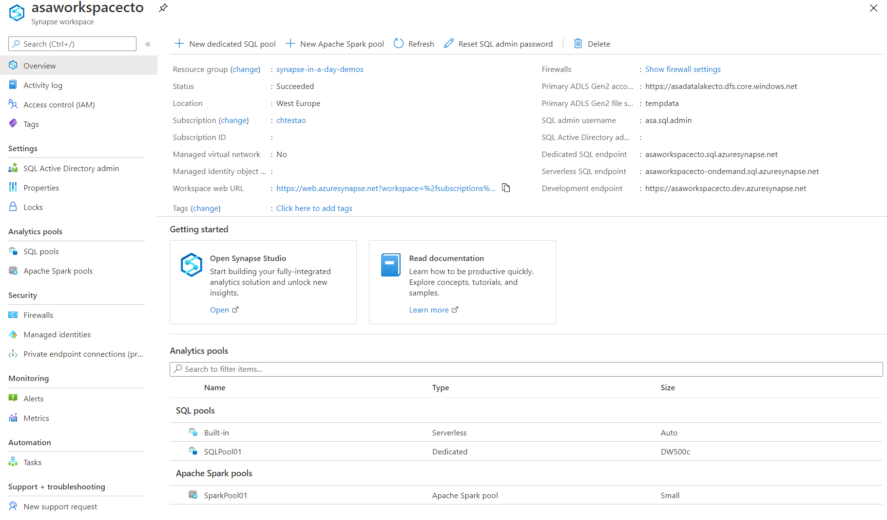

The first step in deploying Azure Synapse Analytics is to deploy an Azure Synapse Analytics workspace.  This deployment creates several resources which include an Azure Data Lake Storage Gen2 account that acts as the primary storage and the container to store workspace data. The workspace stores data in Apache Spark tables. It also stores Spark application logs under a folder called /synapse/workspacename. There are endpoints created that can be used to connect to the SQL on-demand service, and the Azure Synapse Analytics Workspace itself.

Azure Synapse Analytics enables you to create pools, either SQL pools, or Spark pools within the workspace that can be seamlessly mixed and matched based on your requirements. It is able to do this through Azure Synapse Analytics shared metadata, which enables the different engines to share databases and tables.

For example, A shared Hive-compatible metadata system allows tables defined on files in the data lake to be seamlessly consumed by either Spark or Hive. SQL and Spark can directly explore and analyze Parquet, CSV, TSV, and JSON files stored in the data lake. There is also a fast scalable load and unload for data going between SQL and Spark databases.

It is this capability that enables the Modern Data Warehousing workload pattern and gives the workspace SQL engines access to databases and tables created with Spark. It also allows the SQL engines to create their own objects that aren't being shared with the other engines.

The Azure Synapse Analytics workspace is the central location where you can view information about these resources and connect to them from within the Azure portal. The initial setup looks as follows:
 
> [!div class="mx-imgBorder"]
> 

With a SQL on-demand endpoint available, and an Azure Data Lake Storage Gen2 (ADLS Gen2) account, you can immediately realize value from the product by uploading files to the data lake, and using the SQL on-demand service to prepare and explore the files

Furthermore, while you are able to manage some aspects of the service in the Azure portal, the best practices is to connect to the Azure Synapse Studio to perform your activities from with there.
