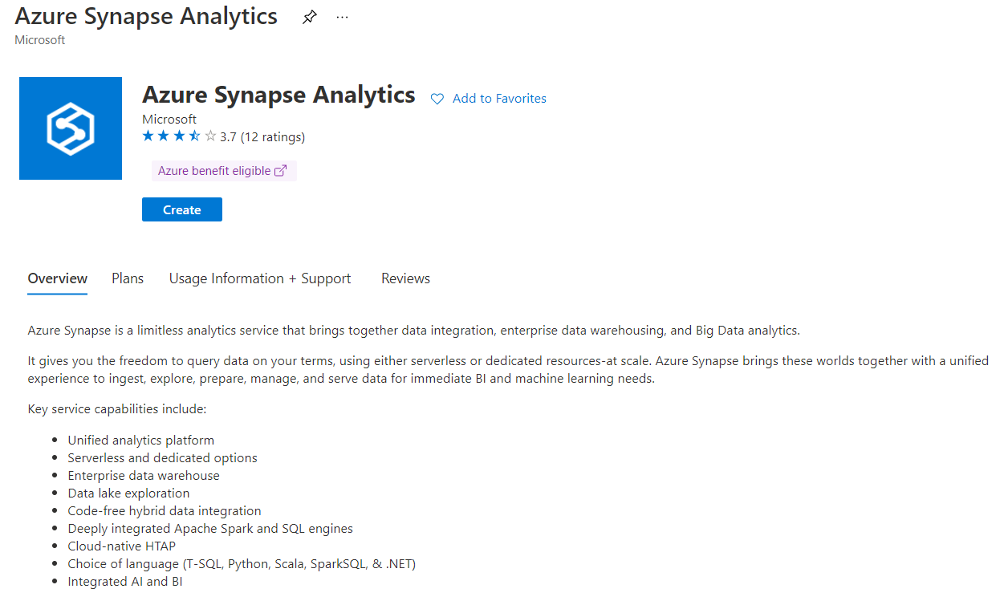
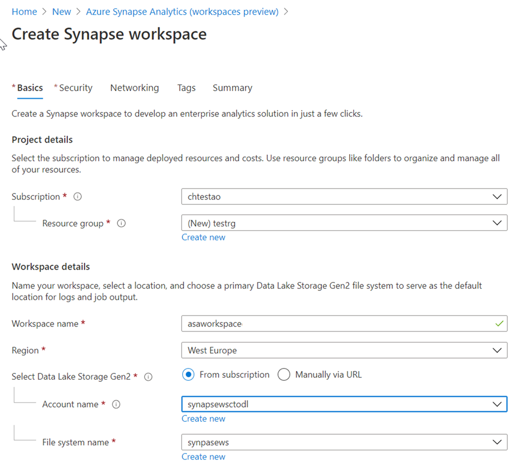

To create an Azure Synapse Analytics workspace, perform the following steps:

1. In the Azure portal, click on **+ Create a resource.**

1. In the text box, replace “Search the Marketplace” with the text “Azure Synapse” and then click on Azure Synapse Analytics (workspaces preview)

1. Click on **Create.**
 
    > [!div class="mx-imgBorder"]
    > 

1. In **Basics**, enter your preferred Subscription, Resource group, Region, and then type in a workspace name. 
 
    > [!div class="mx-imgBorder"]
    > 

1. You need to select a Data Lake Storage Gen2 account and a container in that account to create a workspace. The simplest choice it to create a new one. By clicking on the **Create new** hyperlink, but there is the option to use an existing one by click on the drop-down list.

1. Select **Review + create > Create.** Your workspace is ready in a few minutes.
