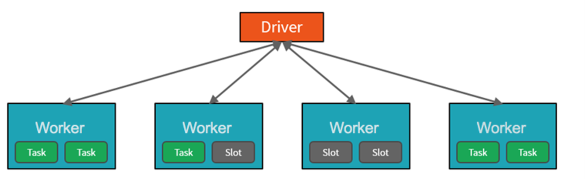

Apache Spark is an open-source distributed system that is used for processing big data workloads. Big data workloads are defined as workloads to handle data that is too large or complex for traditional database systems. Apache Spark processes large amounts of data in memory, which boosts the performance of analyzing big data more effectively, and this capability is available within Azure Synapse Analytics, and is referred to as Spark pools.

To achieve this capability, Spark pools clusters are groups of computers that are treated as a single computer and handle the execution of commands issued from notebooks. The clusters allow processing of data to be parallelized across many computers to improve scale and performance. It consists of a Spark Driver and Worker nodes. The Driver node sends work to the Worker nodes and instructs them to pull data from a specified data source. Moreover, you can configure the number of nodes that are required to perform the task.
 

Spark pools in Azure Synapse Analytics offer a fully managed Spark service. The benefits of creating a Spark pool in Synapse Analytics include.

## Speed and efficiency

Spark instances start in approximately 2 minutes for fewer than 60 nodes and approximately 5 minutes for more than 60 nodes. The instance shuts down, by default, 5 minutes after the last job executed unless it is kept alive by a notebook connection.

## Ease of creation

You can create a new Spark pool in Azure Synapse in minutes using the Azure portal, Azure PowerShell, or the Synapse Analytics .NET SDK.

## Ease of use

Synapse Analytics includes a custom notebook derived from Nteract. You can use these notebooks for interactive data processing and visualization.

## Scalability

Apache Spark in Azure Synapse pools can have Auto-Scale enabled, so that pools scale by adding or removing nodes as needed. Also, Spark pools can be shut down with no loss of data since all the data is stored in Azure Storage or Data Lake Storage.

## Support for Azure Data Lake Storage Generation 2

Spark pools in Azure Synapse can use Azure Data Lake Storage Generation 2 as well as BLOB storage.

The primary use case for Apache Spark for Azure Synapse Analytics is to process big data workloads that cannot be handled by Azure Synapse SQL, and where you don’t have an existing Apache Spark implementation. 

Perhaps you must perform a complex calculation on large volumes of data. Handling this requirement in Spark pools will be far more efficient than in Synapse SQL. You can pass the data through to the Spark cluster to perform the calculation, and then pass the processed data back into the data warehouse, or back to the data lake. 

If you already have a Spark implementation in place already, Azure Synapse Analytics can also integrate with other Spark implementations such as Azure Databricks, so you don’t have to use the feature in Azure Synapse Analytics if you already have a Spark setup already.

Finally, Spark pools in Azure Synapse Analytics come with Anaconda libraries pre-installed. Anaconda provides close to 200 libraries that enables you to use the spark pool to perform machine learning, data analysis, and data visualization. This can enable data scientists and data analysts to interact with the data using the Spark pool too.
