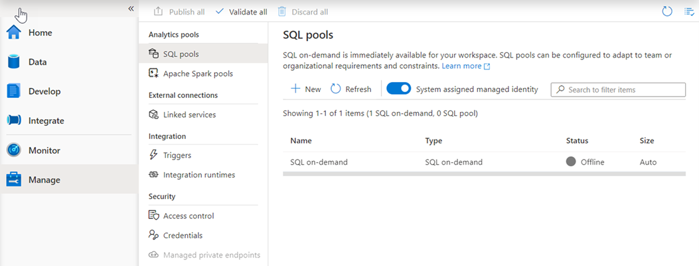
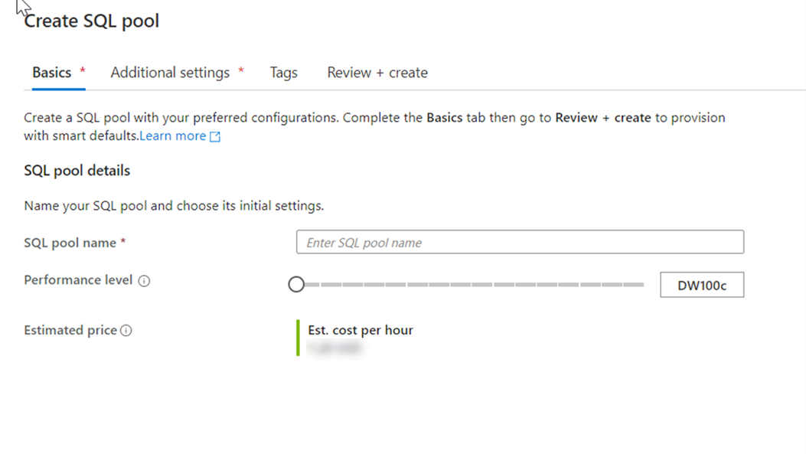
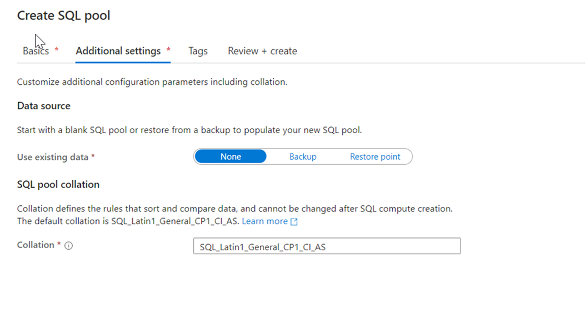
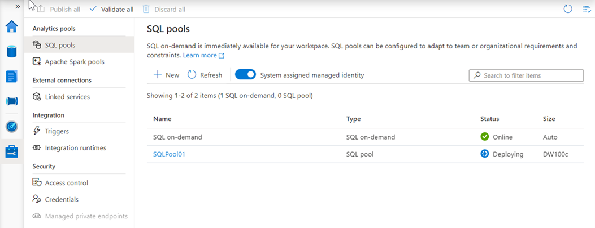
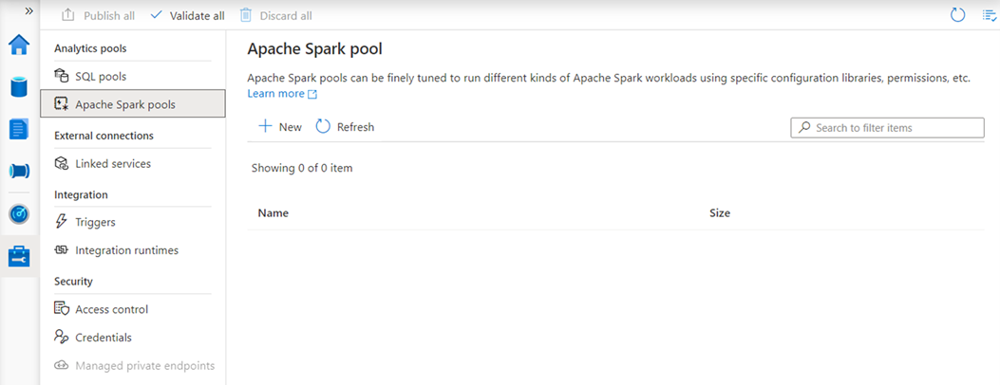
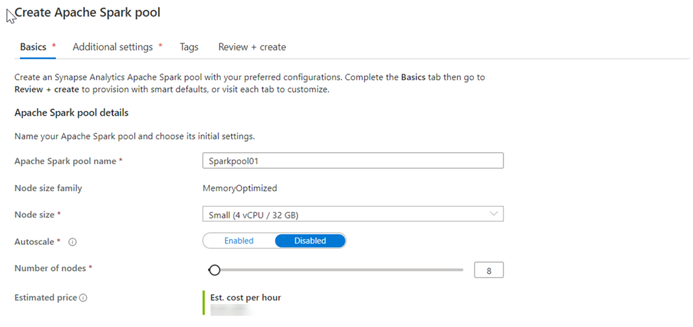
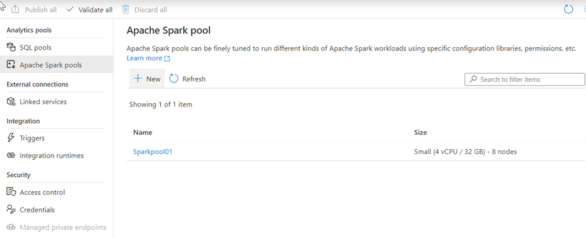
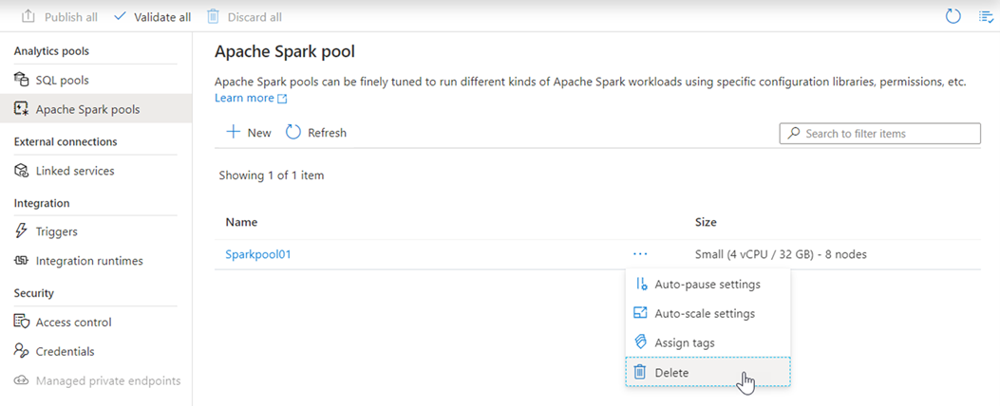

To create an Azure Synapse Analytics pool, perform the following steps:

## For Azure Synapse SQL pool

1. Launch Azure Synapse Studio. The URL can be found in the Azure Synapse Workspace created in the Azure portal.

1. In Azure Synapse Studio, navigate to the **Management Hub** in the left navigation by selecting the **Manage** icon.
 
    

1. Once in the Management Hub, navigate to the **SQL pools** section to see the current list of SQL pools that are available in the workspace.

1. Select **+ New** command and the new SQL pool create wizard will appear.
 
    > [!div class="mx-imgBorder"]
    > 

1. Enter the following details in the **Basics** tab:
    - SQL pool name:  SQLPool01
    - Performance level: DW100c

1. In the next tab, **Additional settings**, select **none** to provision the SQL pool without data. Leave the default collation as selected.
 
    > [!div class="mx-imgBorder"]
    > 

1. We won't add any tags for now, so next select **Review + create**.

1. In the **Review + create** tab, make sure that the details look correct based on what was previously entered, and press **create**
 
    > [!div class="mx-imgBorder"]
    > 

   At this point, the resource provisioning flow will start. After the provisioning completes, navigating back to the workspace will show a new entry for the newly created SQL pool.

1. Once the SQL pool is created, it will be available in the workspace for loading data, processing streams, reading from the lake, etc.
 
    

## Azure Synapse Spark pool

1. Launch Azure Synapse Studio. The URL can be found in the Azure Synapse Workspace created in the Azure portal.

1. In Azure Synapse Studio, navigate to the **Management Hub** in the left navigation by selecting the **Manage** icon.

1. Once in the Management Hub, navigate to the **Apache Spark pools** section to see the current list of Apache Spark pools that are available in the workspace.

    

1. Select **+ New** and the new Apache Spark pool create wizard will appear.

1. Enter the following details in the **Basics** tab:
    - Apache Spark Pool name: Sparkpool01
    - Node size: Small (4 vCPU / 32 GB)
    - Autoscale: Disabled
    - Number of Nodes: 8
 
    > [!div class="mx-imgBorder"]
    > 

1. In the next tab (Additional settings), leave all settings as defaults.

1. We won't add any tags for now, so select **Review + create**.

1. In the **Review + create** tab, make sure that the details look correct based on what was previously entered, and press **Create**.
 
    > [!div class="mx-imgBorder"]
    > 

1. The Apache Spark pool will start the provisioning process.Once the provisioning is complete, the new Apache Spark pool will appear in the list.
 
    > [!div class="mx-imgBorder"]
    > 

## Delete a pool.

1. Navigate to the pools in the Management Hub in Synapse Studio. In this case Apache Spark

1. Select the ellipsis next to the Apache pool to be deleted (in this case, **Sparkpool01**) to show the commands for the Apache Spark pool.
 
    > [!div class="mx-imgBorder"]
    > 

1. Press **delete**.

1. Confirm the deletion, and press **Delete** button.

1. When the process completes successfully, the Apache Spark pool will no longer be listed in the workspace resources.
