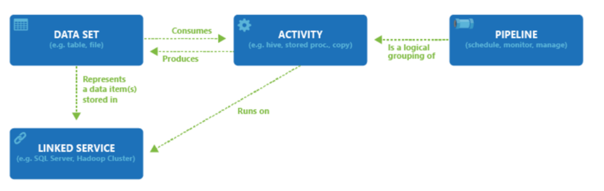

Azure Synapse Pipelines is the cloud-based ETL and data integration service that allows you to create data-driven workflows for orchestrating data movement and transforming data at scale. Using Azure Synapse Pipelines, you can create and schedule data-driven workflows (called pipelines) that can ingest data from disparate data stores. You can build complex ETL, or ELT processes that transform data visually with data flows or by using compute services such as Azure HDInsight Hadoop, Azure Databricks, and Azure Synapse Analytics.

Much of the functionality of Azure Synapse Pipelines come from the Azure Data Factory features and are commonly referred to as Pipelines. Azure Synapse Pipelines enables you to integrate data pipelines between SQL Pools, Spark Pools and SQL Serverless, providing a one stop shop for all your analytical needs.

Like Azure Data Factory, Azure Synapse Pipelines is composed of four core components. These components work together to provide the platform on which you can compose data-driven workflows with steps to move and transform data.

> [!VIDEO https://channel9.msdn.com/Shows/Learn-Azure/Understand-ADF-Components/player?format=ny]

Data Factory supports a wide variety of data sources that you can connect to through the creation of an object known as a **Linked Service**, which enables you to ingest the data from a data source in readiness to prepare the data for transformation and/or analysis. In addition, Linked Services can fire up compute services on demand. For example, you may have a requirement to start an on-demand HDInsight cluster for the purpose of just processing data through a Hive query. So Linked Services enables you to define data sources, or compute resource that is required to ingest and prepare data.

With the linked service defined, Azure Data Factory is made aware of the datasets that it should use through the creation of a **Datasets** object. Datasets represent data structures within the data store that is being referenced by the Linked Service object. Datasets can also be used by an ADF object known as an Activity.

**Activities** typically contain the transformation logic or the analysis commands of the Azure Data Factory’s work. Activities includes the Copy Activity that can be used to ingest data from a variety of data sources. It can also include the Mapping Data Flow to perform code-free data transformations. It can also include the execution of a stored procedure, Hive Query, or Pig script to transform the data. You can push data into a Machine Learning model to perform analysis. It is not uncommon for multiple activities to take place that may include transforming data using a SQL stored procedure and then perform analytics with Databricks. In this case, multiple activities can be logically grouped together with an object referred to as a **Pipeline**, and these can be _scheduled_ to execute, or a _trigger_ can be defined that determines when a pipeline execution needs to be kicked off. There are different types of triggers for different types of events.
 

_Control flow_ is an orchestration of pipeline activities that includes chaining activities in a sequence, branching, defining parameters at the pipeline level, and passing arguments while invoking the pipeline on-demand or from a trigger. It also includes custom-state passing and looping containers, and For-each iterators.

_Parameters_ are key-value pairs of read-only configuration.  Parameters are defined in the pipeline. The arguments for the defined parameters are passed during execution from the run context that was created by a trigger or a pipeline that was executed manually. Activities within the pipeline consume the parameter values.

Azure Synapse pipelines has an _integration runtime_ that enables it to bridge between the activity and linked Services objects. It is referenced by the linked service, and provides the compute environment where the activity either runs on or gets dispatched from. This way, the activity can be performed in the region closest possible. There are three types of Integration Runtime, including Azure, Self-hosted, and Azure-SSIS.

Once all the work is complete, you can then use Data Factory to publish the final dataset to another linked service that can then be consumed by technologies such as Power BI or Machine Learning.
