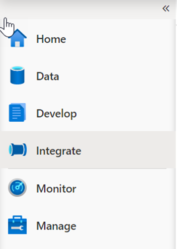
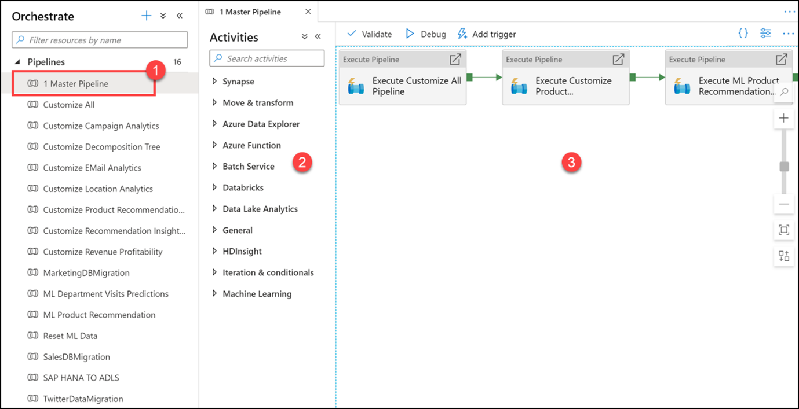
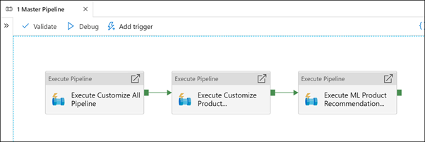
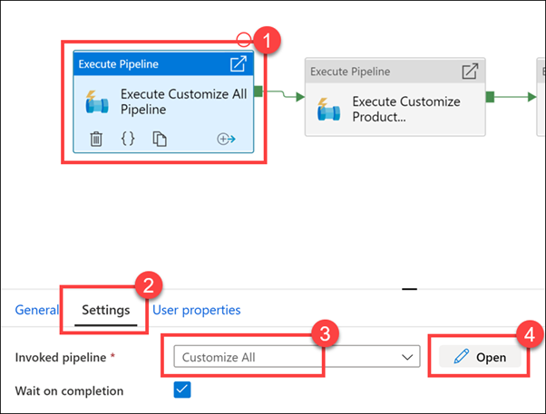
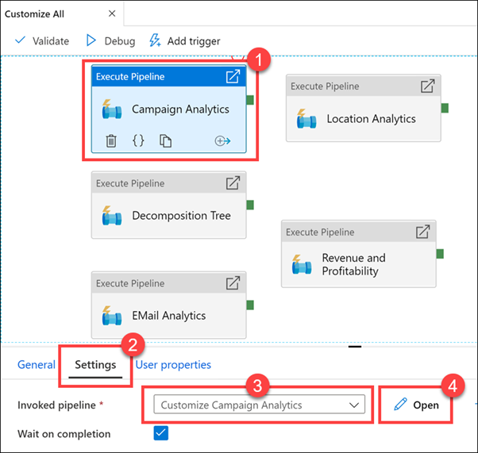

1. Launch Azure Synapse Studio. The URL can be found in the Azure Synapse Workspace created in the Azure portal.

1. In Azure Synapse Studio, navigate to the **Integrate Hub** in the left navigation by selecting the **Integrate** icon.

    

1. Expand Pipelines and select **1 Master Pipeline (1)**. Point out the **Activities (2)** that can be added to the pipeline, and show the **pipeline canvas (3)** on the right.
 
    

1. Our Synapse workspace contains 16 pipelines that enable us to orchestrate data movement and transformation steps over data from several sources.

1. The **Activities** list contains many activities that you can drag and drop onto the pipeline canvas on the right.

1. Here we see that we have three execute (child) pipelines:
 
    

1. Select the **Execute Customize All Pipeline** activity **(1)**. Select the **Settings (2)** tab. Show that the invoked pipeline is **Customize All (3)**, then select **Open (4)**.
 
    

1. As you can see, there are five child pipelines. This **first execute pipeline activity** cleans and ingests new Manufacturer campaign data for the Campaign Analytics report.

1. Select the **Campaign Analytics** activity **(1)**, select the **Settings** tab **(2)**, observe the invoked pipeline is set to **Customize All (3)**, then select **Open (4)**.
 
    

1. **Observe** how cleaning and ingesting happens in the pipeline by clicking on each activity.
 
    
