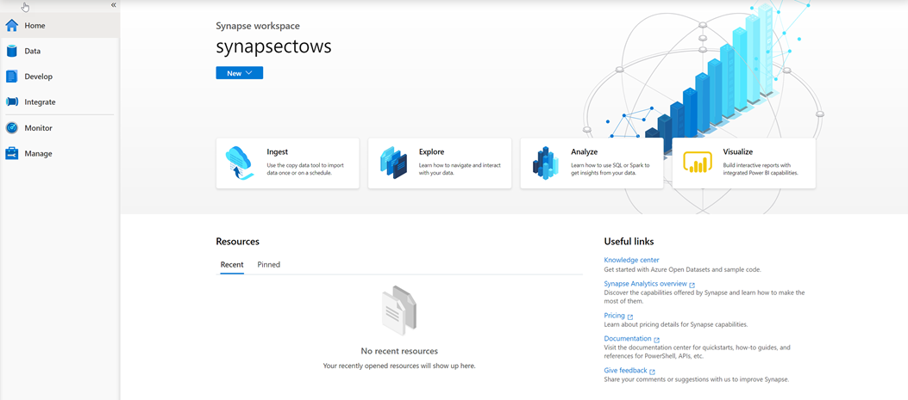
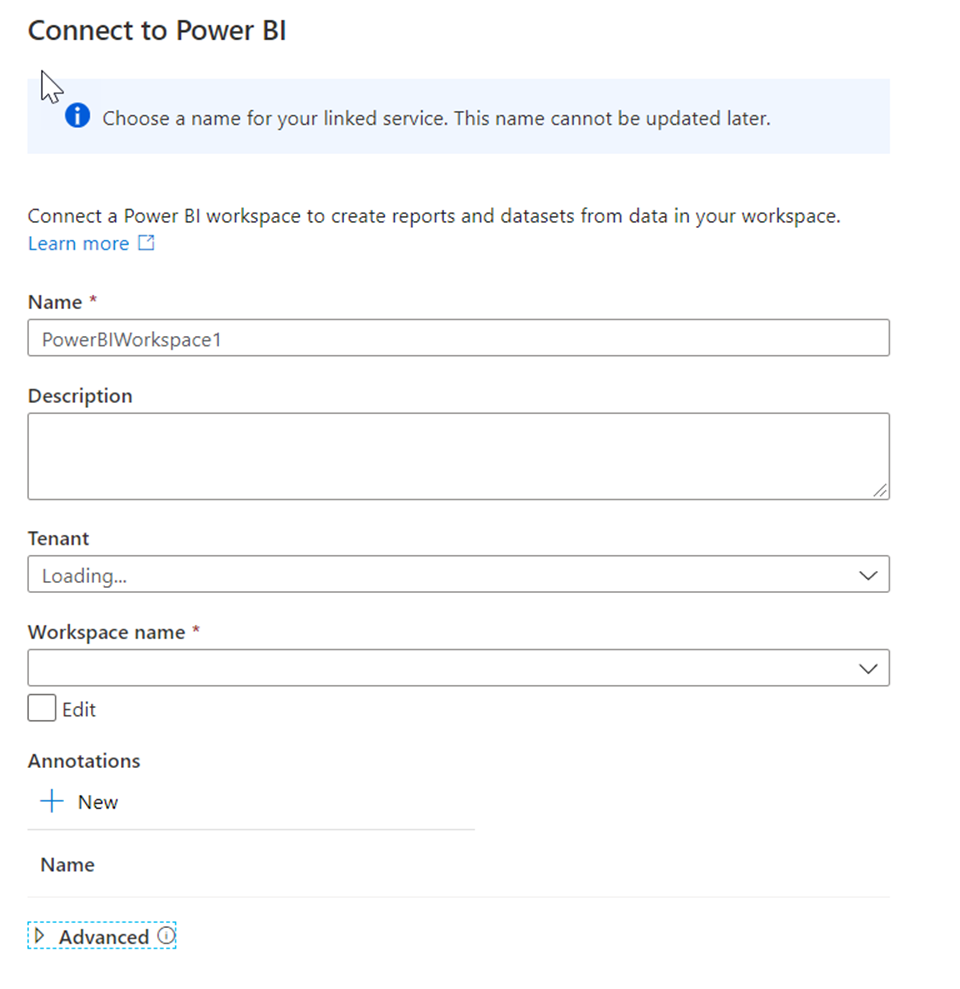
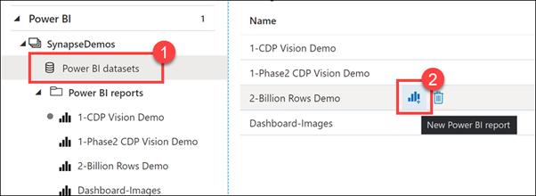
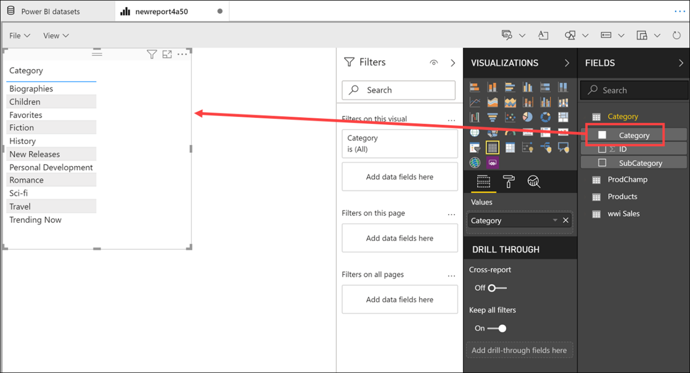
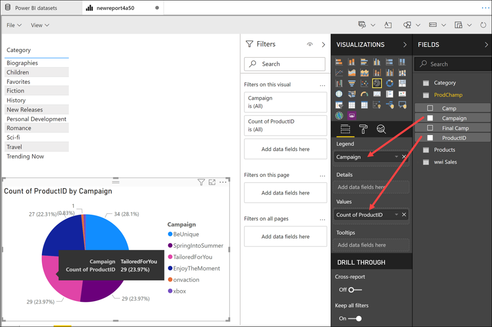

You can integrate You can integrate your Azure Synapse Analytics workspace with a new Power BI workspace so that you can get you data from within Azure Synapse Analytics visualized in a Power BI report or dashboard.

1. You can perform this step by clicking on the visualize icon on the home page of Azure Synapse Studio
 
    

1. Which will bring up the Connect to Power BI screen.
 
    

1. Here you can define a name and description for the Power BI Workspace. Then you would select the Tenant and Workspace name. Once you have connected to your workspace, you will be able to access the existing reports in the Power BI workspace in the Develop hub in Azure Synapse Studio. 
 
    

1. Expand Power BI, expand SynapseDemos, expand Power BI reports, then select **1-CDP Vision Demo (1)**. Select the arrows to collapse the **Visualizations pane **(2)** and the **Fields** pane **(3)** to increase the report size.
 
    

1. As you can see, we can create, edit, and view Power BI reports from within Synapse Studio! As a business analyst, data engineer, or developer, you no longer need to open another browser window, sign in to Power BI, and toggle back and forth between environments.

1. Select a **Campaign Name** and **Region** within the **Decomposition Tree Analysis** tab to explore the data. If you hover over an item, you will see a tool tip.
 
    

1. Select the **Campaign Analytics** tab at the bottom of the report.
 
    

1. The Campaign Analytics report combines data from the various data sources to create a compelling visualization of valuable data within an interactive interface.

1. You can select various filters, campaigns, and chart values to filter the results. Select an item to for the second time to deselect it.
 
    

1. Select **Power BI datasets (1)** in the left-hand menu, hover over the **2-Billion Rows Demo** dataset and select the **New Power BI report** icon **(2)**.
 
    

1. Here is how we can create a brand new Power BI report from a dataset that is part of the linked Power BI workspace, from within Synapse Studio.

1. Expand the Category table, then **drag-and-drop** the **Category** field on to the report canvas. This creates a new Table visualization that shows the categories.
 
    

1. Select a blank area on the report canvas to deselect the table, then select the **Pie chart** visualization.
 
    

1. Expand the ProdChamp table. Drag **Campaign** onto the **Legend** field, then drag **ProductID** onto the **Values** field. Resize the pie chart and hover over the pie slices to see the tool tips.
 
    

1. We have very quickly created a new Power BI report, using data stored within our Synapse Analytics workspace, without ever leaving the studio.
