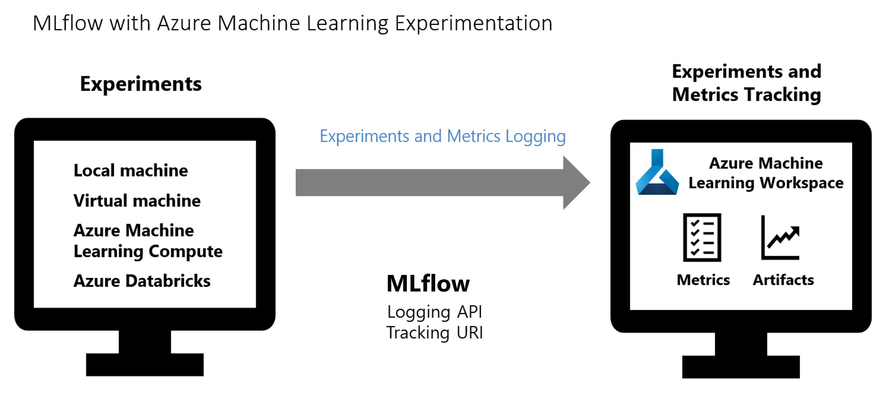

[MLflow](https://www.mlflow.org/) is an open-source library for managing the life cycle of your machine learning experiments. [MLFlow Tracking](https://mlflow.org/docs/latest/quickstart.html#using-the-tracking-api) is a component of MLflow that logs and tracks your training run metrics and model artifacts, no matter your experiment's environment.

A recommended approach for running Azure Machine Learning (AML) Experiments on Azure Databricks cluster is to use MLflow Tracking and connect Azure Machine Learning as the backend for MLflow experiments.

The following diagram illustrates that with MLflow Tracking, you track an experiment's run metrics and store model artifacts in your Azure Machine Learning workspace.



## Track AML Experiments in Azure Databricks

When running AML experiments in Azure Databricks, there are three key steps:

1. Configure MLflow tracking URI to use AML.
2. Configure a MLflow experiment.
3. Run your experiment.

### 1. Configure MLflow tracking URI to use AML

In order to configure MLflow Tracking and connect Azure Machine Learning as the backend for MLFlow experiments, you need to follow these steps as shown in the code snippet:

- Get your AML workspace object.
- From your AML workspace object, get the unique tracking URI address.
- Setup MLflow tracking URI to point to AML workspace.

```python
import mlflow
from azureml.core import Workspace

# Get your AML workspace
ws = Workspace.from_config()

# Get the unique tracking URI address to the AML workspace
tracking_uri = ws.get_mlflow_tracking_uri()

# Set up MLflow tracking URI to point to AML workspace
mlflow.set_tracking_uri(tracking_uri)
```

### 2. Configure a MLflow experiment

Provide the name for the MLflow experiment as shown below. Note that the same experiment name will appear in Azure Machine Learning.

```python
experiment_name = 'MLflow-AML-Exercise'
mlflow.set_experiment(experiment_name)
```

### 3. Run your experiment

Once the experiment is set up, you can start your training run with `start_run()` as shown below:

```python
with mlflow.start_run() as run:
    ...
    ...
```

Your model training and logging code are provided within the `with` block.
