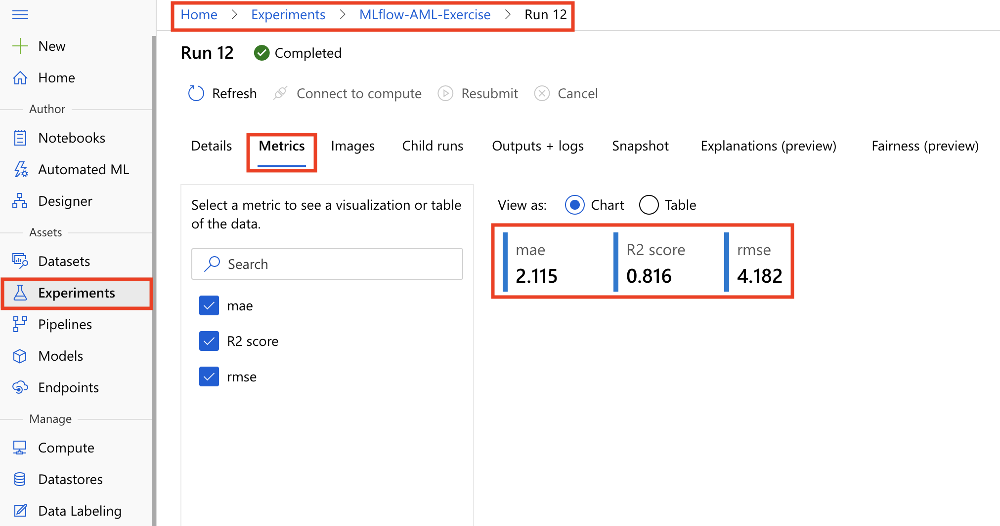
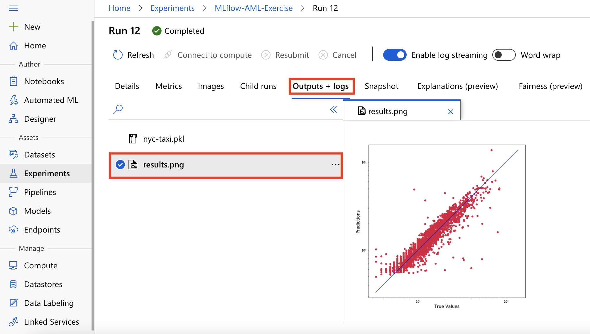

In the previous unit, we discussed how to set up Azure Machine Learning as the backend for MLflow experiments. We also looked at how to start your model training on Azure Databricks as a MLflow experiment. In this section, we will look at how to log model metrics and artifacts to the MLflow logging API. These logged metrics and artifacts are then captured in an Azure Machine Learning workspace that provides a centralized, secure, and scalable location to store training metrics and artifacts.

In your MLflow experiment, once you train and evaluate your model, you can use the MLflow logging API, `mlflow.log_metric()`, to start logging your model metrics as shown below:

```python
with mlflow.start_run() as run:
    ...
    ...
    # Make predictions on hold-out data
    y_predict = clf.predict(X_test)
    y_actual = y_test.values.flatten().tolist()

    # Evaluate and log model metrics on hold-out data
    rmse = math.sqrt(mean_squared_error(y_actual, y_predict))
    mlflow.log_metric('rmse', rmse)
    mae = mean_absolute_error(y_actual, y_predict)
    mlflow.log_metric('mae', mae)
    r2 = r2_score(y_actual, y_predict)
    mlflow.log_metric('R2 score', r2)
```

Next, you can use MLflow’s `log_artifact()` API to save model artifacts such as your `Predicted vs True` curve as shown:

```python
import matplotlib.pyplot as plt

with mlflow.start_run() as run:
    ...
    ...
    plt.scatter(y_actual, y_predict)
    plt.savefig("./outputs/results.png")
    mlflow.log_artifact("./outputs/results.png")
```

## Reviewing experiment metrics and artifacts in Azure ML Studio

Since Azure Machine Learning is set up as the backend for MLflow experiments, you can review all the training metrics and artifacts from within the Azure Machine Learning Studio. From within the studio, navigate to the `Experiments` tab, and open the experiment run that corresponds to the MLflow experiment. In the `Metrics` tab of the run, you will observe the model metrics that were logged via MLflow tracking APIs.



Next, when you open the `Outputs + logs` tab you will observe the model artifacts that were logged via MLflow tracking APIs. 



In summary, using MLflow integration with Azure Machine Learning, you can run experiments in Azure Databricks and leverage Azure Machine Learning workspace capabilities of centralized, secure, and scalable solution to store model training metrics and artifacts.