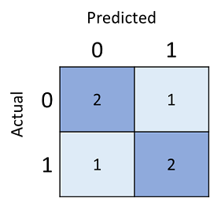

*Classification* is a form of machine learning in which you train a model to predict which category or *class*, an item belongs to. For example, a health clinic might use diagnostic data such as a patient's height, weight, blood pressure, blood-glucose level, and so on, to predict whether or not the patient is diabetic.

In this example, there are two possible classes (non-diabetic and diabetic), making this an example of *binary* classification. The class prediction is made by determining the *probability* for each possible class as a value between 0 (impossible) and 1 (certain). The total probability for all classes is 1 (the patient is definitely either diabetic or non-diabetic), so if the predicted probability of a patient being diabetic is 0.3, then there is a corresponding probability of 0.7 that the patient is non-diabetic. A threshold value, usually 0.5, is used to determine the predicted class - so if the *positive* class (in this case, diabetic) has a predicted probability greater than the threshold, then a classification of diabetic is predicted.

It's also possible to create *multiclass* classification models, in which there are more than two possible classes. For example, the health clinic might expand the diabetes model to classify patients as non-diabetic, type-1 diabetic, or type-2 diabetic. The individual class probability values would still add up to a total of 1 (the patient is definitely in one of the three classes), and the most probable class would be predicted by the model.

## Training and evaluating a classification model

Classification is an example of a *supervised* machine learning technique, which means it relies on data that includes known *feature* values (for example, diagnostic measurements for patients) as well as known *label* values (for example, a classification of non-diabetic or diabetic). A classification algorithm is used to fit a subset of the data to a function that can calculate the probability for each class label from the feature values. The remaining data is used to evaluate the model by comparing the predictions it generates from the features to the known class labels.

### A simple example

Let's explore a simple example to help explain the key principles. Suppose we have the following patient data, which consists of a single feature (blood-glucose level) and a class label (0 for non-diabetic, 1 for diabetic).

| Blood-Glucose | Diabetic |
| ----------- | ------- |
| 82 | 0 |
| 92 | 0 |
| 112 | 1 |
| 102 | 0 |
| 115 | 1 |
| 107 | 1 |
| 87 | 0 |
| 120 | 1 |
| 83 | 0 |
| 119 | 1 |
| 104 | 1 |
| 105 | 0 |
| 86 | 0 |
| 109 | 1 |

We'll use the first eight observations to train a classification model, and we'll start by plotting the blood-glucose feature (which we'll call ***x***) and the predicted diabetic label (which we'll call ***y***).

What we need is a function that calculates a probability value for ***y*** based on ***x*** (in other words, we need the function ***f(x) = y***). You can see from the chart that patients with a low blood-glucose level all non-diabetic, while patients with a higher blood-glucose level higher are diabetic. It seems like the higher the blood-glucose level, the more probable it is that a patient is diabetic, with the inflexion point being somewhere between 100 and 110. We need to fit a function that calculates a value between 0 and 1 for ***y*** to these values.

One such function is a *logistic* function, which forms a sigmoidal (S-shaped) curve, like this:

Now we can use the function to calculate a probability value that ***y*** is positive (in other words, the patient is diabetic) from any value of ***x*** by finding the point on the function line for ***x***; and we can set a threshold value of 0.5 as the cut-off point for the class label prediction. Let's test it with the data values we held-back.

Points plotted below the threshold line will yield a predicted class of 0 (non-diabetic), and points above the line will be predicted as 1 (diabetic).

Now we can compare the label predictions based on the logistic function encapsulated in the model (which we'll call ***y&#770;***, or "y-hat") to the actual class labels (***y***).

| x | y | y&#770; |
| - | - | ------------- |
| 83 | 0 | 0 |
| 119 | 1 | 1 |
| 104 | 1 | 0 |
| 105 | 0 | 1 |
| 86 | 0 | 0 |
| 109 | 1 | 1 |

We can tabulate the results in a structure called a *confusion matrix*, like this:

The confusion matrix shows the total number of cases where:

- The model predicted 0, and the actual label is 0 (*true negatives*)
- The model predicted 1 and the actual label is 1 (*true positives*)
- The model predicted 0 and the actual label is 1 (*false negatives*)
- The model predicted 1 and the actual label is 0 (*false positives*)

The cells in the confusion matrix are often shaded so that higher values have a deeper shade. This makes it easier to see a strong diagonal trend from top-left to bottom-right, highlighting the cells where the predicted value and actual value are the same.

From these core values, you can calculate a range of other metrics that can help you evaluate the performance of the model. For example:

- **Accuracy**: (TP+TN)/(TP+TN+FP+FN) - in other words, out all of the predictions, how many were correct?
- **Recall**: TP/(TP+FN) - in other words, of all the cases that *are* positive, how many did the model identify?
- **Precision**: TP/(TP+FP) - in other words, of all the cases that the model predicted to be positive, how many actually *are* positive?
