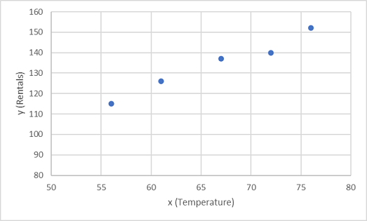

*Regression* is a form of machine learning in which the goal is to create a model that can predict a numeric, quantifiable value; such as a price, amount, size, or other scalar number.

For example, a company that rents bicycles might want to predict the expected number of rentals in a given day, based on the season, day of the week, weather conditions, and so on.

## Training and evaluating a regression model

Regression works by establishing a relationship between variables in the data that represent characteristics (known as the *features*) of the thing being observed, and the variable we're trying to predict (known as the *label*). In this case, we're observing information about days, so the features include things like the day of the week, month, temperature, rainfall, and so on; and the label is the number of bicycle rentals.

To train the model, we start with a data sample containing the features as well as known values for the label - so in this case we need historic data that includes dates, weather conditions, and the number of bicycle rentals. We'll then split this data sample into two subsets:

- A *training* dataset to which we'll apply an algorithm that determines a function encapsulating the relationship between the feature values and the known label values.
- A *validation* or *test* dataset that we can use to evaluate the model by using it to generate predictions for the label and comparing them to the actual known label values.

The use of historic data with known label values to train a model makes regression an example of *supervised* machine learning.

### A simple example

Let's take a simple example to see how the training and evaluation process works in principle. Suppose we simplify the scenario so that we use a single feature, average daily temperature, to predict the bicycle rentals label.

We start with some data that includes known values for the average daily temperature feature and the bicycle rentals label.

| Temperature | Rentals |
| ----------- | ------- |
| 56 | 115 |
| 61 | 126 |
| 67 | 137 |
| 72 | 140 |
| 76 | 152 |
| 82 | 156 |
| 54 | 114 |
| 62 | 129 |

Now we'll take the first five of these observations and use them to train a regression model. Our goal is to find a function (let's call it ***f***) that we can apply to the temperature feature (which we'll call ***x***) to calculate the rentals label (which we'll call ***y***). In other words, we need to define the following function: ***f(x) = y***.

Let's start by plotting the training values for ***x*** and ***y*** on a chart:

Now we need to fit these values to a function, allowing for some random variation. You can probably see that the plotted points form an almost straight diagonal line - in other words, there's an apparent *linear* relationship between ***x*** and ***y***, so we need to find a linear function that's the best fit for the data sample. There are various algorithms we can use to determine this function, which will ultimately find a straight line with minimal overall variance from the plotted points; like this:

The line represents a linear function that can be used with any value of ***x*** to apply the *slope* of the line and its *intercept* (where the line crosses the y axis when ***x*** is 0) to calculate ***y***. In this case, if we extended the line to the left we'd find that when ***x*** is 0, ***y*** is around 20, and the slope of the line is such that for each unit of ***x*** you move along to the right, ***y*** increases by around 1.7. Our ***f*** function therefore can be calculated as 20 + 1.7***x***.

Now that we've defined our predictive function, we can use it to predict labels for the validation data we held back and compare the predicted values (which we typically indicate with the symbol ***y&#770;***, or "y-hat") with the actual known ***y*** values.

The plotted points that are on the function line are the predicted ***y&#770;*** values calculated by the function, and the other plotted points are the actual ***y*** values. There are various ways we can measure the variance between the predicted and actual values, and we can use these metrics to evaluate how well the model predicts.
