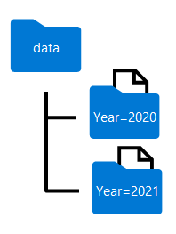

Partitioning is an optimization technique that enables spark to maximize performance across the worker nodes. More performance gains can be achieved when filtering data in queries by eliminating unnecessary disk IO.

## Partition the output file

To save a dataframe as a partitioned set of files, use the **partitionBy** method when writing the data.

The following example creates a derived **Year** field. Then uses it to partition the data.

```python
from pyspark.sql.functions import year, col

# Load source data
df = spark.read.csv('/orders/*.csv', header=True, inferSchema=True)

# Add Year column
dated_df = df.withColumn("Year", year(col("OrderDate")))

# Partition by year
dated_df.write.partitionBy("Year").mode("overwrite").parquet("/data")
```

The folder names generated when partitioning a dataframe include the partitioning column name and value in a ***column=value*** format, as shown here:



> [!NOTE]
> You can partition the data by multiple columns, which results in a hierarchy of folders for each partitioning key. For example, you could partition the order in the example by year and month, so that the folder hierarchy includes a folder for each year value, which in turn contains a subfolder for each month value.

## Filter parquet files in a query

When reading data from parquet files into a dataframe, you have the ability to pull data from any folder within the hierarchical folders. This filtering process is done with the use of explicit values and wildcards against the partitioned fields.

In the following example, the following code will pull the sales orders, which were placed in 2020.

```python
orders_2020 = spark.read.parquet('/partitioned_data/Year=2020')
display(orders_2020.limit(5))
```

> [!NOTE]
> The partitioning columns specified in the file path are omitted in the resulting dataframe. The results produced by the example query would not include a **Year** column - all rows would be from 2020.
