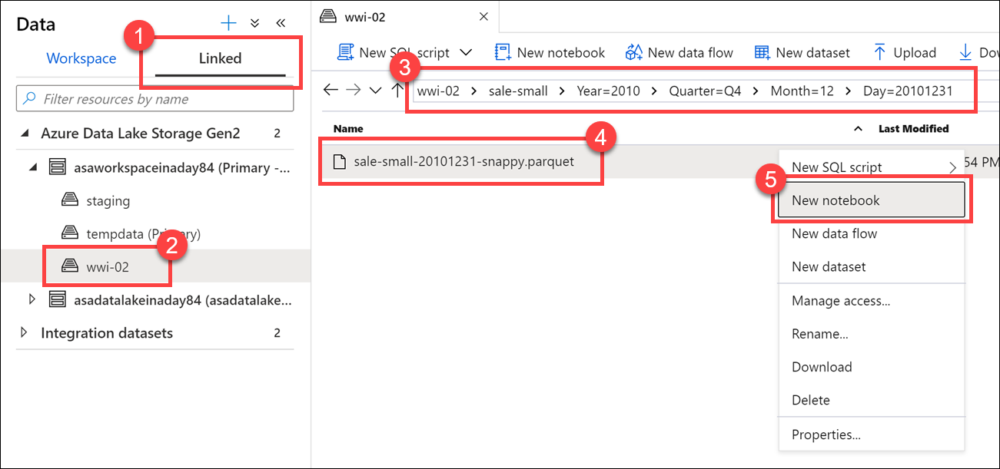

In order to load data into a spark dataframe you need to understand that you can load different filetypes and from different storage accounts. 

In order to bring data to a notebook, you have several options.
Currently it is possible to load data from Azure Blob Storage, Azure Data Lake Store Gen 2, and SQL pool. 
Some examples of loading data are:
* Read a CSV from Azure Data Lake Store Gen2 as a Spark DataFrame
* Read a CSV from Azure Blob Storage as a Spark DataFrame
* Read data from the primary storage account

Let's take an example of the company Tailwind Traders. 
Tailwind Traders has Parquet files stored in their data lake. They want to know how they can quickly access the files and explore them using Apache Spark.

An option to create a dataframe is to recommend using the Data hub in Synapse Studio to view the Parquet files in the connected storage account. 

What you can do is, use the *new notebook* context menu to create a new Synapse Notebook that loads a Spark dataframe with the contents of a selected Parquet file.



This generates a notebook with PySpark code to load the data in a Spark dataframe and display rows with the header.
It also shows that it automatically created the connection to the storage account and file in the data_path section. 


If you would like to load data to or from a SQL Database table into a Spark Dataframe you can use the Azure Synapse Apache Spark pool to Synapse SQL connector.
This is a data source implementation for Apache Spark. 
It uses the Azure Data Lake Storage Gen2 and PolyBase in SQL pools to efficiently transfer data between the Spark cluster and the Synapse SQL instance.

So let's say you want to Load the NYC Taxi data into the Spark nyctaxi database
Assume we have data available in a table in SQLPOOL1. 
How can you load it into a Spark database named nyctaxi?

* In Synapse Studio, go to the Develop hub.
* Select + > Notebook.
* On the top of the notebook, set the Attach to value to Spark1.
* Select Add code to add a notebook code cell, and then paste the following text:

```Scala
Copy
%%spark
spark.sql("CREATE DATABASE IF NOT EXISTS nyctaxi")
val df = spark.read.sqlanalytics("SQLPOOL1.dbo.Trip") 
df.write.mode("overwrite").saveAsTable("nyctaxi.trip")
```
As you can see, there are various ways to load data into a spark dataframe depending on the source the data gets loaded from and whether you want to create your own dataframe and load that into a spark dataframe. 

